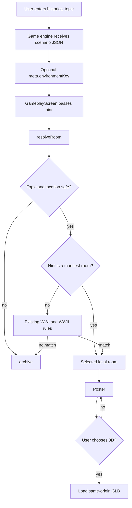

# AI-Routed Historical Environments Implementation Plan

> For agentic workers: REQUIRED EXECUTION METHOD: inline execution with visible checkpoints. Every production behavior follows RED, GREEN, and focused verification before the next task.

**Goal:** Add a safe AI-directed visual-intent contract and one new `kingdom-court` historical environment, while preserving the existing three-room experience when the new hint is absent.

**Architecture:** `packages/game-engine` owns the finite list of AI-visible environment keys and adds an optional `meta.environmentKey` to the scenario prompt, Google response schema, and parsed scenario. The web app passes that hint into `HistoricalEnvironment`; `resolveRoom` only honors a hint represented by the local `roomManifest`, then retains the existing conservative topic/location routes and `archive` fallback. The new room is authored offline, served from the same origin, and remains poster-first.

**Tech Stack:** Bun 1.4.2 workspace, React 18, Vite 5, React Three Fiber 8, Three 0.170, Zod, Bun test, Playwright 1.63, Python Blender exporter, Blender 5.2.1 LTS in WSL.

**Active Project Profile:** Repository `/home/belajarcarabelajar/time-capsule`, revision `dec3a0e` at planning time. Target surfaces are `packages/game-engine`, `apps/web/src/immersive`, `apps/web/e2e`, authored history assets, and historical-environment documentation. Configuration sources: root `package.json`, `apps/web/package.json`, `.github/workflows/quality.yml`, `docs/history-environments.md`, and `scripts/verify-history-assets.mjs`.

**Project Commands:** Focused game-engine test: `rtk bun test packages/game-engine/tests/geminiClient.test.js`. Focused web tests: `rtk bun test apps/web/src/immersive/__tests__/resolveRoom.test.js apps/web/src/immersive/__tests__/roomManifest.test.js apps/web/src/immersive/__tests__/roomAssets.test.js apps/web/src/immersive/__tests__/HistoricalEnvironment.test.jsx apps/web/src/components/__tests__/GameplayScreen.test.jsx`. Asset check: `rtk bun scripts/verify-history-assets.mjs kingdom-court`. Scoped build: `rtk bun --cwd apps/web run build`. Browser checks: `cd apps/web && rtk bun run test:immersive && rtk bun run test:immersive:fallback`. CI additionally runs `test:quality`, web lint, root build, and client-asset validation.

**Protected Boundaries:** Existing game-state, learning content, points, authentication, API endpoints, and default room behavior are unchanged. AI output is never a URL, path, HTML, executable configuration, or runtime-generated 3D asset. Generated `.blend`, `.glb`, `.webp`, and export reports must not be hand-edited. No commit, push, release, deployment, credential change, or database operation is authorized by this plan.

**Spec:** `docs/code-plan/specs/2026-09-07-ai-routed-historical-environments-design.md`.

**Scope:** One shared optional `environmentKey` contract, deterministic client validation, the `kingdom-court` vertical slice, targeted test coverage, updated historical-environment documentation, and local verification instructions.

**Non-Goals:** Adding `war-front`, `urban-poor`, `rural-village`, `market-port`, or region-specific room packs; changing lesson generation; changing the default immersive feature flag; remote model hosting; telemetry; dependency upgrades; publication.

**Plan Status & Version:** Implemented v4. Tasks 1–4 and Chromium verification are complete. Native `/usr/bin/node` was restored so Vite/esbuild can run; Chromium immersive and fallback suites pass. WebKit remains an optional host-environment follow-up because its Linux libraries are unavailable in this WSL image. No product blocker remains for the implemented room slice.

## Visual Map



Mermaid walkthrough: every scenario arrives with the current user topic and model response. Unsafe text stops at `archive`. A present key is only selected after matching an authored manifest entry. Missing and unrecognized keys preserve legacy resolution. The selected room always has a poster before any optional WebGL load, so asset or renderer failure returns to the already-visible learning surface.

## Reasoning Lenses

- Intent and scope: first incremental room pack only, not a catalogue-wide redesign.
- Investigative and evidence: preserve the existing three rooms, parser, resolver, asset budgets, and browser checks.
- Computational and systems contract: optional AI hint, local allowlist, deterministic fallback order, and stable object identifiers.
- Critical and security: reject arbitrary asset selection; unknown keys cannot influence URLs or renderer configuration.
- Behavioral and test-first: prove prompt/schema preservation, safe selection, legacy fallback, asset integrity, and user-visible static/3D states.
- Compatibility, UX, performance, operations, reproducibility: optional field, poster-first accessibility, existing asset budgets, no new telemetry, and documented Blender invocation.

## Acceptance Criteria

| ID | Observable condition |
| --- | --- |
| AC-1 | A valid scenario may contain `meta.environmentKey: "kingdom-court"`; scenarios without that field still parse. |
| AC-2 | The model prompt and response schema advertise only the four finite keys in the shared catalogue. |
| AC-3 | A safe scenario with `environmentKey: "kingdom-court"` renders the `kingdom-court` manifest entry. |
| AC-4 | Unknown, malformed, and absent keys cannot select an asset; absent or unknown values retain the existing WWI/WWII rules and `archive` fallback. |
| AC-5 | `kingdom-court` has one source `.blend`, one GLB, one poster, one export report, provenance, and exactly three matching inspection objects. |
| AC-6 | The new room stays within the documented asset, geometry, and draw-primitive budgets. |
| AC-7 | Desktop 3D, mobile static, reduced motion, missing asset recovery, keyboard exploration, and learning controls behave as before for the new room. |
| AC-8 | Historical-environment documentation explains the new contract, mapping, asset workflow, and safe fallback. |

## Traceability

| Criterion | Task | Test or check | Final evidence |
| --- | --- | --- | --- |
| AC-1, AC-2 | Task 1 | game-engine focused test | parser retains valid key; prompt and response schema list catalogue |
| AC-3, AC-4 | Task 2 and Task 3 | resolver, manifest, component, and browser tests | room data attribute and object inspection use expected room |
| AC-5, AC-6 | Task 2 | asset test and verifier | Blender export report, provenance, checksum, budget output |
| AC-7 | Task 3 | HistoricalEnvironment and Playwright suites | poster, canvas, recovery, focus, and responsive assertions |
| AC-8 | Task 4 | documentation review and targeted checks | documentation diff and passing checks |

## Contract and Algorithm

Create `HISTORY_ENVIRONMENT_KEYS` as the shared ordered constant:

```js
['archive', 'ww1-field-station', 'ww2-radio-room', 'kingdom-court']
```

The parser accepts `meta.environmentKey` as an optional string. The provider response schema supplies the four values as an enum. The renderer uses this decision order:

```js
if (topicOrLocationIsUnsafe(topic, location)) return archive('untrusted-input');
if (typeof environmentKey === 'string' && roomManifest[environmentKey]) {
  return { roomId: environmentKey, reason: 'environment-key' };
}
return resolveExistingTopicAndLocationRules(topic, location);
```

The manifest remains the final authority. The model can request only an environment key. The client derives model and poster URLs from the selected local manifest entry.

## Assumptions, Dependencies, Risks, and Rollback

- The first room is `kingdom-court`, an illustrative and culturally non-specific royal court. It supports Indonesian and global kingdom learning contexts without claiming historical reconstruction.
- `environmentKey` is optional for backward compatibility. Expand the catalogue only through an approved room-pack plan after this slice passes all verification gates.
- WSL Blender uses the system-Python invocation recorded in the spec because the user PATH exposes a UV Python shim. The invocation has successfully loaded the project exporter help without creating assets.
- AI misclassification is visual-quality risk, not a code-execution risk. The local manifest prevents arbitrary asset access; user topic and location remain the fallback input.
- Asset generation is reversible by removing the room entry, source, generated assets, provenance record, and corresponding key in one reviewed change. There is no database migration or persistent user data.
- No new package or lockfile change is planned. Supply-chain review is N/A unless a future room pack introduces a dependency.

## UX, Privacy, Operations, and Rollout

- The room remains poster-first. Static mode, reduced motion, save-data, failed GLB load, and lost WebGL context retain lesson controls and object inspection.
- New labels and descriptions are Indonesian, descriptive, keyboard reachable, and do not represent historical objects as authentic.
- `environmentKey` derives from existing AI scenario data. Do not add analytics or log raw user topics for selection debugging.
- Rollout is code deployment only after separate authorization. Health signal: browser test results plus a manual desktop and mobile review of `data-room="kingdom-court"`. Rollback: deploy the prior revision or remove the key from prompt and manifest in a reviewed follow-up. No production rollout occurs in this plan.

## Global Constraints

- Do not begin implementation until the user explicitly approves this spec and plan.
- Write a failing test before each production behavior change and capture the expected RED failure.
- Preserve existing `archive`, WWI, and WWII output when `environmentKey` is absent.
- Keep all assets same-origin and generated from the editable Blender source.
- Do not use external models, textures, authentic documents, recordings, maps, or unverified historical claims.
- Use Context Mode for large output and `rtk` for development commands.
- Do not commit, push, deploy, or modify credentials without separate authorization.

## Execution Checklist

### Task 1: Add the shared optional visual-intent contract

**Files:**
- Create: `packages/game-engine/src/historyEnvironmentKeys.js`
- Modify: `packages/game-engine/src/index.js:1-3`
- Modify: `packages/game-engine/src/systemPrompt.js:1-98`
- Modify: `packages/game-engine/src/geminiClient.js:1-201`
- Modify: `packages/game-engine/tests/geminiClient.test.js:1-133`

**Interfaces:** Consumes current scenario `meta`. Produces `HISTORY_ENVIRONMENT_KEYS`, an optional parsed `meta.environmentKey`, and an enum advertised to the model. Later tasks consume the string through `gameData.meta.environmentKey`.

**Behavior and Acceptance:** Delivers AC-1 and AC-2. The parser retains `kingdom-court`; old valid fixtures without a key remain valid. The prompt tells the model to emit one known key, but the application never assumes the model complied.

**Edge Cases and Failure Behavior:** `environmentKey` absent means no behavioral change. A non-string fails existing scenario validation. An unrecognized string is retained only as data and is ignored by the local resolver in Task 2.

**Deliberate Shortcuts and Deferrals:** Add keys only when their full room pack has an approved source, asset, manifest, and tests.

**Dependencies and Risks:** No new dependency. The response-schema enum and prompt text must be generated from the shared constant to avoid divergent catalogues.

**Review and Evidence:** Review the exact four values in the exported constant, prompt, provider schema, and parser test output.

**Test Data and Determinism:** Use the existing mocked `fetchScenarioData` response. Do not call external providers.

- [x] Step 1: Added a failing mocked-response assertion that the parser retains `kingdom-court`, plus prompt assertions for every catalogue key.
- [x] Step 2: `rtk bun test packages/game-engine/tests/geminiClient.test.js` returned exit 1 before the implementation because the shared catalogue module did not exist.
- [x] Step 3: Created `historyEnvironmentKeys.js`; exported and consumed the constant in the prompt and provider schema; made the parser field optional.
- [x] Step 4: Re-ran the focused test; it returned exit 0 with both legacy and new-key fixtures.
- [x] Step 5: Contract checkpoint complete. No commit or publication performed.

### Task 2: Author and register the `kingdom-court` room pack

**Files:**
- Modify: `apps/web/src/immersive/rooms.js:1-78`
- Modify: `apps/web/src/immersive/resolveRoom.js:1-27`
- Modify: `apps/web/src/immersive/__tests__/roomManifest.test.js:1-14`
- Modify: `apps/web/src/immersive/__tests__/roomAssets.test.js:1-27`
- Modify: `apps/web/src/immersive/__tests__/resolveRoom.test.js:1-27`
- Modify: `scripts/export-history-assets.py:14-321`
- Modify: `assets/history/provenance.json:1-36`
- Create: `assets/history/source/kingdom-court.blend`
- Create: `apps/web/public/history/kingdom-court/room.glb`
- Create: `apps/web/public/history/kingdom-court/poster.webp`
- Create: `apps/web/public/history/kingdom-court/export-report.json`

**Interfaces:** Consumes `HISTORY_ENVIRONMENT_KEYS` and optional `environmentKey`. Produces a manifest entry keyed `kingdom-court`, three stable object IDs, and generated same-origin asset files.

**Behavior and Acceptance:** Delivers AC-3 through AC-6. The manifest entry exposes `label`, `scopeLabel`, `modelUrl`, `posterUrl`, camera bounds, and exactly three objects: `ceremonial-seat`, `manuscript-table`, and `courtyard-gate`. `resolveRoom` checks unsafe topic/location first, then selects a local manifest key, then follows existing WWI/WWII logic.

**Edge Cases and Failure Behavior:** `environmentKey: 'unknown-room'` never creates a URL. It falls through to current rules. `Majapahit` with `Java` and no key remains `archive`; the new room requires the explicit valid hint. Existing unsafe input returns `archive` even when a valid hint is present.

**Deliberate Shortcuts and Deferrals:** One illustrative royal-court composition; split regional variants only after an approved room pack demonstrates a distinct learning need.

**Dependencies and Risks:** Blender source/export must be generated with the specified system-Python environment. The WSL invocation is verified, but the actual authored visual must receive a human visual review before completion.

**Review and Evidence:** Validate source, output paths, checksums, triangle count, draw primitives, three manifest objects, provenance object IDs, and scope disclaimer.

**Test Data and Determinism:** Use static manifest data and generated local assets. Blender uses the existing deterministic seed `1941` and no network assets.

- [x] Step 1: Added manifest, source/asset, and resolver cases for `kingdom-court` and its three stable object IDs.
- [x] Step 2: Focused tests returned exit 1 before implementation because the manifest and artifacts did not exist.
- [x] Step 3: Added procedural `kingdom_court()` authoring, manifest, provenance, resolver allowlist, and generated source, GLB, poster, and report using the system-Python Blender invocation.
- [x] Step 4: Verifier and focused room tests returned exit 0. Evidence: 1,293,772-byte GLB, 53,494-byte poster, 26,316 triangles, and 7 draw primitives.
- [x] Step 5: Chromium desktop and mobile screenshots/assertions reviewed through Playwright; the room is an illustrative generic court with the three intended elements. No commit or publication performed.

### Task 3: Carry the trusted hint through the learning UI and browser flow

**Files:**
- Modify: `apps/web/src/components/GameplayScreen.jsx:71-73`
- Modify: `apps/web/src/immersive/HistoricalEnvironment.jsx:21-25`
- Modify: `apps/web/src/immersive/__tests__/HistoricalEnvironment.test.jsx:10-100`
- Modify: `apps/web/src/components/__tests__/GameplayScreen.test.jsx`
- Modify: `apps/web/e2e/fixtures/historyScenarios.js:1-37`
- Modify: `apps/web/e2e/immersive.spec.js:1-76`

**Interfaces:** Consumes `gameData.meta.environmentKey`. Produces a `HistoricalEnvironment` prop passed to `resolveRoom` and browser coverage for a model-selected room.

**Behavior and Acceptance:** Delivers AC-3, AC-4, and AC-7. Gameplay passes the optional key unchanged. Static and 3D rendering expose `data-room="kingdom-court"` for a fixture representing a kingdom context. Existing fallback behavior remains intact.

**Edge Cases and Failure Behavior:** Missing `meta` and missing `environmentKey` remain safe. A failed GLB request preserves poster and object inspection. Keyboard Escape returns focus to `Jelajahi ruang`; reduced-motion mobile does not create a canvas.

**Deliberate Shortcuts and Deferrals:** None.

**Dependencies and Risks:** Browser verification requires the installed Playwright browser host. The former contextual-history plan records an incomplete browser rerun, so this task runs the relevant browser checks fresh rather than treating earlier evidence as current.

**Review and Evidence:** Inspect the prop path, selected `data-room`, provider-call count, focus behavior, static fallback, and explicit 3D recovery.

**Test Data and Determinism:** Extend the existing mocked `/api/gemini` fixture with a supplied optional key. The browser must make no live provider call.

- [x] Step 1: Added failing component and Playwright coverage for a `Majapahit` / `Java` fixture carrying `kingdom-court`, including static mobile behavior.
- [x] Step 2: Focused component tests returned exit 1 before the prop wiring. Playwright could not begin its RED run because the configured Vite server failed before test discovery.
- [x] Step 3: Passed `gameData?.meta?.environmentKey` through `GameplayScreen` and `HistoricalEnvironment`; updated mocked scenario and authored-room browser matrix without changing routes or feature flags.
- [x] Step 4: Focused component tests, Chromium immersive suite (7 passed), Chromium fallback suite (1 passed), and the scoped production build returned exit 0. WebKit host libraries remain unavailable.
- [x] Step 5: Chromium screenshots and network assertions confirm no extra provider generation, no remote assets, and no horizontal overflow. No commit or publication performed.

### Task 4: Document, review, and verify the approved scope

**Files:**
- Modify: `docs/history-environments.md:5-77`
- Modify: `docs/code-plan/checkpoints/2026-09-07-three-rooms.md` only if implementation has reached its documented verification checkpoint

**Interfaces:** Consumes final runtime contract and asset evidence. Produces accurate maintainer instructions for routing, Blender export, fallback, and validation.

**Behavior and Acceptance:** Delivers AC-8 and records all applicable verification evidence. Documentation lists `kingdom-court`, explains optional `environmentKey`, states the local-manifest authority, and shows the WSL Blender invocation.

**Edge Cases and Failure Behavior:** Documentation must say that unknown keys follow existing fallback behavior. Do not update the historic checkpoint if any required browser or asset check failed.

**Deliberate Shortcuts and Deferrals:** None.

**Dependencies and Risks:** The repository CI runs broader checks than the targeted local loop. Do not claim CI passed until a fresh workflow result exists.

**Review and Evidence:** Run whitespace and user-copy scans on changed text. Review only approved files and generated asset paths.

**Test Data and Determinism:** Reuse local assets and mocked browser scenarios. No production service, credentials, or external content is needed.

- [x] Step 1: Documented the exact key catalogue, local-manifest rule, fallback rule, budgets, and system-Python exporter invocation.
- [x] Step 2: Baseline scan showed no `kingdom-court` or `environmentKey` documentation.
- [x] Step 3: Updated `docs/history-environments.md`; the historic checkpoint was intentionally not changed because browser verification is incomplete.
- [x] Step 4: Asset verifier, all focused unit tests, scoped production build, diff check, Chromium immersive suite, and Chromium fallback suite returned exit 0. WebKit host validation is documented as unavailable.
- [x] Step 5: Reviewed intended status, source/report paths, poster, screenshots, and acceptance evidence. CI, commit, publication, and deployment remain intentionally undone.

## Definition of Done

- AC-1 through AC-8 have fresh, recorded evidence.
- Every new production behavior was observed failing before its minimal implementation and then passing.
- The four environment keys agree between shared contract, prompt, provider schema, manifest, resolver, tests, and documentation.
- `kingdom-court` source, generated outputs, provenance, checksums, object IDs, and asset budgets verify together.
- Existing room behavior, static fallback, accessibility, mobile behavior, and lesson controls remain covered.
- Targeted tests, asset verifier, scoped build, diff check, and the verified Chromium browser checks pass. WebKit host dependency status is reported honestly; CI was not run.
- No unapproved commit, push, release, deployment, or unrelated file change occurred.

## Plan Self-Review

- Acceptance coverage: every AC maps to a task, test/check, and final evidence.
- Contract consistency: all interfaces use the exact name `environmentKey` and exact first catalogue values.
- Security: model output never selects a URL or non-manifest asset.
- Compatibility: optional field and legacy resolver preserve old scenarios.
- Visual map: start, safe and unsafe branches, fallback, poster-first state, and 3D branch match the planned code path.
- Anti-bloat: no dependency, factory, generic provider abstraction, telemetry, or future-room scaffolding is included.
- Approval state: implementation approved and verified on the available Chromium host; WebKit host dependency follow-up remains outside the room implementation.
