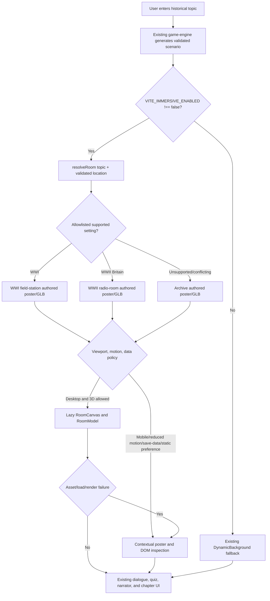

# Contextual History Visuals Implementation Plan

> For agentic workers: REQUIRED EXECUTION METHOD: inline execution with a checkpoint after every task, unless the user explicitly selects delegated execution. No implementation starts until this plan and its intent are approved.

**Goal:** Make historical topics open with a contextual authored visual by default, so `Perang Dunia I` presents a visible WWI field-station/battlefield context instead of the current flat gradient, while preserving the existing learning flow and safe fallback behavior.

**Architecture:** Keep runtime story generation and validation in `@time-capsule/game-engine`. The web app resolves validated topic/location metadata to an allowlisted authored room, then renders a local poster or GLB behind the existing gameplay layers. The immersive feature remains reversible with an explicit `VITE_IMMERSIVE_ENABLED=false` build override; unsupported or contradictory inputs continue to use the fictional archive room.

**Tech Stack:** Bun workspaces, React 18, Vite 5, React Three Fiber 8, Three.js 0.170.0, Tailwind CSS 3, Bun tests, Playwright immersive tests, Blender offline asset export.

**Active Project Profile:**

- Repository: `/home/belajarcarabelajar/time-capsule`, branch `main`, revision `6a9549f`; worktree clean before this plan artifact.
- Target scope: `apps/web`, `packages/ui` only where the existing fallback is involved, authored history assets, scoped tests, and user documentation.
- Configuration sources inspected: `AGENTS.md` instructions supplied in-session, `package.json`, `apps/web/package.json`, `apps/web/vite.config.js`, existing immersive design/spec/plan/checkpoint, and the named planning guide.
- Runtime facts: `GameplayScreen` defaults immersive off when `VITE_IMMERSIVE_ENABLED` is absent; `DynamicBackground` is gradient/particle based; authored rooms already exist for `archive`, `ww1-field-station`, and `ww2-radio-room`.
- Baseline evidence: 31 immersive unit tests pass, 13 App/gameplay integration tests pass, and `rtk bun scripts/verify-history-assets.mjs` validates all three room artifacts. Browser E2E is currently blocked by missing local Playwright Chromium/WebKit executables, which is an environment limitation rather than an application result.

**Project Commands:**

- Focused unit/integration tests: `cd apps/web && rtk bun test <specific test files>`.
- Asset verification: `rtk bun scripts/verify-history-assets.mjs` from the repository root.
- Asset export: `blender -b --python scripts/export-history-assets.py -- --root . --room <room-id>`; use `--input` only when re-exporting a reviewed edited blend.
- Targeted lint: `cd apps/web && rtk bunx eslint <changed files>`.
- Web build: `cd apps/web && rtk bun run build`.
- Immersive browser checks: `cd apps/web && rtk bun run test:immersive` on a host with the configured Playwright browsers installed.
- Development modes: `cd apps/web && rtk bun run dev` for the default contextual path; set `VITE_IMMERSIVE_ENABLED=false` to exercise the legacy fallback explicitly.

**Protected Boundaries:**

- Do not change story schemas, Gemini prompts, authentication, points/quota accounting, quiz behavior, chapter progression, or `@time-capsule/game-engine` contracts.
- Do not turn AI output into URLs, file paths, shaders, HTML, or runtime-generated 3D geometry.
- Do not add a new workspace, renderer dependency to `packages/ui`, physics, free-roaming controls, third-party asset hosts, analytics, or ambient audio without a separately approved scope.
- Preserve same-origin local asset URLs, poster fallback, reduced-motion behavior, keyboard focus, 44px touch targets, Indonesian copy, and the existing `DynamicBackground` rollback path.
- Do not commit, push, deploy, or modify production credentials as part of this plan execution unless separately authorized.

**Spec:** `docs/code-plan/specs/2026-09-07-immersive-history-design.md`, with this plan extending the presentation requirement from opt-in immersive preview to a default contextual visual after acceptance. Existing plan and checkpoint remain historical implementation context, not a reason to repeat completed work.

**Scope:**

- Change the feature gate so absent/`true` enables the contextual immersive path and explicit `false` preserves the flat fallback.
- Cover both start-screen and gameplay rendering with the same tested gate semantics.
- Make room selection tolerant of common validated WWI/WWII location labels while remaining conservative for unsupported, conflicting, malformed, or hostile input.
- Review and, where necessary, re-author the WWI scene so the visual reads as a field/battlefront environment with legible contextual cues such as packed earth, duckboards, sandbags, damaged timber, and a restrained distant exterior/ruin cue. Keep it an illustrative learning diorama, not an exact reconstruction.
- Keep the existing WWII radio-room and archive room functional, contextual, and within asset budgets.
- Add regression coverage for default mode, explicit rollback mode, room selection, static poster fallback, 3D loading, asset failure, accessibility, responsive behavior, and the real scenario flow.
- Document how the default visual mode and fallback mode work.

**Non-Goals:**

- Runtime AI-generated worlds or images for arbitrary user topics.
- A claim that every historical topic has an exact physical reconstruction.
- A full battlefield simulation, combat effects, weapons, explosions, NPC crowds, or free-roaming navigation.
- Replacing dialogue, quizzes, narrator overlays, authentication, scoring, or chapter state.
- Deploying the changed default to production during plan execution.

**Visual Map:**

**Reasoning Lenses:**

- Intent and scope: solve the flat default and weak contextual perception without changing the lesson contract.
- Investigative and evidence: use the current source, existing plan/spec/checkpoint, targeted baseline tests, and browser evidence on a supported host.
- Computational and systems/contract: centralize gate semantics, preserve the resolver allowlist, and model poster/3D/failure transitions explicitly.
- Creative and convergent: compare default-gate-only, richer authored variants, and runtime generation; recommend the first two together and reject runtime generation.
- Critical/adversarial: test unsupported locations, conflicting eras, stale room loads, asset failure, hostile strings, reduced motion, and explicit rollback.
- User-centered/accessibility: preserve reading focus, keyboard operation, responsive reflow, Indonesian text expansion, and static fallback usability.
- Performance and reproducibility: keep existing GLB/poster budgets, record asset metrics, and separate browser-environment blockers from code failures.
- Verification and reflection: map every acceptance criterion to a test/check and fresh evidence before any completion claim.

**Current Findings:**

1. `apps/web/src/components/GameplayScreen.jsx:17,70-72` selects `HistoricalEnvironment` only when the build-time flag is exactly `true`; otherwise it renders `DynamicBackground`.
2. `apps/web/package.json:12` exposes `dev:immersive`, but `README.md:117,192` documents ordinary `bun run dev`, so the contextual path is opt-in in normal development.
3. `packages/ui/src/components/DynamicBackground.jsx:12-66` accepts only safe gradients and decorative scene elements; it does not render a historical location image or geometry.
4. `apps/web/src/immersive/HistoricalEnvironment.jsx:12-18` already chooses 3D on capable desktop screens and poster mode on mobile, reduced-motion, save-data, or a stored static preference.
5. `apps/web/src/immersive/resolveRoom.js:9-25` safely maps supported WWI/WWII inputs to authored rooms, but unsupported or mismatched metadata intentionally falls back to `archive`.
6. `apps/web/src/immersive/rooms.js:27-75` and `scripts/export-history-assets.py:182-218` already contain a WWI field-station asset with earth, duckboards, retaining boards, sandbags, telephone, supplies, and dispatch objects. The remaining question is visual legibility in the default runtime, not proof that no WWI asset exists.

**Alternatives and Decision:**

- Option A, gate-only: enable the existing immersive renderer by default. Smallest diff and directly fixes the flat normal path, but does not improve a scene that still reads as an enclosed diorama or broaden contextual coverage.
- Option B, default gate plus authored contextual refinement: enable the existing renderer by default, improve WWI visual cues and resolver aliases, and verify poster/GLB parity across desktop and mobile. Recommended because it fixes the observed path while preserving deterministic, reviewable historical content.
- Option C, runtime AI-generated backgrounds: broad visual variety, but adds latency, cost, unverifiable historical claims, unsafe asset boundaries, and a new rendering contract. Rejected by the approved design.

**Acceptance Criteria:**

- `AC-1`: With no `VITE_IMMERSIVE_ENABLED` override, a normal desktop `bun run dev` journey renders `HistoricalEnvironment` for a supported topic instead of `DynamicBackground`.
- `AC-2`: `VITE_IMMERSIVE_ENABLED=false` restores the existing `DynamicBackground` path without changing scenario generation or gameplay controls.
- `AC-3`: `Perang Dunia I` with common WWI locations resolves to `ww1-field-station`; `Perang Dunia II` with British locations resolves to `ww2-radio-room`; unsupported, conflicting, malformed, oversized, or hostile input resolves to `archive`.
- `AC-4`: The WWI poster and 3D view visibly communicate an authored field/battlefront setting through at least three reviewed contextual cues, while retaining a readable dialogue area and the existing illustrative scope label.
- `AC-5`: The WWII and archive rooms remain available with valid local model/poster assets, three inspection targets, and no regression in their existing composition or scope disclaimers.
- `AC-6`: Desktop-capable users receive the lazy 3D view; mobile, reduced-motion, save-data, explicit static preference, slow import, missing model, or render failure receives a contextual poster and usable learning UI.
- `AC-7`: Normal background clicks/Enter still advance the story; exploration controls isolate their events; Escape/Kembali ke cerita restores focus; no inspection action changes quiz, score, chapter, or generation state.
- `AC-8`: The visual path has no new provider request, no AI-derived path/HTML/shader, no external asset host, and no secret or account data in logs.
- `AC-9`: The asset verifier passes all room budgets, source/provenance/checksum checks, and local URL checks; targeted tests and build pass.
- `AC-10`: Browser evidence covers default-on desktop, explicit fallback, WWI/WWII/archive selection, 320/390/768/1440 CSS pixels, reduced motion, static mode, asset failure, keyboard/focus, normal lesson overlays, and return-home behavior on a supported Playwright host.

**Traceability:**

| Criterion | Task | Check | Evidence |
|---|---|---|---|
| AC-1, AC-2 | Task 1 | Feature-flag unit tests, App/Gameplay integration, default and disabled browser runs | Fresh test logs and screenshots |
| AC-3 | Task 2 | Resolver table tests and scenario fixtures | Room IDs and fallback reasons in test output |
| AC-4, AC-5 | Task 3 | Asset verifier, visual review, poster/GLB browser screenshots | Asset metrics, screenshots, provenance review |
| AC-6, AC-7 | Task 4 | HistoricalEnvironment tests and browser matrix | Render states, focus, responsive, failure evidence |
| AC-8, AC-9, AC-10 | Task 5 | Diff review, lint, build, asset verification, E2E matrix | Exit codes, zero failures, changed-file review |

**Assumptions & Open Questions:**

- Assumption: the requested normal experience should be immersive by default, with explicit `VITE_IMMERSIVE_ENABLED=false` as rollback. This is the plan's central intent and needs approval before implementation.
- Assumption: authored illustrative context is preferable to runtime generation for correctness, cost, security, and reproducibility.
- Open question for approval: whether production should adopt the default-on behavior immediately after verification, or only after a separate release decision. This plan assumes implementation and local verification only; deployment remains out of scope.
- Open question for visual review: whether the existing WWI model already meets the three-cue threshold in the target browser. If yes, preserve the asset and limit Task 3 to poster/camera/readability adjustments; if no, re-author only the missing cues.

**Dependencies & Impact:** No schema, database, API, package, or external service dependency is planned. Impact is limited to default UI presentation, deterministic room resolution, authored assets, documentation, and tests. Existing game-engine consumers remain unchanged.

**Risks & Rollback:**

- GPU or asset failures: retain poster-first loading, `EnvironmentBoundary`, timeout, and explicit retry; rollback by setting `VITE_IMMERSIVE_ENABLED=false` and rebuilding.
- Visual obstruction: preserve shade, scope label, dialogue gradient, and camera framing; reject any asset/camera revision that reduces text contrast or covers controls.
- Incorrect historical implication: use illustrative labels, reviewed descriptions, no invented readable documents, and provenance review; fall back to archive when setting certainty is insufficient.
- Bundle/load cost: preserve lazy renderer import and existing GLB/poster budgets; record size and load results before acceptance.
- Browser host gap: classify missing Playwright binaries/libraries as an environment blocker and run required E2E on a supported host rather than treating unit tests as equivalent evidence.

**Security & Compatibility:** Resolver input remains normalized, length-bounded, allowlisted, and non-executable. Manifest paths remain authored same-origin constants. The old fallback remains available. No new permissions, network destinations, storage of user topics, or provider calls are introduced.

**Operations & Rollout:** Local/default build first. Keep the explicit false gate as the rollback control. No production deployment in this implementation cycle. If deployment is later authorized, use a staged release, verify app start/sign-in/topic journey/room asset failures/console errors, observe the existing available signals for 30 minutes and again at 24 hours, and rollback on broken learning paths, repeated asset failures, or failed performance/accessibility acceptance.

**CI/Review Gate:** Review the intended diff and generated asset list; run targeted tests, asset verification, lint, build, and supported-host browser checks. No commit or publication is part of this plan until the user authorizes it. The named planning guide must be reread at implementation start, after each checkpoint, before final verification, and after any scope change.

**Documentation:** Update `README.md` with default-on behavior, explicit fallback override, room mapping, and local browser prerequisites. Add or update `docs/history-environments.md` with room scope, asset provenance workflow, and visual acceptance notes if the implementation creates that document.

**Definition of Done:** Approved intent and plan; RED tests observed before each behavior change; implementation limited to approved files; all applicable focused tests pass; asset budgets/source/provenance/checksums pass; targeted lint and build pass; supported-host browser matrix passes or has a separately accepted environment exception; accessibility/responsive/error/recovery states are evidenced; diff/worktree review is clean; no deployment claim is made.

**Plan Status & Version:** Verification v1, 2026-09-07. User approved implementation. Tasks 0-5 implementation work is complete; AC-10 browser evidence is blocked by missing local Playwright executables. Re-read the named planning guide at every execution checkpoint.

**Reproducibility:** WSL path `/home/belajarcarabelajar/time-capsule`; Bun 1.4.2 observed by tests; React 18.3.1 range; Vite 5; Fiber 8.18.0; Three.js 0.170.0; Playwright 1.63.0. Use repository-local fixtures and same-origin asset routes. Do not print credential values. Expected default result is an authored contextual room or poster, not a gradient-only scene.

**Test Reliability:** Unit tests use fixed resolver inputs, injected renderer promises, controlled storage, and cleanup. Browser tests use mocked auth/scenario/fallback APIs, block real provider domains, reset storage per test, use one worker, and do not retry failed assertions. Browser availability is an external environment prerequisite and must be recorded separately from code results.

**Privacy & Data Governance:** Topic and generated scenario metadata are user-provided/content data. Keep selection in memory, do not add analytics or retention, do not log prompts/accounts/tokens, and keep account/auth behavior unchanged.

**Dependencies & Supply Chain:** Do not add dependencies. Preserve existing pinned Fiber/Three compatibility and lockfiles. Review generated GLB/poster provenance, Blender version/report hashes, local font licenses, and asset redistribution status. No third-party runtime asset host is allowed.

**UX States:** Cover start screen, loading, normal dialogue, narrator, quiz, chapter continuation, return home, unsupported/empty input, static poster, 3D loading, retry, missing model, missing poster, reduced motion, save-data, keyboard focus, 200% zoom, 320px reflow, and Indonesian text expansion. Maintain minimum 44px controls and visible focus.

**Verification:** Record each command as `[command] -> [exit code] -> [relevant metrics] -> [verdict]`. Do not claim the original flat-background issue is fixed until AC-1 is reproduced in the default run and AC-4 is visually verified in a supported browser.

## Global Constraints

- Use the named planning guide at `/home/belajarcarabelajar/.config/ai/Super Ultra Code Plan Implementation.md` as the session authority; re-read it at every checkpoint.
- No production code before a failing test, except authored visual asset changes verified by the documented visual/artifact checks.
- Use `ctx_execute`, `ctx_execute_file`, or `ctx_batch_execute` for large output and analysis; use `rtk` for development commands.
- Preserve unrelated work and inspect status/diff before every mutation.
- Keep new code files below 500 lines and split responsibilities if a file approaches the limit.
- Never use runtime AI output as a path, shader, HTML, or executable configuration.
- Never add external image/texture URLs to the contextual room path.
- No commit, push, deployment, credential change, or production database mutation without explicit authorization.

## Execution Checklist

### Task 1: Make contextual rendering the tested default

**Files:**

- Create: `apps/web/src/immersive/featureFlag.js`.
- Test: `apps/web/src/immersive/__tests__/featureFlag.test.js`.
- Modify: `apps/web/src/components/StartScreen.jsx:9-36`, `apps/web/src/components/GameplayScreen.jsx:14-72`, `apps/web/package.json:6-13`, and the affected component tests.

**Interfaces:**

- Consumes: optional `VITE_IMMERSIVE_ENABLED` string and existing `immersiveEnabled` component override.
- Produces: `isImmersiveEnabled(value)` returning `false` only for the explicit string `false`; `StartScreen` and `GameplayScreen` use the same default semantics.

**Behavior & Acceptance:** AC-1, AC-2. Normal development and production builds use the authored contextual path by default. Explicit `VITE_IMMERSIVE_ENABLED=false` keeps the old flat fallback available.

**Edge Cases & Failure Behavior:** Empty/undefined flag enables; only exact `false` disables; a failed 3D renderer still uses poster fallback and never falls back to AI or blocks the lesson.

**Deliberate Shortcuts & Deferrals:** `ponytail: one global build-time gate, upgrade-trigger: a measured need for remote runtime rollout control after production telemetry and ownership are approved.`

**Dependencies & Risks:** Existing tests that assume the old default may need explicit `immersiveEnabled={false}` to test the legacy path. Do not change test intent silently.

**Review & Evidence:** RED flag tests for undefined/true/false semantics, then GREEN focused component tests and a default-on browser scenario. Verify the explicit false build separately.

**Reasoning Output:** One shared gate prevents StartScreen and GameplayScreen from drifting. The exact-false rollback preserves compatibility without requiring a new service.

**Test Data & Determinism:** Test pure flag values; mock/inject `HistoricalEnvironment` or assert its room marker in integration tests; no network or GPU dependency for unit coverage.

- [x] Step 1: Write failing tests for undefined/true/false gate semantics and default StartScreen/GameplayScreen routing.
- [x] Step 2: Run `cd apps/web && rtk bun test src/immersive/__tests__/featureFlag.test.js src/components/__tests__/GameplayScreen.test.jsx src/__tests__/App.test.jsx`; verify the new default assertions fail for the current exact-true implementation.
- [x] Step 3: Add the shared gate and update both callers; keep `immersiveEnabled` overrides usable by tests.
- [x] Step 4: Rerun the same focused tests; verify zero failures and explicit false still selects `DynamicBackground`.
- [x] Step 5: Stop at the review checkpoint; no commit or publication without separate authorization.

### Task 2: Broaden deterministic supported-setting resolution

**Files:**

- Modify: `apps/web/src/immersive/resolveRoom.js`.
- Test: `apps/web/src/immersive/__tests__/resolveRoom.test.js`.
- Modify fixtures only if needed: `apps/web/e2e/fixtures/historyScenarios.js`.

**Interfaces:**

- Consumes: bounded `topic` and `location` strings already held by the gameplay flow.
- Produces: the existing `{ roomId, reason }` result with no new AI/API contract.

**Behavior & Acceptance:** AC-3. Add only reviewed aliases for common WWI field-front and WWII British-home-front labels; preserve archive fallback for unsupported or contradictory settings.

**Edge Cases & Failure Behavior:** Keep URL/HTML-like input, mixed eras, oversized values, incompatible regions, unknown islands, and location/topic contradictions on `archive`.

**Deliberate Shortcuts & Deferrals:** `ponytail: allowlisted aliases only, upgrade-trigger: a reviewed source-backed room catalog for additional eras or regions.`

**Dependencies & Risks:** More aliases can create false positives. Each new alias needs a test for the intended room and a nearby negative case.

**Review & Evidence:** Table-driven RED tests first, then resolver GREEN output with room IDs and fallback reasons. Review no AI string becomes a path.

**Reasoning Output:** Topic establishes era; location refines the authored setting only when an allowlisted relation is proven. The resolver remains O(n) over a fixed set of regular expressions and bounded input.

**Test Data & Determinism:** Fixed Indonesian/English inputs, no provider call, no locale-dependent normalization beyond existing NFKC/lowercase behavior.

- [x] Step 1: Add failing cases for representative `Perang Dunia I`/WWI field locations and British WWII labels, plus negative contradictions.
- [x] Step 2: Run `cd apps/web && rtk bun test src/immersive/__tests__/resolveRoom.test.js`; verify the new cases fail before resolver changes.
- [x] Step 3: Extend only the reviewed allowlist and preserve existing rejection order.
- [x] Step 4: Rerun resolver tests and the immersive manifest tests; verify all old and new cases pass.
- [x] Step 5: Stop at the review checkpoint; no commit or publication without separate authorization.

### Task 3: Make the authored WWI context visibly read as a field/battlefront

**Files:**

- Review/modify: `scripts/export-history-assets.py` and `assets/history/source/ww1-field-station.blend` only if visual review identifies missing cues.
- Regenerate: `apps/web/public/history/ww1-field-station/room.glb`, `poster.webp`, and `export-report.json` using the dedicated export command.
- Modify only if required: `apps/web/src/immersive/rooms.js`, `assets/history/provenance.json`, `scripts/verify-history-assets.mjs`, and asset tests.

**Interfaces:**

- Consumes: deterministic authored scene source and existing room manifest paths.
- Produces: the same `room.glb`/poster/provenance/checksum contract, with visual cues legible at the authored camera and poster scale.

**Behavior & Acceptance:** AC-4, AC-5, AC-9. WWI must communicate field/battlefront context without false documents or exact-reconstruction claims. Archive and WWII remain valid and within current budgets.

**Edge Cases & Failure Behavior:** If the new cue exceeds 4 MiB, 100,000 triangles, 60 primitives, or 250 KiB poster budget, reduce geometry/material complexity before acceptance. If visual review finds no missing cue, do not re-author the asset.

**Deliberate Shortcuts & Deferrals:** `ponytail: authored diorama rather than photorealistic battlefield, upgrade-trigger: user-approved asset collection expansion with source review, budget measurement, and a separate visual plan.`

**Dependencies & Risks:** Blender availability, target-browser lighting, screenshot scale, and historical interpretation. Generated binaries must be regenerated together so hashes and provenance remain consistent.

**Review & Evidence:** Review poster and 3D screenshots at desktop and mobile sizes. Record at least three contextual cues, asset metrics, source hashes, and scope-label readability.

**Reasoning Output:** Improve content-driven composition, not decorative particle density. Reuse current authored primitives and export pipeline before adding dependencies or runtime effects.

**Test Data & Determinism:** Use the existing fixed export seed and dedicated script. Preserve room object IDs and descriptions unless a reviewed visual change requires a matching metadata update.

- [x] Step 1: Write/extend a failing artifact or scene-contract assertion for the selected WWI visual cues and existing budgets; capture the current poster/GLB as the RED baseline when a cue is absent.
- [x] Step 2: Run `rtk bun scripts/verify-history-assets.mjs ww1-field-station`; verify the baseline/contract failure is attributable to the missing cue, or record a visual-review pass that makes no asset code change necessary.
- [x] Step 3: Make the smallest authored scene/export change only if required; regenerate the source, GLB, poster, report, and provenance hashes together.
- [x] Step 4: Run `rtk bun scripts/verify-history-assets.mjs` and the targeted asset tests; review screenshots and verify budgets/checksums.
- [x] Step 5: Stop at the visual review checkpoint; no commit or publication without separate authorization.

### Task 4: Prove poster-first, 3D, fallback, and learning-flow behavior

**Files:**

- Modify: `apps/web/src/immersive/HistoricalEnvironment.jsx` only where default/static preference or status behavior needs correction.
- Test: `apps/web/src/immersive/__tests__/HistoricalEnvironment.test.jsx`, `apps/web/e2e/immersive.spec.js`, `apps/web/e2e/fixtures/historyScenarios.js`, and Playwright configuration as needed for default-on/off runs.

**Interfaces:**

- Consumes: room ID from Task 2 and local assets from Task 3.
- Produces: observable poster/3D/failure states while preserving existing gameplay event and focus contracts.

**Behavior & Acceptance:** AC-6, AC-7, AC-10. Verify supported desktop default, explicit fallback, mobile poster, reduced motion, static preference, model failure, missing poster, stale import, keyboard inspection, quiz/narrator/continue/home overlays, and each room.

**Edge Cases & Failure Behavior:** No WebGL, slow/lost context, failed lazy import, missing model/poster, visibility changes, room transitions, and `sessionStorage` unavailability must preserve the lesson and expose recovery where applicable.

**Deliberate Shortcuts & Deferrals:** `ponytail: one authored camera and poster per room, upgrade-trigger: measured evidence that separate scene variants materially improve comprehension without violating mobile budgets.`

**Dependencies & Risks:** Browser binaries and WebKit host libraries are external prerequisites. A missing browser is a verification blocker, not a passing E2E result.

**Review & Evidence:** Use mocked API fixtures, one worker, no retries, screenshots/traces on failure, and explicit room markers. Record exit codes and classify environment failures.

**Reasoning Output:** The state path is `poster -> loading -> ready` or `poster -> failed -> retry`; the lesson remains the owner of click/keyboard progression while exploration owns only its local events.

**Test Data & Determinism:** Block real AI/provider domains, count Gemini/fallback calls, reset storage, emulate fixed viewport/reduced-motion settings, and use stable fixture locations for WWI/WWII/archive.

- [x] Step 1: Add failing browser cases for default-on normal dev and explicit-off fallback, plus missing/failed asset recovery where coverage is absent.
- [x] Step 2: Run `cd apps/web && rtk bun run test:immersive`; verify failures are the intended missing behavior or an explicitly classified browser-environment blocker.
- [x] Step 3: Adjust only the necessary renderer/default-mode behavior and test configuration.
- [ ] Step 4: Rerun focused unit tests and `rtk bun run test:immersive` on a supported browser host; verify all applicable cases pass with no unexpected provider calls.
- [x] Step 5: Stop at the browser checkpoint; no commit or publication without separate authorization.

### Task 5: Documentation, quality gates, and handoff

**Files:**

- Modify: `README.md`.
- Create or modify: `docs/history-environments.md` for room scope, fallback, authoring, and verification notes.
- Review only: all changed source, tests, assets, reports, and provenance files.

**Interfaces:** Documentation describes the actual default gate, explicit rollback, room mapping, asset workflow, browser prerequisites, and known verification boundary.

**Behavior & Acceptance:** AC-8, AC-9, AC-10 and Definition of Done. Documentation must not claim live production release, unsupported browser success, or exact historical reconstruction.

**Edge Cases & Failure Behavior:** If browser prerequisites remain unavailable, record the exact missing executable/library and leave the plan in Verification/Blocked for that evidence, not Complete.

**Deliberate Shortcuts & Deferrals:** `None.`

**Dependencies & Risks:** Documentation must match final flag semantics and commands after implementation; refresh the active project profile before final checks.

**Review & Evidence:** Run targeted lint, default and disabled builds, focused tests, asset verification, supported-host browser tests, `rtk git diff --check`, and final status/diff review. Scan changed user-visible copy for em dashes.

**Reasoning Output:** The handoff distinguishes code success, visual acceptance, browser-environment limits, and deployment authorization instead of collapsing them into one claim.

**Test Data & Determinism:** Commands and expected outputs are recorded in the plan/checkpoint; no credentials, live provider calls, or production mutations.

- [x] Step 1: Write documentation acceptance checks for default-on/off commands, room mapping, fallback, and browser prerequisites.
- [x] Step 2: Run documentation/configuration checks against the current behavior; verify they fail or identify the exact update required.
- [x] Step 3: Update only the approved documentation and checkpoint state.
- [x] Step 4: Run `cd apps/web && rtk bunx eslint <changed files> && rtk bun run build && rtk bun test <focused files>` plus `rtk bun scripts/verify-history-assets.mjs` and `rtk git diff --check`; inspect every log and exit code.
- [x] Step 5: Review the final diff/status, reread the named planning guide, update plan status, and stop for the user's implementation/release decision.

**Approval Gate:** Approved by the user on 2026-09-07. Contextual rendering is the default and `VITE_IMMERSIVE_ENABLED=false` is the rollback path. Production publication remains separately unauthorized.

**Live State:**

- Status: Verification.
- Approved scope: default contextual rendering, conservative resolver coverage, authored WWI visual review, resilient renderer/browser verification, documentation and quality gates.
- Completed: Task 0 profile refresh and baseline evidence; Task 1 shared gate and default/legacy route tests; Task 2 reviewed resolver aliases; Task 3 WWI authored visual cue and artifact regeneration; Task 4 browser configurations and fallback coverage added.
- Current: Final verification and handoff.
- Next: Run the supported-host browser matrix when Playwright executables are available; do not treat the current host blocker as a passing AC-10 result.
- Blockers: Playwright browsers are not installed on the current WSL host; default suite reached Vite and stopped at 10 browser launches, fallback suite reached Vite and stopped at 1 browser launch. AC-10 remains unverified until a supported host supplies Chromium/WebKit.
- Decisions: preserve explicit `VITE_IMMERSIVE_ENABLED=false` rollback; do not add runtime AI-generated visuals.
- Evidence: feature flag `3 pass / 0 fail`; GameplayScreen `8 pass / 0 fail`; App `7 pass / 0 fail` with a non-failing multiple-Three warning; resolver/manifest `19 pass / 0 fail`; room assets `3 pass / 0 fail`; all-room verifier pass; targeted lint exit 0; default/disabled builds exit 0; diff check exit 0; default E2E config uses plain `vite`; explicit-off config added; WWI `1,524,932 bytes / 24,360 triangles / 9 draw primitives`; revision `6a9549f`.
