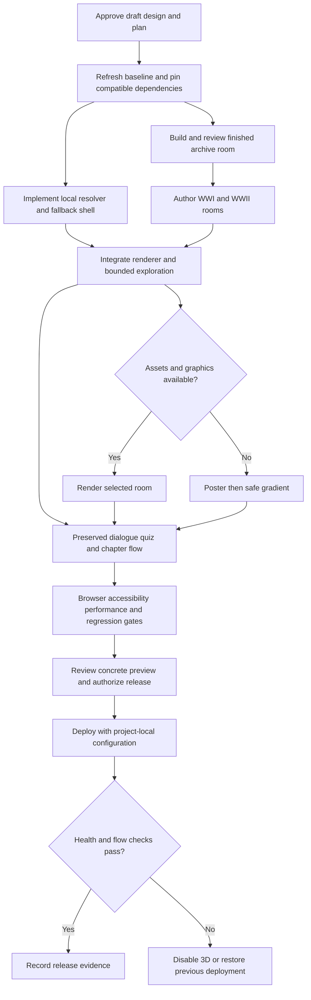

**Immersive History Implementation Plan**

**Status:** In progress v3, 2026-09-07. User approved implementation and continued after the archive preview. Three authored rooms are delivered and Chromium-verified. Latest authoritative task/evidence state: [checkpoint](../checkpoints/2026-09-07-three-rooms.md). No commit, push, or deployment requested. Earlier task checklists retain the original acceptance steps; use the checkpoint to avoid repeating completed implementation.

**Goal:** Ship three authored, interactive 3D spaces around Time Capsule's existing history-learning flow, with reliable mobile and static experiences.

**Architecture:** A lazy React Three Fiber renderer owned by the web application consumes a deterministic local room manifest. Existing game state, story validation, API schemas, quizzes, and authentication remain the source of truth. Blender assets are created ahead of runtime and served from the same origin.

**Spec:** `../specs/2026-09-07-immersive-history-design.md`.

**Active project profile and warm-up evidence**

| Item | Verified state on 2026-09-07 |
| --- | --- |
| Root / revision | `/home/belajarcarabelajar/time-capsule`, `main`, `49741be`; initially clean; no remote fetch performed |
| Harness / skills | Codex; context-mode used; named planning guide read. Standalone brainstorming/writing-plans/debugging/verification skills were not found in checked skill locations; guide supplies the integrated workflow |
| Stack | Bun workspaces, Turborepo, React 18.3.1 range, Vite 5, Tailwind 3, JavaScript/JSX; Pages Functions and D1 |
| Actual package name | Web manifest is `web`; README's `@time-capsule/web` label is inconsistent. Use manifest/cwd, not README label, for commands |
| Runtime | Bun 1.4.2; RTK 0.46.0. Root `packageManager` requests Bun 1.2.0, so version drift is recorded rather than silently upgrading the manifest |
| Dependency restoration | Frozen install with scripts disabled: 525 packages installed, exit 0, lockfile unchanged. Initial attempts failed on temporary-directory EROFS and sandbox DNS; retry used `/tmp` and approved network escalation |
| Tree discovery | `printdirtree --report` unsupported. Supported `printdirtree --dirs-only` captured to `/tmp/time-capsule-dirtree-report.md` and inspected; no custom filesystem traversal |
| Tests | 88 passed, 0 failed across 11 explicitly targeted files, in isolated invocations described below |
| CI / type checking | No tracked CI workflow, TypeScript config, or typecheck script found in the inspected file inventory. Do not claim CI or type-check success |
| Build / deployment | Existing `scripts/deploy-website.sh` builds and deploys together and reads a neighboring Cloudflare credentials file. It was inspected, not executed; it is incompatible with the current project-isolation rule |
| Runtime limits | No browser/GPU render, production build, live OAuth, live D1, or paid AI request verified during planning |
| Memory | Indexed history queried; no callable memory graph MCP was exposed. No architecture implementation or global memory edit performed |

**Baseline commands and results**

Run from repository root. Root test invocations are intentional: existing test files register their DOM environment; package-local Bun preloads differ. Keep each frontend file in its own process to avoid cross-file `mock.module` contamination.

| Command | Result |
| --- | --- |
| `rtk bun test functions/api/gemini.test.js functions/api/ai.test.js functions/api/auth/me.test.js` | 18 pass |
| `rtk bun test apps/web/src/components/__tests__/GameplayScreen.test.jsx` | 6 pass |
| `rtk bun test apps/web/src/hooks/__tests__/useGameState.test.jsx` | 5 pass |
| `rtk bun test packages/ui/src/components/__tests__/DynamicBackground.test.jsx` | 19 pass |
| `rtk bun test packages/game-engine/src/__tests__/geminiClient.test.js` | 14 pass |
| `rtk bun test apps/web/src/components/__tests__/StartScreen.test.jsx` | 3 pass |
| `rtk bun test apps/web/src/__tests__/App.test.jsx` | 7 pass |
| `rtk bun test apps/web/src/context/__tests__/AuthContext.test.jsx` | 8 pass |
| `rtk bun test apps/web/src/components/__tests__/UserBar.test.jsx` | 8 pass |

Frontend tests initially failed to resolve React/Happy DOM before dependency restoration. All listed reruns passed afterward. Negative-path tests intentionally print parsing/network errors; no unhandled baseline failures remained. This is focused coverage, not a whole-repository correctness claim.

**Source findings / hypothesis record**

| Finding | Evidence | Confidence / severity | Disposition |
| --- | --- | --- | --- |
| Current visuals are mood gradients and randomized emoji positions | `packages/ui/src/components/DynamicBackground.jsx:12-65` | High / visual gap | Replace default background through a wrapper; retain safe fallback |
| Whole gameplay surface advances the story on click | `apps/web/src/components/GameplayScreen.jsx:53` | High / high integration risk | Consume exploration events without changing reading behavior |
| Enter is handled globally | `apps/web/src/hooks/useGameState.js:235-243` | High / high integration risk | Stop exploration key events before they reach window; browser regression required |
| Schema contains location, gradient, and emoji elements but no trusted era or room ID | `packages/game-engine/src/geminiClient.js:37-52` | High / medium | Use conservative local matching; preserve schema |
| Existing backgrounds contain external texture URLs | `DynamicBackground.jsx:65`, `StartScreen.jsx:30` | High / low | New room assets are same-origin; do not depend on those textures |
| Vite development proxy bypasses Pages auth and accounting | `apps/web/vite.config.js:33-53` | High / high diagnostic risk | Vite-only requests cannot reproduce production points behavior |
| CSP is report-only | `apps/web/public/_headers:1-4` | High / medium | Check compatibility; do not claim enforced protection |
| VITE-prefixed server credentials are supported | `apps/web/vite.config.js:10-12`, Functions credential reads | High existence / potential high security impact | Do not read values; release review must verify no secrets in bundles. Exposure is unproven |
| Deployment helper crosses credential boundary | `scripts/deploy-website.sh:18-34` | High / high operational risk | Dedicated safe build/preview path before release; do not execute existing helper |

Accounting findings, including stale UI, fail-open checks, races, and partial writes, are fully retained in the separate points plan. These are source findings, not a diagnosis of live production state.

**Scope, assumptions, and non-goals**

- Include the archive, WWI field station, WWII radio room, static posters, bounded exploration, three inspectable objects per room, optional ambience, and start/loading/return-home visual continuity.
- Preserve AI text, system prompt, schema, narration, quiz answers, chapter/preload behavior, authentication routes, daily reset, and generation prices.
- No React migration, free-roaming game, combat simulation, multiplayer, VR, runtime Blender, runtime asset-generation service, new rewards, or paid asset procurement.
- User delegates creative direction. First launch is a representative collection, not coverage of all history. A neutral archive is mandatory for unsupported or contradictory settings.
- `defer: three authored rooms at launch; expand only after the first-room quality gate and measured demand for unsupported settings`. Unknown input never silently downloads an unrelated historical room.
- No new code file reaches 500 lines. Do not split existing unrelated code or run mass lint/format fixes.

**Visual implementation map**

**Interfaces, ownership, and algorithms**

- `resolveRoom({ topic, location }) -> { roomId, reason }`, pure and deterministic. Normalize Unicode/case/whitespace, cap each input at 500 characters, match token-boundary English/Indonesian aliases, and reject conflicting era/geography signals before positive matches. Fixed registry scan is O(input length × small fixed alias count), with no network calls. `reason` is for tests/diagnostics, not historical proof.
- `roomManifest[roomId]`: `id`, `label`, `scopeLabel`, `modelUrl`, `posterUrl`, `camera` (`position`, `target`, `yawLimit`, `pitchLimit`), `objects` (`id`, `label`, `description`, `view`), and `audioUrl` when a licensed clip exists. All values are authored. Every room has exactly three reviewed objects and valid local paths.
- `HistoricalEnvironment({ topic, location, mood, blocked })` owns selection, lazy import, fallback, inspection mode, and motion/audio preferences. Start screen supplies an empty topic to keep the archive; gameplay supplies current topic and validated location. `blocked` combines loading, quiz, narrator, chapter-prompt, and return-home states.
- `RoomCanvas({ room, mood, motionEnabled, exploring, selectedObject })` owns WebGL, camera, animation, and resource lifetime. No game-state setter, auth context, fetchScenarioData call, or point mutation crosses this boundary.
- `EnvironmentControls({ exploring, onExploreChange, motionEnabled, onMotionChange, audioEnabled, onAudioChange, objects, onInspect })` is ordinary DOM. Use stopPropagation for click/keydown; Escape restores focus. Canvas remains decorative to screen readers; DOM exposes the useful content.
- State: `poster -> loading3d -> ready`, or `loading3d -> failed -> poster`. Render a poster immediately. On import/model failure or a 10-second load timeout, remain on poster; an explicit retry uses a new attempt token. Ignore late results from older room/attempt tokens. Never delay story display waiting for rendering.
- One mounted canvas. Load only the active room; dispose it before replacing the model. No persistent all-room asset cache. Retain the poster during swaps; cap in-flight room requests to one logically active request and discard stale responses. Reset inspection when room changes.
- Hidden tab/unmount stops animation and ambience. Motion disabled uses a demand render. Moving scenes schedule frames only while visible and enabled. Own and release loaded geometry/material/texture resources explicitly, accounting for shared ownership.

**Acceptance criteria and traceability**

| ID | Observable acceptance | Task / verification evidence |
| --- | --- | --- |
| AC1 | Existing input, auth, dialogue, quiz, preload, continuation, and return-home work with unchanged story output and call counts | T1/T5; existing tests plus browser journey |
| AC2 | Three finished authored rooms and posters exist; all nine inspection targets work | T2/T4/T5; asset audit and visual review |
| AC3 | English/Indonesian aliases, unrelated topics, mixed eras, and incompatible locations select safely and deterministically | T3; resolver tests |
| AC4 | Visuals add zero AI requests, zero points mutations, and no server schema change | T3/T5; mocked request counters and diff review |
| AC5 | Dragging, keyboard inspection, audio and motion controls never advance text or submit a quiz | T5; DOM tests and browser event checks |
| AC6 | Missing WebGL, failed imports/models/posters, timeout, and stale room loads preserve the learning UI | T3/T4; failure-injection tests |
| AC7 | Reduced motion and animation pause work; all inspection information is keyboard/screen-reader accessible | T5/T6; accessibility/browser evidence |
| AC8 | At 320px and 200% zoom no required control is clipped; dialogue remains readable in every room | T6; screenshots and manual review |
| AC9 | Performance and download budgets below are met on recorded device/browser profiles | T4/T6; traces, transfer report, renderer measurements |
| AC10 | Ten room/home cycles do not accumulate canvases, active audio, or unbounded GPU resources | T4/T6; lifecycle test and browser memory observations |
| AC11 | All assets are local, licensed, reviewed for historical scope, and reproducible from delivered sources | T2/T6; manifest/source audit |
| AC12 | Build-only verification and a reversible reviewed preview precede release | T1/T7; build exit code, bundle review, preview report |

**Performance budgets: proposed release gates, not measured claims**

| Surface | Budget / measurement |
| --- | --- |
| Initial UI | No static Three/Fiber import in initial entry. Added non-3D shell code at most 30 KiB gzip; existing topic/auth UI becomes usable independently |
| Renderer chunk | Three/Fiber and renderer code at most 350 KiB gzip, measured from built chunks; no physics/postprocessing library by default |
| Room transfer | Each room's initial model/textures at most 4 MiB on mobile and 8 MiB desktop; poster at most 250 KiB; ambience loaded only after enable and at most 500 KiB per room |
| Scene complexity | At most 100k visible triangles and 60 draw calls mobile; 250k triangles and 100 calls desktop; reuse geometry/materials, baked lighting, no realtime shadows on mobile |
| Textures / resolution | Mobile maps generally at most 1024px, desktop at most 2048px; texture residency target under 64 MiB mobile; device pixel ratio cap 1 mobile / 1.5 desktop |
| Frame pacing | After warm-up, p95 frame interval at most 33.3ms mobile / 20ms desktop during a 30-second inspection; if sustained median exceeds 40ms for 3 seconds, lower quality, then poster if it persists |
| Responsiveness | p95 scripted input-to-next-paint under 200ms over 20 interactions; capture field INP separately if available, do not label a small local sample as field INP |
| Startup | Under a documented 10 Mbps / 100ms RTT profile, poster first and active room visible within 5 seconds after lazy load begins; 10-second timeout still guarantees usable fallback |
| Lifecycle | After 10 swaps, one canvas maximum and geometry/texture counts return near steady-state baseline; record counts and ownership, not an unsupported exact GPU-memory claim |

Record actual CPU/GPU, viewport, DPR, OS, browser version, power mode, and network profile before measuring. Mobile emulation alone is not physical mobile GPU proof. If a physical device is unavailable, mark that gate unverified and keep low/static mode as the release default until tested. Quality downgrade never lowers text legibility.

**T1: reproducible development and regression boundary**

Files: create `scripts/build-website.sh`, `scripts/build-website.test.js`; modify `apps/web/package.json` and `bun.lock` for renderer/browser-test dependencies; extend `apps/web/src/components/__tests__/GameplayScreen.test.jsx` and `apps/web/src/__tests__/App.test.jsx` only where preserving interaction needs characterization.

Consumes existing manifests and the baseline above. Produces a build-only entry and a recorded dependency selection. Keep React 18; verify Fiber 8 and Three peer ranges in registry metadata at execution, then pin exact compatible versions. Add browser automation only as a dev dependency. No Drei/postprocessing unless a demonstrated requirement justifies it.

- [ ] Refresh status/revision and the guide. Read the Mermaid paths against the current source before editing.
- [ ] Add a build-script contract test: `expect(script).toContain('set -euo pipefail'); expect(script).not.toMatch(/pages deploy|cloudflare\/\.env/);` and a behavior test running the script against a stub Bun executable, asserting only the web build cwd/arguments. Run `rtk bun test scripts/build-website.test.js`, expect failure because the script is absent.
- [ ] Implement the dedicated script with `set -euo pipefail`, resolve repository root, enter `apps/web`, and invoke its declared `bun run build`. No credentials or deploy action. Run the test, expect pass.
- [ ] Preserve existing click and Enter characterization tests before adding exploration. Install chosen pinned dependencies with frozen baseline recorded, then immediately rerun `rtk bun test apps/web/src/components/__tests__/GameplayScreen.test.jsx`.
- [ ] Run `rtk bash scripts/build-website.sh` using project-local placeholder-free configuration or a credential-free fixture environment. Inspect emitted assets for unintended secrets without printing matches. No public service credentials are needed to build a fixture UI.
- [ ] Review only intended files. Commit only after explicit user commit authorization, with sole author `Iwan Kurniawan <iwan@belajarcarabelajar.com>` and no co-author trailers.

Risk: current dependency versions and package scripts may drift. Failure to resolve compatible dependencies blocks renderer work, not the existing app. No deliberate shortcut.

**T2: author and review the archive vertical slice**

Files: create `assets/history/source/archive.blend`, `assets/history/provenance.json`, `apps/web/public/history/archive/room.glb`, `apps/web/public/history/archive/poster.webp`, `apps/web/src/immersive/rooms.js`, `apps/web/src/immersive/__tests__/roomAssets.test.js`, and `scripts/export-history-assets.py`. Export script is a Blender-only authoring tool; no Python runtime is added to the website.

Produces the first manifest entry and a finished source/export pair. Start with authored geometry, proper UVs, physically based roughness/normal detail, baked ambient occlusion, believable object scale, and an intentionally composed reading view. Lighting looks convincing with postprocessing disabled.

- [ ] Write a failing artifact test for the archive files and manifest: `expect(readFileSync(model).subarray(0, 4).toString()).toBe('glTF'); expect(room.objects).toHaveLength(3);`. Also assert local paths and byte budgets. Run `rtk bun test apps/web/src/immersive/__tests__/roomAssets.test.js`, expect missing-asset failure.
- [ ] Author the editable archive in Blender, create three inspection views, export GLB and poster, and record source/license/author/export version/checksums. Do not buy assets or fabricate provenance.
- [ ] Implement the exporter with explicit input/output arguments and repeatable export settings; verify current Blender CLI syntax using its installed help. Run export through that dedicated script, then rerun the asset test, expect pass.
- [ ] Render and review the first room on desktop and mobile with the real dialogue/quiz overlay after T4 integration. Obtain the user's visual approval before authoring both historical rooms to final detail.
- [ ] Record approved camera/material screenshots and remaining defects in this plan. Do not claim a passing metadata test proves visual quality. Review/authorized commit checkpoint.

Dependency: compatible local Blender and asset-authoring capability. If absent, establish them before T2, or report a specific authoring blocker; a primitive-only mockup is not an equivalent completed room. `defer: no realtime shadows in the first slice; introduce only if baked lighting fails visual review within the measured budget`.

**T3: deterministic room selection and resilient shell**

Files: create `apps/web/src/immersive/resolveRoom.js`, `HistoricalEnvironment.jsx`, `EnvironmentBoundary.jsx`, `__tests__/resolveRoom.test.js`, `__tests__/HistoricalEnvironment.test.jsx`. Modify `rooms.js` only for known reviewed entries.

Consumes topic/location and manifest. Produces selected room and poster-first state. Do not parse generated dialogue for historical truth or alter scenario validation.

- [ ] Write table-driven RED cases including `expect(resolveRoom({topic:'Perang Dunia I', location:'Western Front'}).roomId).toBe('ww1-field-station')`, mixed WWI/WWII -> archive, WWII Tokyo -> archive, unrelated Majapahit -> archive, malformed values -> archive, and hostile URL input -> archive. Run `rtk bun test apps/web/src/immersive/__tests__/resolveRoom.test.js`, expect missing resolver failure.
- [ ] Implement the bounded normalization/conflict/allowlist algorithm. Run the same file, expect all cases pass.
- [ ] Write shell RED tests with controlled import/load promises and fake clock: poster is immediate; rejection and 10-second timeout preserve child learning UI; old room completion cannot replace the current room. Run `rtk bun test apps/web/src/immersive/__tests__/HistoricalEnvironment.test.jsx`.
- [ ] Implement state ownership, lazy import, error boundary, and manual retry; keep generation independent. Run the shell tests, expect pass. No automatic retry loop.
- [ ] Review interfaces against the design and AC3/4/6, then authorized commit checkpoint.

Test determinism: injected promises, fixed manifest, fake timer restored after every test; no network/AI. No deliberate shortcut.

**T4: renderer lifecycle and complete historical assets**

Files: create `apps/web/src/immersive/RoomCanvas.jsx`, `RoomModel.jsx`, `RoomCamera.jsx`, `useRenderQuality.js`, `__tests__/rendererLifecycle.test.jsx`; create `.blend`, `room.glb`, and `poster.webp` pairs under the same T2 roots for `ww1-field-station` and `ww2-radio-room`; update `rooms.js` and provenance.

Consumes manifest/camera inputs. Produces a visible model with bounded view, lighting, and performance policy. Shared materials are disposed only when their owner is released; unmount cannot destroy assets still in use. See [Three.js cleanup guidance](https://threejs.org/manual/en/cleanup.html) and [Fiber performance guidance](https://r3f.docs.pmnd.rs/advanced/scaling-performance).

- [ ] Write RED lifecycle tests with a mock renderer/resource owner: `expect(activeCanvases()).toBe(1)` after replacement, `expect(disposeCount(resource)).toBe(1)` after final unmount; hidden tab and motion-off stop frame scheduling. Run `rtk bun test apps/web/src/immersive/__tests__/rendererLifecycle.test.jsx`, expect absent component failure.
- [ ] Implement GLTF loading, owned cleanup, authored cameras, subtle optional motion, DPR limits, context-loss fallback, and quality downgrade. Rerun lifecycle tests, expect pass.
- [ ] Complete the T2 archive visual gate, then add failing asset assertions for both historical rooms. Author/export them with the same source and review requirements. Rerun `roomAssets.test.js`, expect all three pass.
- [ ] Review all nine descriptions against credible museum/archive sources and record exact references in provenance. Verify regional scope and avoid invented historical measurements, slogans, or recordings. Assets are illustrative unless exact reconstruction evidence exists.
- [ ] Measure draw calls, triangles, model size, and steady-state resources in the real renderer. Record browser evidence before accepting AC2/9/10. Review/authorized commit checkpoint.

Risk: test DOMs cannot provide actual WebGL fidelity. Browser measurements are mandatory. `defer: only the active room stays resident; add a bounded two-room cache only after measured chapter-swap latency justifies its memory cost`.

**T5: preserve learning while adding optional interaction**

Files: modify `apps/web/src/App.jsx:52-73`, `components/GameplayScreen.jsx:13-66`, `components/StartScreen.jsx:20-45`, and the corresponding existing component/App tests. Create `apps/web/src/immersive/EnvironmentControls.jsx`, `useAmbientAudio.js`, `__tests__/EnvironmentControls.test.jsx`, `__tests__/useAmbientAudio.test.js`, and `immersive.css`. Add licensed local audio/font files and notices under `apps/web/public/history/` only after provenance review.

Consumes existing `topic`, `gameData.meta.location`, `displayMood`, and overlay booleans. Produces a background and isolated local controls; no engine schema or progression change.

- [ ] Add RED tests asserting exploration drag/click/Enter never call `handleNext`; Escape restores focus; closing exploration restores ordinary background advancement; opening a quiz removes inspection. Run `rtk bun test apps/web/src/immersive/__tests__/EnvironmentControls.test.jsx`.
- [ ] Implement ordinary DOM controls, event propagation guards, constrained camera changes, and all nine object descriptions. No click-only 3D hotspot is required to access content. Rerun that test, expect pass.
- [ ] Add RED audio tests: disabled by default, enabled only from a user action, hidden/unmounted stops playback, failed/denied playback leaves story usable. Run `rtk bun test apps/web/src/immersive/__tests__/useAmbientAudio.test.js`; implement a local HTMLAudio owner and rerun.
- [ ] Pass topic from App and mount the wrapper in StartScreen/GameplayScreen; retain existing overlay ordering and callbacks. Reduce motion immediately when preference changes. Keep 3D optional in static mode.
- [ ] Run the existing GameplayScreen, StartScreen, and App test files in separate invocations chained with `&&`. Assert added inspection performs zero `/api/gemini` or `/api/ai` requests and does not change quiz answers or chapter count.
- [ ] Verify the real browser's window Enter listener cannot receive consumed control events, including when a control has focus. Review/authorized commit checkpoint.

Risk: parent click handlers and global keydown differ from 3D event propagation. Validate both DOM and canvas wrappers. Existing text timing is preserved; no arbitrary travel-animation delay. No deliberate shortcut.

**T6: browser, accessibility, and performance acceptance**

Files: create `apps/web/playwright.immersive.config.js`, `apps/web/e2e/immersive.spec.js`, `apps/web/e2e/fixtures/historyScenarios.js`, and `scripts/verify-history-assets.mjs`. Modify `apps/web/package.json` only to expose scoped browser/asset commands. Keep fixtures under 500 lines, using the existing valid scenario schema.

- [ ] Write failing browser cases for AC1/5/6/7/8/10 before closing corresponding implementation gaps. Fixture `/api/auth/me`, Gemini, and fallback responses; block real provider domains. Count generation calls, including existing preload, rather than expecting only one call per adventure.
- [ ] Add artifact checks for model header, file sizes, missing URLs, texture dimensions, manifest references, provenance, and required source files. Run `rtk bun scripts/verify-history-assets.mjs`, fix only actual delivery failures.
- [ ] Run the new scoped package command `test:immersive` against only `e2e/immersive.spec.js`, Chromium and WebKit projects, with screenshots/traces on failure. Fixture server uses the declared Vite command; browser route stubs prevent bypass proxies from making real AI requests.
- [ ] Test at 320/390/768/1440 CSS pixels, keyboard-only, 200% zoom, reduced motion, slow assets, offline assets, context loss, no-WebGL, and failed poster. Test normal quiz/narrator/loading/error/continuation/return-home states in each room.
- [ ] Use fixed fixtures/seeds and disable ambient animation for screenshot comparisons. Separately capture 30-second animated traces for performance; screenshots alone do not verify motion/frame pacing.
- [ ] Run targeted ESLint from `apps/web` against only modified/new application files. UI and source assets require visual review; no whole-workspace formatter. Record every finding with severity and confidence.
- [ ] Map every AC to concrete evidence, including physical mobile limitations. Review/authorized commit checkpoint.

No retries that mask assertions. Restore clocks/fetch/matchMedia after each unit test; reset browser storage per test; backend remains mocked. No deliberate shortcut.

**T7: reviewable preview and controlled release**

Files: modify `README.md` for room authoring/fallback/commands; create `docs/history-environments.md`; modify `scripts/deploy-website.sh` only if release work is approved, replacing cross-project credential loading with explicit current-project configuration and using the build-only script. A deployment configuration/binding change requires its own reviewed concrete diff.

- [ ] Run `rtk bash scripts/build-website.sh`, verify exit 0, lazy chunks, local asset URLs, transfer sizes, and absence of exposed credentials. Inspect CSP violations without broadly relaxing directives or promoting report-only CSP as an unrelated change.
- [ ] Produce a local/preview experience with fixtures; review desktop/mobile screenshots, interaction recording, all AC evidence, asset provenance, and intended Git diff. Do not expose fixture auth or scenario routes in production.
- [ ] Add a build-time `VITE_IMMERSIVE_ENABLED` gate defaulting off until acceptance; test both values. Off selects the existing learning background. Disable/rebuild/redeploy is an explicit rollback route, not claimed as an instant remote switch.
- [ ] Only after explicit release authorization, establish current-project deployment credentials/bindings, identify the prior deployment, and execute the reviewed helper. Never source a neighboring project. Do not publish from the existing unsafe helper.
- [ ] Observe the first 30 minutes and recheck after 24 hours: app start, sign-in, representative journey, fallback, console errors, asset failures, and any available performance telemetry. Designated executing maintainer owns rollback; user owns release acceptance.
- [ ] Roll back to the previous deployment or disable/rebuild if any normal learning path breaks, repeated context/asset failures exceed 1% of observed sessions, or measured performance fails its budget. If session telemetry is absent, do not invent percentages; any reproducible blocking regression triggers rollback and the rate remains unknown.

No database migration in the visual release. Points repair has separate review, tests, and rollback limits. No deliberate shortcut.

**Security, privacy, supply chain, and operations**

- Classify topic/story as user content and account data as personal data. Visual selection stays in memory; do not send topics or account information to analytics. Optional local preferences store only motion/audio choice. No new permissions, third-party asset hosts, trackers, or data retention.
- Dependency selection includes peer compatibility, exact resolved versions, license and vulnerability review. Reproduce assets from delivered source with recorded Blender version/settings and hashes. Audio/fonts/textures need attribution and redistribution rights.
- Existing safe text rendering and sanitization remain intact. Never use model output for HTML, URLs, file paths, or shaders. Asset manifests contain authored same-origin URLs only.
- Use local debug counters/DevTools first. Production telemetry is not automatically authorized; use existing signals or document the gap. Redact logs and never emit provider keys, JWTs, prompts, or D1 user data in reports.
- Rendering errors fail to poster while the lesson continues. A quota/server failure is independent and must never be disguised as a graphics failure.

**Reasoning outputs and plan self-review**

Core lenses: intent fixed to immersive presentation; investigation recorded in source/baseline tables; computation yields a deterministic allowlist resolver and bounded lifecycle; analysis yields T1–T7 and explicit interfaces; systems yields the Mermaid and protected data boundary; adversarial review covers event propagation, conflicting history, failure fallback, and secret handling; test-first steps precede implementation; evidence maps all ACs to tests and manual gates.

Conditional lenses: creative alternatives resolved to authored rooms; accessibility retains meaningful DOM; performance has measurable gates; temporal analysis covers stale loaders and disposal; operational analysis requires reversible release; security/privacy forbids new trust in AI strings; reproducibility records versions and fixtures. Compatibility needs no story/API migration. Database backup/migration is N/A for visual-only work.

Anti-bloat review: `native:` DOM controls and HTMLAudio; `yagni:` no physics, global scene store, runtime generation, or new workspace; `stdlib:` local alias matching; `delete:` no unrelated deletion; `shrink:` reuse existing overlays/fallback. Net line reduction is not realistic for this new subsystem; keep modules focused and below 500 lines instead.

**Definition of done and checkpoint record**

Implementation is complete only when AC1–AC12 have fresh evidence, all three rooms are finished and reviewed, focused regressions pass, artifact/build checks pass, browser/accessibility/performance gates are recorded, historical/provenance review is complete, and the user has reviewed the concrete preview. Deployment is a separately authorized completion state. A build passing alone cannot close visual quality or mobile verification.

Current checkpoint: [three rooms and points checks](../checkpoints/2026-09-07-three-rooms.md). Build helper, dependency setup, authored archive/WWI/WWII assets, resolver, renderer lifecycle, accessible inspection, application integration, and local points repair are implemented. Both feature-gate builds pass. Next: finish the browser/accessibility/performance matrix, historical source review, visual refinement, and local Pages/D1 end-to-end accounting proof. Production release remains unauthorized. The named guide's TDD and fresh-evidence gates remain active; the original architecture diagram still applies without new services or schema changes.
