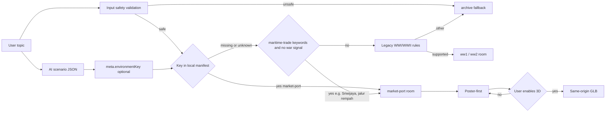

# Market-Port Environment Implementation Plan
> For agentic workers: inline plan execution with per-task checkpoints. Steps use checkbox syntax.
**Goal:** Add `market-port`, an open-air maritime trading port, as the fifth authored dimensional room so Indonesian maritime-history topics get a real visual and the catalogue gains its first outdoor setting.
**Architecture:** Extend the local catalogue with no new dependencies or endpoints. `market-port` joins `HISTORY_ENVIRONMENT_KEYS` and `roomManifest`; the renderer honors it exactly like `kingdom-court` via the validated `environmentKey` hint, plus a new conservative maritime-trade keyword rule in `resolveRoom.js`. Assets stay same-origin procedural `.blend` to `.glb`/`.webp` with provenance. AI output never selects file paths.
**Tech Stack:** Three.js + React Three Fiber (renderer), Bun/Vite (web), Blender 4.5.4 + `scripts/export-history-assets.py`, Playwright Chromium (e2e).
**Active Project Profile:** Repository root `/home/belajarcarabelajar/time-capsule`, branch `main`, base revision `0fdd33f`. Toolchain Bun + Vite + Turbo; test runner `bun test`; e2e Playwright Chromium; ESLint. Configuration sources: `package.json`, `turbo.json`, `apps/web/package.json`, `scripts/export-history-assets.py`, `assets/history/provenance.json`, `docs/history-environments.md`, `docs/code-plan/specs/2026-09-07-ai-routed-historical-environments-design.md`.
**Project Commands:**
- `rtk bun test apps/web/src/immersive/__tests__/resolveRoom.test.js apps/web/src/immersive/__tests__/roomManifest.test.js apps/web/src/immersive/__tests__/roomAssets.test.js`
- `rtk bun test packages/game-engine/tests/geminiClient.test.js`
- `rtk bun scripts/verify-history-assets.mjs market-port`
- `PATH=/usr/bin:/bin:$PATH rtk bun run test:immersive -- --project=chromium`
- `rtk bun run lint` (inside `apps/web`)
- `env -u PYTHONUNBUFFERED -u PYTHONUTF8 -u PYTHONDONTWRITEBYTECODE PATH=/usr/bin:/bin blender --background --python scripts/export-history-assets.py -- --root . --room market-port`
**Protected Boundaries:** Exact-order key assertions in `packages/game-engine/tests/geminiClient.test.js:18-21` and `roomManifest.test.js:5`; asset budgets (GLB ≤ 4 MiB, poster ≤ 250 KiB, < 100,000 triangles, ≤ 60 draw primitives, editable `.blend`, sha256 checksums); conservative resolver (unsafe/conflicting/incompatible inputs and unknown keys stay `archive`); AI never returns a URL or path.
**Spec:** `docs/code-plan/specs/2026-09-07-market-port-environment-design.md`
**Scope:** room manifest + keys + resolver + prompt advertise list (auto via template) + Blender authoring branch + asset generation + provenance + unit/e2e tests + `docs/history-environments.md`.
**Non-Goals:** no `war-front`/`urban-poor`/`rural-village`, no runtime baked AO, no audio, no new dependency/endpoint/deploy, no source-citation backfill.
**Visual Map:**

**Reasoning Lenses:** Intent & Scope, Investigative & Evidence, Computational, Creative & Convergent, Systems & Contract, Behavioral & Test-First, Evidence & Reflection.
**Acceptance Criteria:**
- AC-1: `market-port` in `HISTORY_ENVIRONMENT_KEYS` and the system-prompt advertise list.
- AC-2: Manifest entry with valid `/history/market-port/*` URLs, camera, 3 unique objects, scopeLabel.
- AC-3: `environmentKey:"market-port"` selects market-port; unknown key and unsafe input stay `archive`.
- AC-4: Maritime keywords (Sriwijaya, jalur rempah, Sunda Kelapa, pelabuhan, maritim, VOC) with no war signal select market-port; war/mixed/incompatible stay `archive`.
- AC-5: Assets pass budgets, provenance, and checksums; editable `.blend` present.
- AC-6: Chromium renders the GLB, inspection works, exactly 2 gemini calls, 0 fallback.
- AC-7: `docs/history-environments.md` and provenance updated.
- AC-8: Existing 4 rooms and resolver rows remain green.
**Traceability:**
| AC | Task | Test/Check | Evidence |
|---|---|---|---|
| AC-1 | T1 | geminiClient.test | pass, prompt contains key |
| AC-2 | T2 | roomManifest.test | pass |
| AC-3 | T2/T3 | resolveRoom.test | pass |
| AC-4 | T3 | resolveRoom.test | pass |
| AC-5 | T4 | roomAssets.test + verify-history-assets.mjs | exit 0 |
| AC-6 | T5 | immersive.spec.js | 6 rows pass |
| AC-7 | T6 | doc diff | reviewed |
| AC-8 | T3-T6 | full focused suite | 0 failures |
**Assumptions & Open Questions:** Blender 4.5.4 available via verified WSL invocation. Playwright Chromium verified locally; WebKit remains environment-blocked (recorded, not in scope). The keyword path stays conservative; generic commerce words rely on `environmentKey`. The e2e fixture `mockHistoryApi` accepts arbitrary `environmentKey` (confirmed by the kingdom-court row).
**Dependencies & Impact:** `export-history-assets.py --room` choices array, `provenance.json`, `roomAssets.test.js`, `roomManifest.test.js`, `geminiClient.test.js`, `immersive.spec.js`. No DB/API/contract consumers beyond these.
**Risks & Rollback:** GLB budget overrun (clamp geometry and re-export); resolver misorder regression (full resolveRoom.test.js row pass gates T3); Blender authoring is the highest-effort step (verify before e2e). Rollback = omit market-port; feature-off rebuild path unchanged.
**Security & Compatibility:** No new input boundary; keyword regex runs on normalized text ≤ 500 chars; environmentKey validated against local manifest; same-origin asset URLs. Old responses without the key remain valid.
**Operations & Rollout:** Local only; no deploy. Post-change verification = full focused suite + e2e Chromium + asset verification.
**CI/Review Gate:** ESLint on changed JS/JSX; targeted unit suites; Chromium e2e; verify-history-assets.
**Documentation:** `docs/history-environments.md` runtime table + authored-assets list; checkpoint file.
**Definition of Done:** AC-1..AC-8 evidenced; fresh log/exit-0 per check; diff review only intended files; docs updated; no em dashes or buzzwords in user-visible copy.
**Plan Status & Version:** Approved v1, 2026-09-07.
**Reproducibility:** Blender 4.5.4 LTS; Bun lockfile unchanged; commands reproduce from repo root on this WSL host.
**Test Reliability:** Deterministic fixtures; no clock/network in unit tests; e2e blocks provider domains via mock fixture.
**Privacy & Data Governance:** No data collection; no PII; no retention changes.
**Dependencies & Supply Chain:** No new dependencies; lockfile unchanged; no license impact.
**UX States:** Poster-first fallback, reduced motion, save-data, static preference, failed model load, keyboard exploration, lesson controls all retain current behavior.
**Verification:** Per-task RED/GREEN with fresh logs; final full focused suite; Chromium e2e; asset verification.

## Global Constraints
- Exactly 3 inspection objects per room; unique ids; label > 3 chars; description > 40 chars.
- Same-origin local media only; never a remote or AI-selected URL.
- Indonesian-first copy; every object description marks the scene as illustration, never an authentic artifact.
- No em dashes in user-visible copy; no AI-marketing vocabulary.
- Mobile-first: 44px targets, zero horizontal overflow, keyboard focus preserved.

## Task 1: Game-engine environment keys
**Files:**
- Modify: packages/game-engine/src/historyEnvironmentKeys.js
- Modify: packages/game-engine/tests/geminiClient.test.js:18-21
**Interfaces:** Produces key `"market-port"` appended last; consumed by the systemPrompt.js template and the geminiClient test.
**Behavior & Acceptance:** AC-1; the allowed-keys array and the prompt advertise list contain `market-port`.
**Edge Cases & Failure Behavior:** Order must match the manifest order convention; appending last keeps existing keys stable.
**Deliberate Shortcuts & Deferrals:** None.
**Dependencies & Risks:** None.
**Review & Evidence:** geminiClient test passes; prompt contains `market-port`.
**Test Data & Determinism:** Static array; no external state.
- [ ] Step 1: Write failing test [extend expected array with `"market-port"`]
- [ ] Step 2: Run, verify fail [rtk bun test packages/game-engine/tests/geminiClient.test.js]
- [ ] Step 3: Write minimal implementation [append key to HISTORY_ENVIRONMENT_KEYS]
- [ ] Step 4: Run, verify pass [same command]
- [ ] Step 5: Commit [git add packages/game-engine && git commit -m "feat(game-engine): register market-port environment key"]

## Task 2: Web room manifest entry
**Files:**
- Modify: apps/web/src/immersive/rooms.js
- Modify: apps/web/src/immersive/__tests__/roomManifest.test.js:5,20-25
**Interfaces:** Consumes AC-1 key; produces `roomManifest["market-port"]` with objects `dock`, `market-stall`, `cargo`; camera `{ position: [9,5,13], target: [0,1.5,-2], yawLimit: 0.5, pitchLimit: 0.22 }`.
**Behavior & Acceptance:** AC-2; manifest contract checks pass for market-port.
**Edge Cases & Failure Behavior:** Missing or duplicated object ids fail the manifest test.
**Deliberate Shortcuts & Deferrals:** None.
**Dependencies & Risks:** Must land after T1 key (resolver uses manifest, not keys).
**Review & Evidence:** roomManifest test passes.
**Test Data & Determinism:** Static manifest; deterministic.
- [ ] Step 1: Write failing test [extend key array + market-port object-id assertion]
- [ ] Step 2: Run, verify fail [rtk bun test apps/web/src/immersive/__tests__/roomManifest.test.js]
- [ ] Step 3: Write minimal implementation [rooms.js market-port entry with copy]
- [ ] Step 4: Run, verify pass [same command]
- [ ] Step 5: Commit [git add apps/web/src/immersive && git commit -m "feat(web): add market-port room manifest"]

## Task 3: Conservative resolver keyword path
**Files:**
- Modify: apps/web/src/immersive/resolveRoom.js
- Modify: apps/web/src/immersive/__tests__/resolveRoom.test.js
**Interfaces:** Consumes roomManifest; produces `{ roomId: "market-port", reason: "maritime-trade" }` from `marketPort` predicate checked before the incompatible fallback, guarded by `!first && !second`.
**Behavior & Acceptance:** AC-3, AC-4; existing rows unchanged.
**Edge Cases & Failure Behavior:** War signals, incompatible contexts, and mixed era inputs stay `archive`.
**Deliberate Shortcuts & Deferrals:** None.
**Dependencies & Risks:** Predicate ordering is critical; full-row pass gates this task.
**Review & Evidence:** resolveRoom test passes in full.
**Test Data & Determinism:** Static table; deterministic.
- [ ] Step 1: Write failing test [add market-port rows + environmentKey honored test]
- [ ] Step 2: Run, verify fail [rtk bun test apps/web/src/immersive/__tests__/resolveRoom.test.js]
- [ ] Step 3: Write minimal implementation [marketPort regex + guarded branch]
- [ ] Step 4: Run, verify pass [same command]
- [ ] Step 5: Commit [git add apps/web/src/immersive && git commit -m "feat(web): route maritime-trade contexts to market-port"]

## Task 4: Asset authoring, generation, provenance
**Files:**
- Modify: scripts/export-history-assets.py (choices + scene branch)
- Modify: assets/history/provenance.json
- Modify: apps/web/src/immersive/__tests__/roomAssets.test.js (loop)
- Generate: assets/history/source/market-port.blend; apps/web/public/history/market-port/{room.glb,poster.webp,export-report.json}
**Interfaces:** Scene branch under `args.room == "market-port"`; three named inspection node groups (`dock`, `market-stall`, `cargo`); provenance record matching the manifest.
**Behavior & Acceptance:** AC-5.
**Edge Cases & Failure Behavior:** Budget overruns, checksum mismatches, or missing source fail verification.
**Deliberate Shortcuts & Deferrals:** Blender scene authoring is visual/generated work; TDD exception with verification = asset budgets + screenshot + e2e. `ponytail: no baked AO, upgrade-trigger = realism acceptance pending in three-rooms checkpoint`.
**Dependencies & Risks:** Highest-effort task; verify assets before e2e.
**Review & Evidence:** roomAssets test pass; verify-history-assets.mjs exit 0 for market-port.
**Test Data & Determinism:** Fixed seed 1941 in authoring script; deterministic output.
- [ ] Step 1: Write failing test [add market-port to roomAssets loop]
- [ ] Step 2: Run, verify fail [missing market-port assets]
- [ ] Step 3: Write minimal implementation [scene branch: pier, 3 stalls, moored ship, cargo, water]
- [ ] Step 4: Generate assets [blender export command]
- [ ] Step 5: Update provenance.json
- [ ] Step 6: Run, verify pass [roomAssets + verify-history-assets market-port]
- [ ] Step 7: Commit [feat(web): author market-port room assets]

## Task 5: Browser e2e row
**Files:**
- Modify: apps/web/e2e/immersive.spec.js (loop row `["Sriwijaya","Palembang, Sumatra","market-port","Dermaga","market-port"]`)
**Interfaces:** Consumes the mocked history API fixture with the market-port key.
**Behavior & Acceptance:** AC-6.
**Edge Cases & Failure Behavior:** Render-state timeout, fallback calls, or extra gemini calls fail the row.
**Deliberate Shortcuts & Deferrals:** None.
**Dependencies & Risks:** Requires T4 assets present and served by the dev server.
**Review & Evidence:** Chromium suite passes all 6 rows.
**Test Data & Determinism:** Fixture-based; no provider network.
- [ ] Step 1: Write the row [mirror kingdom-court row for market-port]
- [ ] Step 2: Run, verify pass [test:immersive Chromium]
- [ ] Step 3: Commit [test(e2e): cover market-port rendering and inspection]

## Task 6: Docs, lint, final verification
**Files:**
- Modify: docs/history-environments.md
- Create: docs/code-plan/checkpoints/2026-09-07-market-port.md
**Interfaces:** Documentation reflects the fifth room in table + authored-assets list.
**Behavior & Acceptance:** AC-7, AC-8.
**Edge Cases & Failure Behavior:** Em-dash scan hits block completion; any pre-existing lint error in changed files must be reported.
**Deliberate Shortcuts & Deferrals:** None.
**Dependencies & Risks:** Needs all prior tasks green.
**Review & Evidence:** Lint exit 0; full focused suite pass; checkpoint with AC-1..AC-8 evidence mapping.
**Test Data & Determinism:** N/A documentation; deterministic checks.
- [ ] Step 1: Update docs/history-environments.md
- [ ] Step 2: Lint changed files + em-dash scan
- [ ] Step 3: Full focused suite + asset verification
- [ ] Step 4: Diff review, write checkpoint, commit [docs: document market-port environment]

## Plan lifecycle
Status: Approved. Decisions: market-port selected over rural-village and urban-poor; conservative keyword predicate (strong maritime signals only); generic commerce words covered by environmentKey. Superseded: none.
