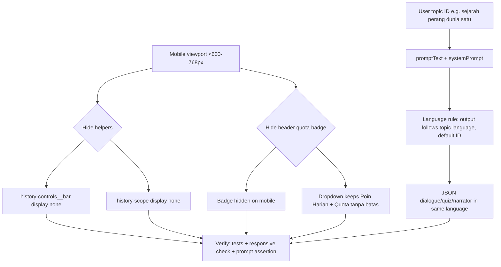

# Mobile Text, Quota Placement, Language Lock Implementation Plan
> For agentic workers: REQUIRED EXECUTION METHOD — delegated task execution (recommended) or inline plan execution. Steps use checkbox syntax.
**Goal:** Fix mobile crowding, relocate quota status to profile on mobile, and lock output language with minimal tokens.
**Architecture:** CSS-only desktop gating for immersive helpers, responsive hiding of the header quota badge with full retention in the profile dropdown, and a one-line language rule in the shared system prompt.
**Tech Stack:** React (apps/web), Tailwind + immersive.css, @time-capsule/game-engine systemPrompt.js, Cloudflare Pages Functions proxy.
**Active Project Profile:** root `/home/belajarcarabelajar/time-capsule`, targets `apps/web` + `packages/game-engine` + `functions/api/scenario.js`; toolchain bun 1.4.2, turbo, vitest/bun:test, wrangler; config sources `package.json`, `turbo.json`, `apps/web/src/immersive/*`, `packages/game-engine/src/systemPrompt.js`; revision: current worktree (uncommitted plan only).
**Project Commands:** `bun run test` (turbo), `bun run test:backend` (`bun test functions/api`), `bun run lint` (`turbo lint`), scoped: `bun test apps/web/src/components/__tests__/UserBar.test.jsx`, `bun test packages/game-engine/tests/scenarioClient.test.js`.
**Protected Boundaries:** Do not change quota accounting (`functions/api/_ai_utils.js`, D1 ledger/debit), auth policy (`functions/api/auth/me.js`, admin unlimited rule), scenario JSON schema (zod), 3D room manifest contracts; no secrets in diff; no full-file rewrites.
**Spec:** This plan (user request 2026-09-07: 3 issues + concise prompt constraint). Image `pasted_a44339e9dba04745b1c48fae18dc9c82.png` in `C:\Temp\snipset_files\` was unreadable from WSL (returned unrelated selector UI); findings below are code-verified instead.
**Scope:** (1) Desktop-only `Jelajahi ruang` / `Gunakan gambar` bar and `history-scope` label on mobile; (2) Quota badge hidden in mobile header, always visible in profile dropdown with limited vs unlimited states; (3) Minimal language-lock line in system prompt.
**Non-Goals:** Redesign of header layout, new quota API, per-language UI localization, 3D room content changes, provider/model switch, prompt rewrite beyond 1-2 lines.
**Visual Map:**

**Reasoning Lenses:** Intent and Scope (3 acceptance criteria, mobile-first), Investigative (verified EnvironmentControls.jsx:10-12, HistoricalEnvironment.jsx:146, rooms.js scopeLabel, UserBar.jsx:62-65/87-90, systemPrompt.js:5-62 + scenarioClient.js:159-160), User-Centered and Accessible (44px targets preserved, focus visible, zero horizontal overflow), Computational (language rule as invariant on topic language), Behavioral and Test-First (RED tests per task), Evidence and Reflection (fresh test logs before completion claim).
**Acceptance Criteria:**
- AC-1 (mobile text): On viewport <=600px the `Jelajahi ruang` / `Gunakan gambar` bar and `Ruang imajinatif untuk menjelajahi sejarah` (and all `scopeLabel`) are not visible; on >=768px they render unchanged.
- AC-2 (quota): On mobile header only avatar/name button shows; tapping it reveals quota (`12/50 Poin` or `Quota tanpa batas` for admin or `Saldo belum tersedia`); on desktop header badge remains visible.
- AC-3 (language): Topic `sejarah perang dunia satu` yields Indonesian JSON script; prompt diff adds <=30 tokens and existing schema tests still pass.
**Traceability:** AC-1 -> Task 1 -> CSS/responsive check + visual verify; AC-2 -> Task 2 -> UserBar dropdown test + responsive check; AC-3 -> Task 3 -> prompt assertion test + scenarioClient test suite.
**Assumptions & Open Questions:** Assumed image shows GameplayHeader crowding (location pill + quota badge + exit) overlapping history-controls on a 360-390px viewport; code confirms overlap vectors. Assumed Indonesian is the default (whole UI is ID). Open: (a) confirm target breakpoint 600px (immersive.css) vs 768px (Tailwind md) — plan uses 600px media + `md:` consistent with GameplayHeader; (b) confirm admin unlimited label stays `Quota tanpa batas` inside dropdown — yes per UserBar.test.jsx:49-57.
**Dependencies & Impact:** Task 1 touches `immersive.css` only, consumed by HistoricalEnvironment/EnvironmentControls; Task 2 touches `UserBar.jsx` (+ test), consumed by StartScreen.jsx:28-30 and GameplayHeader.jsx:22-24; Task 3 touches `systemPrompt.js`, consumed by `scenarioClient.js:159` and proxied via `functions/api/scenario.js:71`. No migration, no API change.
**Risks & Rollback:** Risk: hiding controls removes mobile access to explore mode — mitigated by keeping a single compact entry point (see Task 1 decision). Risk: hiding badge hides quota exhaustion signal — mitigated because dropdown retains it and generation errors still surface. Rollback: revert single CSS block / single class / single prompt line; no data effects.
**Security & Compatibility:** No auth/quota logic change; avatar URL guard (`isSafeImageUrl`) untouched; JSON schema unchanged so provider contract compatible; no new network surface.
**Operations & Rollout:** No deploy change; static frontend + prompt string; post-deploy check is manual responsive pass + one ID generation smoke test.
**CI/Review Gate:** `bun test apps/web` scoped + `bun run test:backend` for touched surfaces; `turbo lint`; self-review diff (no peer available); block on any failure.
**Documentation:** No docs update needed (behavior restores intended design); plan file itself is the record.
**Definition of Done:** AC-1..AC-3 evidenced by fresh test output exit 0, diff review (only approved files), lint clean on touched packages, no `—` in user-visible copy, temp artifacts removed.
**Plan Status & Version:** Draft v1, 2026-09-07, awaiting explicit approval. HARD GATE: no implementation until yes.
**Reproducibility:** bun 1.4.2, repo as-is; commands in Verification; fixtures: 360x740 mobile viewport, admin vs regular user objects, topic `sejarah perang dunia satu`.
**Test Reliability:** Deterministic happy-dom + bun:test; no clocks/network (fetch mocked); cleanup per test; bounded retry only on transient infra.
**Privacy & Data Governance:** No personal data change; quota values already exposed to own session only; no logging of prompts beyond existing 500-char snippet server-side.
**Dependencies & Supply Chain:** No new dependencies, no lockfile change.
**UX States:** Loading (`Memuat...`), empty/guest (login button unchanged), error (quota unavailable shows honest `Saldo belum tersedia`, never invented 50), keyboard (focus-visible retained, Esc closes), responsive (360px, 768px, 1280px), localization (ID strings unchanged).
**Verification:** See per-task Review & Evidence + global: `bun test <touched files>`, `bun run test:backend`, `bun run lint`, `git status --short && git diff --stat`.
## Global Constraints
- Prompt addition <=30 tokens, Indonesian-first, no token-heavy examples.
- Mobile: zero horizontal overflow, 44px min tap targets preserved.
- Never invent quota balance; keep `Saldo belum tersedia` honesty rule.
- No em dashes in user-visible copy.

### Task 1: Desktop-only immersive helpers on mobile
**Files:**
- Modify: `apps/web/src/immersive/immersive.css:23-29` (extend existing `@media (max-width: 600px)` block)
- Test: manual responsive check + existing `apps/web/src/immersive/__tests__/*` regression (no new unit needed; CSS-only). Add `data-testid` only if reviewer demands a DOM assertion, else `None`.
**Interfaces:**
- Consumes: `.history-controls__bar`, `.history-scope` rendered by `HistoricalEnvironment.jsx:146-153`.
- Produces: same DOM, hidden on mobile, visible on desktop. No JS API change.
**Behavior & Acceptance:**
- AC-1: <=600px hides `.history-controls__bar` and `.history-scope`; >=768px unchanged. Explore entry remains reachable via one compact control (decision: keep `Jelajahi ruang` accessible through a single icon-sized toggle OR hide full bar and rely on tap-to-read flow — exact choice confirmed at approval gate; default is hide bar + scope text, keep inspection reachable when `exploring=true` via JS class override).
**Edge Cases & Failure Behavior:**
- Start screen (`is-start`) bottom bar must not overlap the `Mulai Petualangan` form on 360px; gameplay arrival banner (`.history-arrival`) must not cover location pill; reduced-motion media query stays intact; landscape 600px height keeps inspection `max-height 35dvh`.
**Deliberate Shortcuts & Deferrals:**
- None (pure CSS; `defer: none`).
**Dependencies & Risks:**
- Risk of removing mobile explore affordance; decision at gate picks hide-vs-collapse. Rollback is one CSS block revert.
**Review & Evidence:**
- Review `git diff apps/web/src/immersive/immersive.css`; evidence: 360px and 1280px screenshots (or Playwright viewport log) + `bun test apps/web/src/immersive` pass.
**Reasoning Output:**
- Systems lens: presentation-only change, no state/lifecycle impact; user-centered lens: declutters top region where GameplayHeader already occupies `top-0` full width.
**Test Data & Determinism:**
- Fixture: `archive` room scopeLabel `Ruang imajinatif untuk menjelajahi sejarah`; deterministic CSS, no flake.
- [ ] Step 1: Write failing check (responsive assertion or visual checklist noting bar/scope visible on 360px) [checklist + screenshot]
- [ ] Step 2: Run — verify fail (screenshot shows crowding) [manual evidence]
- [ ] Step 3: Write minimal CSS (hide bar + scope under 600px, keep desktop rules untouched) [code]
- [ ] Step 4: Run — verify pass (360px clean, 1280px unchanged; `bun test apps/web/src/immersive` exit 0) [command + output]
- [ ] Step 5: Commit [git add + commit, only after plan approval]

### Task 2: Quota badge into profile dropdown on mobile
**Files:**
- Modify: `apps/web/src/components/UserBar.jsx:60-65` (badge wrapper gets responsive hide, e.g. `hidden md:flex`)
- Test: `apps/web/src/components/__tests__/UserBar.test.jsx` (extend: badge hidden class present on mobile query; dropdown still exposes `balanceLabel` for regular, admin, unavailable states)
**Interfaces:**
- Consumes: `user { points, maxPoints, pointsAvailable, unlimitedQuota }` from `AuthContext`.
- Produces: identical dropdown content (`Poin Harian: <balanceLabel>` at UserBar.jsx:87-90) plus responsive badge visibility. No prop change.
**Behavior & Acceptance:**
- AC-2: mobile header shows only avatar/name (+ exit in gameplay); quota readable after opening profile; admin sees `Quota tanpa batas`; regular sees `N/M Poin`; broken state sees `Saldo belum tersedia`.
**Edge Cases & Failure Behavior:**
- Guest (no user) unchanged login button; long names truncate (`max-w-[120px]`); dropdown `z-50` above canvas; outside-click close retained; badge must not wrap onto second row at 360px once hidden.
**Deliberate Shortcuts & Deferrals:**
- None.
**Dependencies & Risks:**
- Depends on existing dropdown (already ships balance); risk is users missing quota — accepted because header space is exhausted and errors still surface at generation time.
**Review & Evidence:**
- Review diff limited to `UserBar.jsx` + test; evidence: `bun test apps/web/src/components/__tests__/UserBar.test.jsx` exit 0 + 360px header screenshot.
**Reasoning Output:**
- Analytical lens: moves low-urgency status (quota) out of high-contention header slot; preserves trust boundary (own quota only).
**Test Data & Determinism:**
- Fixtures: `{points:12,maxPoints:50}`, `{unlimitedQuota:true}`, `{points:null,pointsAvailable:false}`; isolated, no network.
- [ ] Step 1: Write failing test (badge carries mobile-hide class; dropdown contains balanceLabel per fixture) [code]
- [ ] Step 2: Run — verify fail [bun test UserBar.test.jsx + expected fail output]
- [ ] Step 3: Write minimal implementation (one responsive class on badge div) [code]
- [ ] Step 4: Run — verify pass [bun test exit 0, no regressions]
- [ ] Step 5: Commit [git commands]

### Task 3: Concise language lock in system prompt
**Files:**
- Modify: `packages/game-engine/src/systemPrompt.js:58-62` (append 1-2 line rule inside `ATURAN` area) and optionally `packages/game-engine/src/scenarioClient.js:159-160` (translate trailing English JSON-only instruction to Indonesian, same meaning, ~same tokens)
- Test: `packages/game-engine/tests/scenarioClient.test.js` (add: prompt contains language rule; mocked fetch captures system content and asserts rule present; existing schema tests unchanged)
**Interfaces:**
- Consumes: `cleanTopic` language signal in `promptText` (`TOPIK UTAMA: ...`).
- Produces: same JSON shape; all human-readable string values follow topic language (default Indonesian).
**Behavior & Acceptance:**
- AC-3: `sejarah perang dunia satu` returns Indonesian `script.text`/`choices`/`narrator`; added tokens <=30; `max_tokens:3000` and TPM budget untouched.
**Edge Cases & Failure Behavior:**
- Mixed-language topic follows topic language, not forced ID; proper nouns (e.g. `Gavrilo Princip`) stay untranslated; JSON keys/values `environmentKey`, `themeColor`, `bg` stay English enums; rule must not inflate output or break JSON parsing.
**Deliberate Shortcuts & Deferrals:**
- Single-sentence rule over per-field language tags or post-generation translation (deferred: `defer: translation pass, trigger = recurring wrong-language output after rule lands`).
**Dependencies & Risks:**
- Risk: weak model still drifts to English — accepted; rule is cheapest lever within TPM budget. No schema/accounting impact.
**Review & Evidence:**
- Review `git diff packages/game-engine/src/systemPrompt.js packages/game-engine/src/scenarioClient.js`; evidence: `bun test packages/game-engine` exit 0 + prompt-content assertion + token-count note (`wc`/length before-after).
**Reasoning Output:**
- Computational lens: invariant `outputLang = topicLang ?? id`; cheapest enforcement is one-line system constraint, not examples. Proposed rule text (final wording at implementation): `Seluruh teks JSON WAJIB ikut bahasa TOPIK UTAMA (default Bahasa Indonesia).`
- Token note: ~14 tokens, replaces nothing, keeps `SCENARIO_SYSTEM_PROMPT` under TPM budget.
**Test Data & Determinism:**
- Fixture topic `sejarah perang dunia satu`; mocked `/api/scenario` captures `messages[0].content`; deterministic string assertion.
- [ ] Step 1: Write failing test (system prompt contains language rule; request body carries it) [code]
- [ ] Step 2: Run — verify fail [bun test scenarioClient + expected fail]
- [ ] Step 3: Write minimal implementation (1-line rule + ID translation of JSON-only instruction) [code]
- [ ] Step 4: Run — verify pass [bun test packages/game-engine exit 0 + token delta note]
- [ ] Step 5: Commit [git commands]
