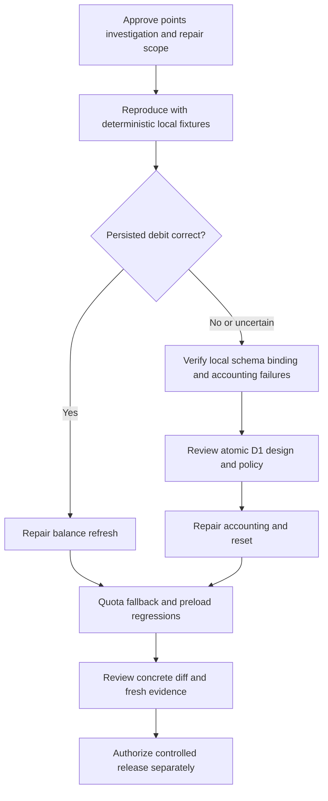

**Points Integrity: separate implementation plan**

Status: In progress v3, 2026-09-07. Local accounting and refresh repairs implemented with focused passing tests. See [latest checkpoint](../checkpoints/2026-09-07-three-rooms.md) for completed work and remaining integration proof. No production data mutation, commit, or release requested. Repository: `/home/belajarcarabelajar/time-capsule`, revision `49741be`.

Goal: establish whether the reported unchanged points are a display problem, persistence failure, or both, then repair the smallest proven causes without changing the learning flow.

Planning authority: `/home/belajarcarabelajar/.config/ai/Super Ultra Code Plan Implementation.md`. Follow reproduce → trace → RED → minimal fix → GREEN → focused regression. The main visual plan contains the verified project profile and baseline commands.

**Evidence and competing hypotheses**

| ID | Finding / hypothesis | Source evidence | Confidence / estimated severity |
| --- | --- | --- | --- |
| P1 | Visible balance remains stale even after a successful debit | `_ai_utils.js:119-120` attaches `user_points`; `geminiClient.js:261-263,363-369` returns parsed story only; `AuthContext.jsx:42` checks at mount; `UserBar.jsx:55` displays cached user points | High source confidence / medium |
| P2 | Missing D1, missing user row, or read error silently allows generation with default 50 | `_ai_utils.js:7-10,18,61-69`; `/auth/me` also defaults to 50 at `me.js:34-63` | High source confidence / high; live occurrence unverified |
| P3 | Concurrent generations can lose debits | `_ai_utils.js:86-89` writes stale `currentPoints - cost` as an absolute balance | High / high |
| P4 | Debit, ledger, story can partially commit; failures still yield provider success | `_ai_utils.js:87-117,123-130`; `gemini.js:106` | High / high |
| P5 | Reading the first chapter can already pay for the next one | `useGameState.js:46-51,89`; preload uses the normal generation path | High / medium policy consequence, not automatically a bug |
| P6 | Concurrent daily reset and debit can overwrite newer balances | `_ai_utils.js:23-38`, `auth/me.js:50-56` | High / medium |
| P7 | Empty/malformed Gemini 401/403 can fall through to fallback | `geminiClient.js:265-280` only throws when parsed message/error exists | High / medium |
| P8 | Legacy user IDs may not match ledger FK identity | `schema.sql:49,63` reference users.id; `_ai_utils.js:97,111` uses JWT sub; new callback users intentionally use matching IDs | Low confidence of actual legacy mismatch / medium if present; audit only |
| P9 | Existing tests intentionally preserve fail-open behavior | `functions/api/gemini.test.js:19-60`, `functions/api/auth/me.test.js` error/default tests | High / medium coverage gap |
| P10 | Local Vite bypasses accounting entirely | `apps/web/vite.config.js:33-53` forwards to providers directly | High / high diagnostic risk |

Baseline: targeted backend tests pass 18/18; client parser tests 14/14; AuthContext 8/8 and UserBar 8/8. These establish current behavior, not accounting correctness. No production D1 values, bindings, logs, or paid generation were accessed. Do not call any hypothesis the confirmed production root cause yet.

**Protected policy and assumptions for review**

- Preserve 10 points per successful provider generation, current 50-point default/daily allowance, UTC daily reset, existing authentication, and current automatic preload timing. Respect per-user `max_points`; do not hard-code reset to 50 for all users.
- A successful preload is chargeable under current code; consuming its cached chapter must not charge again. A policy of charging only when a user opens a chapter is a separate product change.
- Keep the existing validated story object and AI prompts unchanged. API accounting metadata stays outside the AI story schema.
- Do not silently add cancellation/retry deduplication or change unusable-provider-response charging policy. Reproductions must reveal those consequences; a larger consistency change needs an updated reviewed plan before code.
- Fail-closed accounting is a deliberate proposed behavior repair: chargeable generation returns a controlled unavailable response if quota cannot be established. Authentication itself remains usable.

**Decision and dependency map**

**P-T1: reproduce and discriminate display versus persistence**

Files: create `functions/api/_ai_utils.test.js`, `apps/web/src/context/__tests__/PointsRefresh.test.jsx`; extend `packages/game-engine/src/__tests__/geminiClient.test.js`. Use current-project local D1-compatible fixtures; do not read neighboring credentials.

- [ ] Write failing tests with a user at 50, successful primary response, and persisted debit at 40: `expect(screen.getByText(/40/)).toBeTruthy()` after generation. Include fallback and preload completion. Run `rtk bun test apps/web/src/context/__tests__/PointsRefresh.test.jsx` and record the actual assertion failure.
- [ ] Use SQL-backed local tests with distinct `users.id`/`google_id` and two controlled concurrent completions; assert two successful generations from 50 yield 30 and two ledger/story records. Run `rtk bun test functions/api/_ai_utils.test.js`; expected existing-code failures must identify the relevant causes.
- [ ] Add missing DB, missing row, DB read/write failure, UTC reset, and ledger/story failure injection. Mock provider calls; record database state before/after without personal data. Do not mistake an in-memory mock for proof of D1 transaction semantics.
- [ ] Record whether display, persistence, or both fail. Live attribution remains unknown until current-project binding/schema/log evidence is available. Do not require live production requests to fix a deterministic local reproduction.

**P-T2: synchronize displayed balance without changing story contracts**

Files: modify `apps/web/src/hooks/useGameState.js:7,46-57,75-89,136-148`, `apps/web/src/context/AuthContext.jsx:10-25`; extend existing hook/context tests and `PointsRefresh.test.jsx`.

Recommended narrow interface: continue using `checkSession()` after successful generation, including background preload, instead of appending fields to parsed story data. Make refresh latest-request-wins within AuthContext so an older response cannot overwrite a newer balance. Do not log out the user merely because an accounting refresh temporarily fails; initial auth check and post-generation refresh need distinct error behavior.

- [ ] Add RED cases for out-of-order refresh, logged-out completion, temporary refresh failure, and a cached chapter consumed without another debit. Run the named context test file, verify failure.
- [ ] Implement generation-triggered refresh and monotonic request ordering. Do not use `Math.min` on balances: legitimate daily reset can increase them. Return/display unavailable state honestly on confirmed quota-read failure after P-T3, without inventing 50.
- [ ] Run `rtk bun test apps/web/src/context/__tests__/PointsRefresh.test.jsx && rtk bun test apps/web/src/hooks/__tests__/useGameState.test.jsx && rtk bun test apps/web/src/components/__tests__/UserBar.test.jsx`.
- [ ] Review primary, fallback, preload, return-home, logout, and midnight behavior. Commit only with explicit authorization and the required sole author.

Tradeoff: one extra session read per completed generation uses existing contracts. `ponytail: use session refresh for this repair; replace with versioned accounting metadata only if measured request overhead or cross-tab staleness warrants a separately reviewed interface`.

**P-T3: conditional accounting/reset repair after local evidence**

Files: modify `functions/api/_ai_utils.js`, `functions/api/auth/me.js`, `functions/api/gemini.js`, `functions/api/ai.js`, and their existing tests. New local accounting fixture: `functions/api/test-support/pointsDb.js`. `schema.sql` and migrations are not authorized automatically.

Consumes the P-T1 failures. Produces consistent quota checks, guarded debits, resets, ledger/story writes, and controlled unavailable responses. The exact transaction design is a required pre-code checkpoint because D1 semantics and actual schema/binding have not been verified in this planning session.

- [ ] Check current official D1 batch/transaction/affected-row semantics through context-mode documentation tools. Rehearse them with local D1; a generic SQLite transaction test alone is insufficient. Record the concrete SQL, rollback behavior, user identity lookup, and affected-row contract in this plan before implementing.
- [ ] Require atomic guarded decrement (`points >= cost`) plus ledger/story consistency; reject stale absolute assignments. A failed guard must produce no ledger/story success. A D1 batch that merely executes statements without gating later inserts on successful debit is insufficient.
- [ ] Require reset conditional on stored reset date and preserve a racing debit; reset and debit cannot blindly overwrite one another. Centralize this shared policy for both `/auth/me` and generation after reproducing the sibling failure.
- [ ] Write RED consistency cases: from 50 two successes -> 30; from 10 at most one chargeable success; injected ledger/story failures leave no partial commit; concurrent reset happens once; no DB/row/read fails closed; authorization rejection occurs before provider request where possible.
- [ ] Decide and document how a provider-success/accounting-failure is returned without causing an unintended second generation through fallback. If request reservation/idempotency or schema changes are necessary, stop this subtask and expand the reviewed plan with exact migration/backfill/rollback before writing code. Do not claim exact-once charging without that proof.
- [ ] Implement only the proven design. Run `rtk bun test functions/api/_ai_utils.test.js` followed by the three baseline backend test files. Intentionally replace permissive tests with explicit approved fail-closed expectations.

Risk: changing quota failure behavior can reveal production binding errors as service unavailability. Verify project binding/schema before release and monitor controlled errors. Do not use fake credentials or remove foreign keys to make a test pass. No deliberate shortcut.

**P-T4: fallback status guard and integration verification**

Files: modify `packages/game-engine/src/geminiClient.js:265-280`; extend its existing tests. Reuse P-T1 local fixtures.

- [ ] Add RED tests for empty, malformed JSON, and message-free 401/403 bodies. Example: `expect(fetch.mock.calls.filter(([url]) => url === '/api/ai')).toHaveLength(0)`. Verify failure using `rtk bun test packages/game-engine/src/__tests__/geminiClient.test.js`.
- [ ] Make authorization/quota status terminal regardless of error-body parsing, preserving readable fallback messages. Handle any new accounting-unavailable status according to P-T3's approved contract. Run the same file, expect pass.
- [ ] Reproduce the original unchanged-balance symptom end to end with a local Pages/D1 runtime, not Vite's direct upstream proxies. Verify persisted balance, UI balance, ledger count, and provider call count for primary/fallback/preload cases.
- [ ] Record all findings and uncertain cases with severity/confidence. A successful refresh does not prove race-free accounting; both need their own evidence.

**Acceptance / traceability**

| Criterion | Evidence |
| --- | --- |
| Successful foreground and preload debits are visible; stale responses never overwrite a newer refresh | P-T1/P-T2 integration tests |
| Cached chapter consumes no additional generation and policy remains explicit | P-T2 request-count test |
| Missing quota state cannot authorize unlimited usage or present invented balance | P-T3 allowed/denied tests |
| Concurrency, reset, and partial failure preserve selected accounting invariant | P-T3 SQL-backed and local D1 evidence |
| Authorization/quota rejections do not reach fallback | P-T4 malformed-body/status tests |
| Existing story schema, auth flow, quizzes, and chapter progression remain | Main plan's relevant baseline plus local end-to-end journey |

**Operations, privacy, compatibility, and completion**

No production data or secret values in fixtures/logs; audit identifiers are synthetic. No live database write without explicit authorization. Current-project OAuth credentials must remain a matched pair. Dependency/migration changes require isolated review and documented D1 backup/restore rehearsal if applicable.

Release accounting separately from visuals. Record prior deployment and a 30-minute/24-hour observation window for controlled quota errors, ledger mismatches, and balance display. Executing maintainer owns rollback. Rolling code back cannot reverse legitimate charges safely; do not restore a database snapshot over new transactions or fabricate compensating credits. Any reconciliation requires its own audited approved operation.

Definition of done: reproduce the original symptom, pass new RED-to-GREEN cases and relevant regressions, verify D1 semantics for any accounting mutation, review the concrete diff and policy, and record limits of production attribution. No accounting fix or concurrency guarantee is claimed by this draft.

Current checkpoint: P-T1 local reproductions, P-T2 refresh ordering/unavailable balance, P-T3 D1-backed atomic accounting and shared UTC reset, and P-T4 terminal status handling are implemented. This continuation additionally proved and fixed refresh after generation failure. Fresh tests include 33 backend/accounting-status cases, 19 refresh/hook/UserBar cases, and existing authentication/gameplay regressions. Pending: primary/fallback/preload end-to-end UI plus persisted ledger proof against local Pages/D1, and current-project production attribution before release. See [checkpoint](../checkpoints/2026-09-07-three-rooms.md) and [accounting decision](../points-accounting-decision.md). No schema migration or exact-once retry guarantee is claimed.
