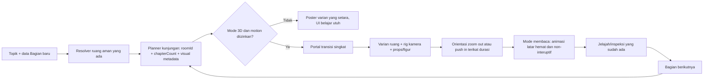

# Rencana Implementasi: Pengayaan 3D per Sesi untuk Vibes Time Travel

**Status:** Draft v1, 2026-09-07. Audit dan perencanaan saja. Tidak mengizinkan perubahan kode, pembuatan aset, commit, push, deployment, perubahan kredensial, atau operasi data sampai pengguna menyetujui rencana ini.

**Otoritas perencanaan sesi:** `~/.config/ai/Super Ultra Code Plan Implementation.md`. Panduan ini harus dipanggil ulang pada persetujuan, checkpoint aset pertama, checkpoint transisi sesi pertama, dan sebelum klaim selesai.

**Snapshot profil aktif:** repository `/home/belajarcarabelajar/time-capsule`, status Git bersih saat audit. Aplikasi web React 18 + Vite + Bun, Three.js `0.170.0`, React Three Fiber `8.18.0`, Blender 4.5 untuk sumber aset, Playwright untuk browser evidence. Konfigurasi yang diperiksa: `package.json`, `apps/web/package.json`, `apps/web/src/immersive/*`, `scripts/verify-history-assets.mjs`, `docs/history-environments.md`, dan checkpoint immersive yang ada. Target utama tetap `apps/web/src/immersive/`; paket UI, kontrak skenario, autentikasi, poin, kuis, dan alur dialog bukan target perubahan.

## Ringkasan keputusan desain

Setiap **sesi** pada permintaan ini dipetakan ke `chapterCount` atau Bagian yang sudah diproduksi aplikasi. Ketika Bagian berganti, latar tidak boleh hanya memuat ulang kamera awal. Renderer harus memilih sebuah **kunjungan visual** baru: varian ruang yang relevan, lintasan kamera singkat, objek hidup, dan bila cocok satu atau lebih figur anonim beranimasi. Sesudah orientasi singkat, ruang kembali tenang agar teks pelajaran tetap pusat perhatian.

## Audit visual saat ini

| Area | Bukti audit | Penilaian | Dampak |
| --- | --- | --- | --- |
| Katalog | Lima GLB: archive, WWI field station, WWII radio room, kingdom court, market port. Ukuran 0.31 sampai 1.68 MiB dan berada di bawah batas model 4 MiB. | Cukup sebagai fondasi, belum kaya sebagai dunia hidup. | Variasi lokasi ada tetapi belum memiliki variasi kunjungan per Bagian. |
| Komposisi | Poster memperlihatkan diorama bersih dengan meja/rak sebagai motif berulang. Archive paling padat; WWI, WWII, kingdom, dan port masih sangat lapang atau sederhana. | Sedang, confidence tinggi dari lima poster yang diperiksa. | Terasa seperti set statis, bukan tempat yang sedang berlangsung. |
| Karakter | Tidak ada mesh/asset karakter pada katalog atau runtime. Deskripsi objek menegaskan ruang ilustratif, bukan tokoh/sejarah literal. | Kosong, confidence tinggi. | Tidak ada skala manusia, kegiatan, atau fokus emosional untuk kamera. |
| Gerak | Runtime hanya memiliki debu ambient berputar perlahan, lerp kamera ke view inspeksi, dan look-around bounded saat Jelajahi ruang. | Minimal, confidence tinggi. | Tidak ada arrival shot, zoom, dolly, atau kejadian yang merespons pergantian sesi. |
| Transisi sesi | `GameplayScreen` memberi topik/lokasi/key lingkungan kepada `HistoricalEnvironment`, namun tidak memberi `chapterCount`; pemilihan ruang tidak berubah oleh Bagian. | Celah utama, confidence tinggi. | Bagian 2+ dapat mempertahankan set dan framing yang sama. |
| Interaksi | Tombol jelajah, drag/touch, panah arah, dan tiga inspeksi DOM per ruang sudah ada serta melindungi klik/Enter alur belajar. | Fondasi aksesibel baik. | Pengayaan harus memperluas tanpa mengambil alih navigasi belajar. |
| Ketahanan | Poster-first, static mode, save-data, reduced-motion, timeout, fallback performa, dan pembatas kamera sudah ada. | Kuat. | Efek baru wajib tunduk pada kebijakan ini, bukan menggantikannya. |

**Kesimpulan:** visual saat ini lengkap sebagai MVP ruang ilustratif dan inspeksi, tetapi belum lengkap maupun kaya untuk pengalaman perjalanan waktu dinamis. Prioritasnya bukan menambah banyak dimensi sekaligus. Prioritasnya adalah membuat lima ruang yang ada terasa berubah, ditempati, dan memiliki perjalanan kamera yang bermakna pada setiap Bagian.

## Lingkup dan batasan

**Termasuk:**

- Katalog kunjungan visual berbasis room dan Bagian, dengan varian berbeda dari kunjungan tepat sebelumnya dalam topik yang sama.
- Koreografi kamera singkat yang dapat berupa reveal zoom out, push-in pada objek fokus, atau lateral parallax. Koreografi berakhir otomatis dan tidak menunda dialog.
- Animasi lingkungan kecil yang sesuai dengan tempat: instrumen arsip berputar lambat, lampu/radio hidup, tirai bergerak tipis, kapal dan air bergerak terbatas, atau aktivitas meja/pelabuhan.
- Figur 3D anonim, non-fotorealistik, berperan latar dan beranimasi hemat. Contoh yang harus ditinjau per ruang: penjaga arsip, operator telepon, pendengar radio, juru tulis/pengunjung balairung, pedagang atau awak kapal. Semua diberi label ilustratif dan tidak boleh menyatakan tokoh sejarah tertentu.
- Poster varian atau fallback poster yang tetap cocok dengan ruang/session beat, kontrol keyboard/touch, reduced-motion, static preference, save-data, konteks WebGL gagal, dan perangkat berperforma rendah.
- Bukti visual desktop/mobile dan metrik aset/frame sebelum klaim selesai.

**Tidak termasuk:**

- Runtime AI untuk membuat model, karakter, animasi, atau sejarah baru.
- Mengubah dialog, skema respons, urutan cerita, kuis, poin, autentikasi, atau cara user maju ke Bagian berikutnya.
- Karakter yang berbicara, menjadi kontrol gameplay, melakukan pengenalan wajah, atau mengklaim identitas tokoh nyata.
- Physics, pointer lock, auto-walk, device orientation wajib, scroll capture, atau efek yang memaksa pengguna menunggu.
- Memperluas katalog menjadi dimensi baru di luar lima ruang yang ada pada tahap pertama.

## Kontrak target

### `VisualVisit` yang akan diautorkan

Tambahkan metadata lokal dan allowlisted, bukan data bebas dari AI:

- `roomId`, `visitId`, dan `chapterBand` atau aturan deterministik dari `chapterCount`.
- `cameraBeat`: posisi awal, posisi akhir, target, tipe `reveal`/`focus`/`drift`, durasi maksimum, dan easing.
- `focusObjectId` opsional yang harus cocok dengan tiga objek inspeksi telah diautorkan.
- `environmentCues`: node GLB yang boleh dianimasikan serta parameter aman seperti intensitas lampu atau amplitudo air.
- `figures`: URL aset lokal, peran ilustratif, posisi, skala, animation clip allowlist, dan mode kehadiran. Tidak menerima URL/node/clip dari respons skenario.
- `posterUrl` varian bila sebuah beat tidak dapat direpresentasikan dengan poster dasar tanpa menyesatkan.

Planner murni menerima `{ room, chapterCount, topicSessionId }` dan menghasilkan visit deterministik. Ia memakai Bagian untuk memilih beat, mencegah pengulangan beat segera, lalu kembali ke varian aman bila daftar belum cukup panjang. `topicSessionId` harus berasal dari state aplikasi yang sudah ada atau token lokal yang diperiksa saat implementasi, bukan identitas pengguna atau teks topik mentah yang dicatat.

### Mesin keadaan

`poster -> loading3d -> arrival -> reading -> exploring`.

- `arrival` hanya mulai setelah model/figur siap; maksimum sekitar 1.2 detik, dapat dilewati, dan tidak memblokir naskah.
- Pada reduced motion, static mode, save-data, gagal asset/import, kehilangan context, atau fallback pacing: langsung `poster`/`reading` tanpa tween atau loop animasi.
- Memilih objek untuk inspeksi menjalankan framing fokus yang singkat hanya bila motion diizinkan; fokus tetap dapat dicapai dengan tombol DOM tanpa WebGL.
- Saat quiz, narrator, loading, continue prompt, auth modal, atau return home aktif: batal/bersihkan arrival dan eksplorasi seperti kontrak `blocked` saat ini.

### Arah visual tahap pertama

| Ruang | Beat awal Bagian | Aktivitas latar yang dapat diautorkan | Figur yang cocok, anonim |
| --- | --- | --- | --- |
| Archive | Reveal zoom out dari instrumen menuju meja dan rak | instrumen berputar, debu berlapis, lampu hangat berdenyut halus | penjaga arsip sedang menyusun buku |
| WWI field station | Push-in dari peta/meja pesan ke telepon lapangan | kabel/penanda lembut, lampu pos, kertas bergerak sangat ringan | operator komunikasi sedang mencatat |
| WWII radio room | Reveal dari tirai blackout ke radio dan kursi | dial radio/indikator cahaya, tirai tipis, lampu meja | pendengar sipil duduk atau menyesuaikan radio |
| Kingdom court | Dolly keluar dari meja naskah ke kursi upacara/gerbang | panji bergerak, cahaya halaman, lembar dekoratif | juru tulis atau pengunjung balairung |
| Market port | Pull-back dari muatan ke dermaga dan kapal | air, ayunan kapal, tali/sail, barang ditata | pedagang dan awak kapal dengan loop aktivitas rendah |

Setiap ruang mulai dengan dua beat yang benar-benar berbeda sebelum aset dimensi baru dibuat. Bagian ketiga dan seterusnya hanya boleh mengulang setelah semua beat untuk ruang tersebut telah dipakai, dan pengulangan harus mengubah fokus/arah kamera. Jika bukti ukuran atau frame tidak mendukung figur pada semua ruang, mulai dengan archive dan market-port sebagai vertical slice, lalu perluas hanya setelah gate performa lolos.

## Acceptance criteria dan traceability

| ID | Acceptance criterion | Tugas | Bukti |
| --- | --- | --- | --- |
| AC1 | Setiap perpindahan Bagian memilih `VisualVisit` baru dan tidak mengulang visit tepat sebelumnya. | T1, T2 | Unit planner dan test integrasi GameplayScreen. |
| AC2 | Arrival memberi zoom/reveal yang terasa, singkat, dapat dilewati, dan tidak menunda naskah atau input belajar. | T2, T4 | RED/GREEN lifecycle tests dan Playwright timing/input check. |
| AC3 | Setiap ruang memiliki minimal dua beat visual yang berbeda dan fokus ke ruang/objek yang relevan. | T3 | Manifest, source asset, checksum, screenshot desktop. |
| AC4 | Figur anonim dan aktivitas lingkungan meningkatkan skala/kehidupan tanpa klaim tokoh atau fakta sejarah palsu. | T3 | Provenance, copy review, visual review. |
| AC5 | Static/reduced-motion/save-data/failure memakai fallback setara dan pelajaran tetap operasional. | T2, T4 | Unit failure matrix dan browser fallback suite. |
| AC6 | Jelajah, inspeksi, keyboard, touch, quiz, narrator, continue, auth, dan return home mempertahankan kontrak sebelumnya. | T2, T4 | Focused regression tests dan end-to-end journeys. |
| AC7 | Aset, renderer, dan animasi memenuhi budget yang diset ulang dari baseline nyata; tidak ada klaim GPU/mobile tanpa pengukuran. | T3, T5 | Script asset audit, build output, Chromium GPU/mobile measurements. |
| AC8 | Tidak ada AI string atau user topic yang menjadi URL model, nama clip, shader, atau konfigurasi executable. | T1, T2, T5 | Code review, allowlist tests, provenance review. |

## Rencana eksekusi berurutan

### T0. Revalidasi dan baseline

**Status:** pending approval.

1. Panggil ulang panduan perencanaan sesi dan revalidasi worktree, revisi, manifest, implementasi immersive, test config, evidence sebelumnya, serta model/poster/checksum saat ini.
2. Jalankan hanya test immersive terarah dan verifikasi aset saat ini. Catat pass/fail, ukuran GLB/poster, triangles/draw primitives, bundle gzip, dan baseline browser dari perangkat yang tersedia.
3. Buka screenshot semua lima ruang pada desktop dan mobile. Tulis matriks visual yang membedakan kekayaan komposisi, keterbacaan teks, kontras, serta ruang aman UI dari kesan subjektif.
4. Tentukan batas baru berdasarkan baseline dan perangkat pengukuran, bukan asumsi. Batas minimum harus membatasi total ukuran asset figur/varian, total draw primitives aktif, jumlah skinned meshes, loop update, dan frame budget per mode.

Checkpoint: presentasikan baseline, batas performa, dan daftar room yang layak untuk vertical slice. Jangan buat atau edit aset sebelum pengguna menyetujui arah karakter dan budget.

### T1. Kontrak visit dan koneksi Bagian, test-first

**File target:** `apps/web/src/components/GameplayScreen.jsx`, `apps/web/src/immersive/` (manifest/planner baru yang fokus), dan test immersive terarah.

1. Tulis RED test murni untuk planner: Bagian 1 dan 2 pada room sama menghasilkan visit berbeda; sequence deterministik; tidak ada pengulangan langsung; chapter tidak valid fail-closed ke visit dasar; input tidak dapat memilih URL/node/clip.
2. Tulis RED integration test yang membuktikan `chapterCount` diteruskan ke historical environment dan change of Bagian memulai visit baru tanpa mengubah request/provider calls, advancing behavior, atau selected-room resolver.
3. Implementasikan planner lokal minimum dan prop `chapterCount` dengan input allowlisted. Jangan mengubah `scenarioClient`, prompt AI, atau resolver room.
4. Review race: late GLB/animation load dari visit lama tidak boleh memasang state pada Bagian/room baru. Bersihkan mixer, tween, timer, dan resource milik visit ketika key berubah.

Checkpoint: AC1/AC8 unit evidence dan diff review. Panggil ulang panduan sesi sebelum lanjut ke animasi runtime.

### T2. Runtime arrival yang ramah pembelajaran, test-first

**File target:** `HistoricalEnvironment.jsx`, `RoomCanvas.jsx`, `RoomCamera.jsx`, `renderPolicy.js`, focused tests baru/yang ada.

1. Tulis RED cases untuk state arrival: renderer ready memulai satu beat; next Bagian membatalkan beat lama; reduced motion/static/save-data/failed renderer tidak menggerakkan kamera; block state menghentikan beat; Escape dan control tetap tidak membubble ke narrative advance.
2. Implementasikan rig kamera berbasis waktu yang memakai metadata `cameraBeat`, interpolasi bounded, dan satu invalidation cadence saat motion off. Hindari global timers dan jangan menulis ke game state.
3. Tambahkan affordance non-intrusif: tombol `Lewati perjalanan` pada arrival aktif atau interaksi belajar pertama menghentikan beat. Semua label final mengikuti bahasa aplikasi dan tidak menggunakan copy yang menunggu.
4. Saat inspeksi dipilih, gunakan focus shot singkat yang tidak mengubah status Bagian. Saat kembali belajar, pulihkan reading pose untuk visit aktif.

Checkpoint: AC2/AC5/AC6 focused unit suite hijau, keyboard/touch manual check, serta no-extra-provider-call assertion.

### T3. Authoring aset dan pengayaan ruang, vertikal slice dulu

**File target:** `assets/history/source/*.blend`, `apps/web/public/history/*`, `assets/history/provenance.json`, `scripts/export-history-assets.py`, manifest visit, serta verifikasi aset jika format kontraknya perlu diperluas.

1. Tulis RED asset contract tests untuk clip/figure local, source `.blend`, provenance yang berisi role/author/license/export/checksum, node/object ID yang allowlisted, serta budget baru. Test harus menolak asset URL eksternal dan figure tanpa label ilustratif.
2. Author dahulu archive dan market-port: dua beat, satu figur anonim per ruang, dan aktivitas lingkungan low-cost. Gunakan geometry/material yang disengaja, animasi loop pendek yang dapat dipause, dan source provenance lengkap. Tidak gunakan model generatif tanpa provenance yang dapat diverifikasi.
3. Export GLB/poster/checksum bersama melalui `scripts/export-history-assets.py`; jangan mengedit binary hasil export secara manual. Pastikan objek inspeksi yang ada tetap punya framing bersih tanpa tertutup figur.
4. Uji real rendering, frame pacing, disposals, poster fallback, dan copy disclaimer. Hanya setelah gate slice lolos, ulangi pola yang sama untuk WWI, WWII, dan kingdom court.
5. Jika skinned animation menyebabkan budget/frame gagal, pilih fallback yang dibuktikan: figur billboard/low-poly dengan transform loop atau hanya activity props. Jangan memaksa model humanoid mahal.

Checkpoint: visual acceptance per room, provenance, triangle/draw/byte audit, dan approval untuk perluasan tiga ruang lain.

### T4. Interaksi, aksesibilitas, responsivitas, dan perjalanan pengguna

1. Tambahkan RED browser/unit coverage untuk skip arrival, visit change saat continue, focus order, 44px touch control, 320/390/768/1440 widths, 200% zoom, no horizontal overflow, dan static/poster equivalence.
2. Validasi full journeys per room: start, foreground/preloaded Bagian, arrival, normal dialogue click/Enter, quiz, narrator, continue to next Bagian, inspect, Home, dan return. Fokuskan assert pada kontrak yang mungkin rusak oleh canvas/z-index.
3. Pastikan figur bukan target wajib berbasis click. Semua informasi tetap melalui tiga tombol inspeksi DOM; canvas tetap `aria-hidden` kecuali interaksi yang telah dikelola controller.
4. Tes preference change secara live: user yang mengaktifkan reduced motion selama arrival harus melihat transisi dihentikan segera dan state stabil.

Checkpoint: AC5/AC6 browser evidence desktop dan mobile, daftar a11y/responsive issues beserta severity/confidence.

### T5. Quality gate, rollout, dan dokumentasi

1. Jalankan test terarah baru, asset verification, build immersive feature-on/off, client asset check, browser suites Chromium dan WebKit pada host yang mendukung. Jangan menyatakan WebKit/mobile GPU lulus dari WSL tanpa bukti nyata.
2. Tinjau bundle chunks, lazy loading, disposal, dependency/lockfile, CSP/asset origin, diff, generated output provenance, dan absence of secrets.
3. Perbarui `docs/history-environments.md`, README bila perilaku default/pengaturan berubah, evidence/checkpoint, dan traceability AC final. Dokumentasikan fallback, cara re-export, license/provenance, serta batas katalog lima ruang.
4. Rollout hanya setelah persetujuan eksplisit. Rollback tetap feature flag immersive off atau deployment sebelumnya yang telah terbukti, tanpa mengubah alur belajar/data.

## Matriks test dan evidence

| Lapisan | Fokus | Command/alat yang harus dikonfirmasi ulang saat eksekusi |
| --- | --- | --- |
| Unit planner | determinisme, anti-repeat, allowlist, fallback | targeted `bun test` pada file planner baru |
| Component lifecycle | arrival, cancellation, blocked state, motion preference, event isolation | targeted `bun test apps/web/src/immersive/__tests__/...` |
| Asset contract | source, provenance, hash, GLB, poster, triangle/primitives, clips | `rtk bun run test:assets` atau scope room yang setara |
| Browser | renderer nyata, visit transition, skip, controls, failure and static modes | `rtk bun run test:immersive` dan fallback config, scope test baru |
| Build | feature on/off lazy chunks and client assets | dedicated scripts/declared build commands, with fresh output inspection |
| Manual visual | five posters/3D variants, text contrast, UI safe zones, intended motion | saved screenshots/video plus target hardware/device details |

TDD exception berlaku untuk Blender visual authoring, karena mesh/animation tidak dapat bermakna diuji RED tanpa asset. Penggantinya wajib asset contract test sebelum export, provenance, budget audit, dan visual browser evidence sesudah export. Runtime planner, lifecycle, dan interaction tetap RED lalu GREEN.

## Risiko dan mitigasi

| Risiko | Severity | Mitigasi dan rollback |
| --- | --- | --- |
| Figur/animasi membuat renderer melewati pacing threshold | High | Slice dua ruang, set budget eksplisit, pause/disable loops, dispose mixer; poster fallback dan feature off tetap tersedia. |
| Kamera terasa sinematik tetapi mengganggu membaca | High | Durasi singkat, skip, cancel on interaction/blocked, no new wait gate, visual review dengan text UI. |
| Bagian berubah sebelum asset lama selesai | High | Visit key/token, cancellation, stale-load test, explicit resource disposal. |
| Figur anonim terbaca sebagai klaim tokoh/rekonstruksi nyata | Medium | Label illustratif, role generik, no historical identity/unverified uniform/detail, provenance review. |
| Variasi terlihat kosmetik karena beat sama | Medium | AC mensyaratkan framing/focus/environment state berbeda dan screenshot per beat. |
| WebKit/GPU/mobil belum terukur | High evidence gap | Tetap open sampai diuji pada host yang kompatibel; jangan mengklaim parity atau performance. |
| Asset provenance atau lisensi tidak lengkap | High | Tidak ship asset tersebut; gunakan asset authored sendiri atau license yang tercatat. |

## Definition of done

- Semua AC memiliki bukti test/review segar dan evidence artefak yang ditautkan dari checkpoint.
- Tidak ada Bagian yang mempertahankan `VisualVisit` langsung sebelumnya ketika alternatif authored tersedia.
- Arrival/zoom, props, dan figur tidak menunda atau mengubah progression belajar dan semua fallback tetap usable.
- Setiap asset baru memiliki source, export report, checksum, author/license/provenance, audit budget, dan cleanup lifecycle yang terbukti.
- Semua test terarah, build yang relevan, browser matrix yang tersedia, diff/security review, documentation, dan responsive/accessibility checks selesai atau tiap gap dilaporkan secara eksplisit.
- Tidak ada commit, push, atau deployment tanpa otorisasi terpisah.

## Approval gate

Persetujuan yang diperlukan sebelum T0/T1: setujui arah **"kunjungan per Bagian"** ini, dimulai dengan vertical slice Archive dan Market Port, serta figur anonim/ilustratif yang tidak mengklaim tokoh sejarah nyata. Setelah disetujui, eksekusi tetap berhenti di checkpoint baseline dan asset slice untuk meminta review visual sebelum memperluas ke tiga ruang lain.

## Catatan kemajuan (2026-09-07, worktree belum di-commit)

- T1/T2 runtime: `visualVisits.js`, `cameraMotion.js`, `AmbientActivity.jsx`/`ambientMotion.js`, arrival di `HistoricalEnvironment`/`RoomCamera`/`RoomCanvas` — unit + lifecycle hijau (AC1/AC2/AC8).
- T3 aset: kelima ruang sudah diperkaya (figur anonim + `ambient_figure`/`ambient_prop` pivots, `poster-detail.webp`, provenance ilustratif) dan lolos `verify-history-assets.mjs` 5/5. Budget: GLB 0.39–1.75 MiB, segitiga 6.2k–27.4k, primitives 12–18. Catatan env: export Blender 5.2 wajib dijalankan dengan env bersih (`env -i PATH=/usr/local/bin:/usr/bin:/bin HOME=$HOME`) agar embedded Python tidak terkontaminasi.
- Perbaikan bug T2: mount saat `blocked` (loading) dulu langsung menghanguskan arrival sehingga arrival tidak pernah main pada alur nyata; sekarang arrival hanya ditunda oleh state transient dan hanya dibatalkan bila sudah mulai, dimatikan permanen, dieksplor, dilewati, atau `storyStep > 0`. Ditambah 2 regression test di `VisualJourney.test.jsx`.
- T4 journeys: `e2e/session-journeys.spec.js` (+ `playwright.journeys.config.js`) hijau 4/4 pada Chromium (320/390px static, reduced-motion, skip + jeda gerakan); suite `immersive.spec.js` 8/8 Chromium tanpa regresi. WebKit belum dapat dijalankan pada host ini (system deps `libicu74/libxml2/libflite1` belum terinstal) — tetap evidence gap sesuai matriks.
- Belum: review visual per-beat di perangkat fisik, pengukuran frame/GPU mobile, pembaruan `docs/history-environments.md`, serta commit/push (menunggu otorisasi terpisah).
