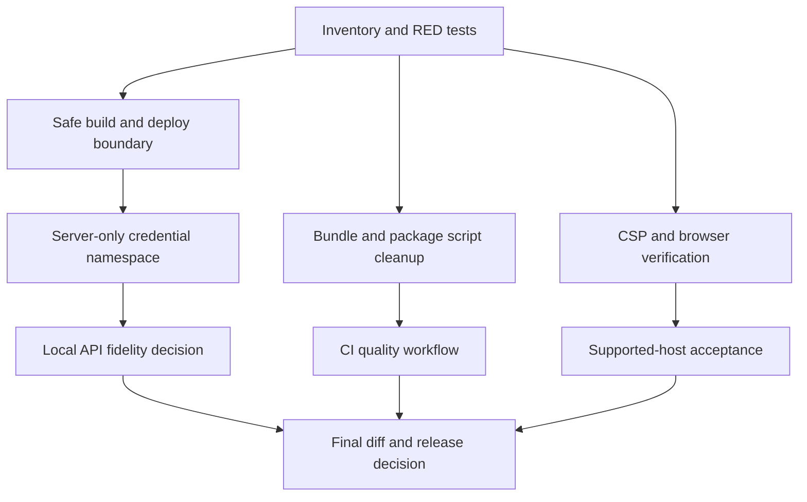

**Technical Debt Remediation Plan**

**Status:** Verification complete for local code and CI contracts, with host-dependent evidence explicitly open, 2026-09-07. The user authorized remediation of the current technical debt. This plan records the current evidence, safe implementation boundary, and verification state. Commit, push, and production deployment are not implied by this remediation request.

**Goal:** Remove the currently evidenced technical debt without changing story generation, authentication policy, points policy, room selection, or lesson interaction contracts.

**Planning authority:** `/home/belajarcarabelajar/.config/ai/Super Ultra Code Plan Implementation.md`, reread at implementation checkpoints.

**Repository:** `/home/belajarcarabelajar/time-capsule`, branch `main`, baseline revision `07263da`.

**Evidence baseline:**

| Area                    | Current evidence                                                                                                                         | Confidence | Severity                      |
| ----------------------- | ---------------------------------------------------------------------------------------------------------------------------------------- | ---------- | ----------------------------- |
| Deployment credentials  | `scripts/deploy-website.sh` auto-loads `/home/belajarcarabelajar/cloudflare/.env` or `/root/.env`, crossing the current project boundary | High       | Critical operational/security |
| Build/deploy coupling   | Deployment helper builds and publishes in one command; the build-only helper exists but is not used by deployment                        | High       | High                          |
| Server credential names | Vite config and Pages Functions accept `VITE_*` credential names, which are client-exposure-prone by convention                          | High       | High security hygiene         |
| Local API fidelity      | Vite proxy sends `/api/ai` and `/api/gemini` directly to providers, bypassing Pages auth and points accounting                           | High       | High diagnostic risk          |
| CSP                     | `_headers` contains only `Content-Security-Policy-Report-Only`                                                                           | High       | Medium security hardening     |
| Bundle budget           | Production build reports `RoomCanvas` at about 869.51 kB after minification                                                              | High       | Medium performance            |
| Test orchestration      | UI test script uses `find` and `xargs`; game-engine has no test script; backend and build tests are outside the root test pipeline       | High       | Medium quality                |
| CI                      | No tracked GitHub workflow was found                                                                                                     | High       | Medium release risk           |
| Runtime pinning         | `packageManager` says Bun 1.2.0 while the verified runtime is Bun 1.4.2                                                                  | High       | Medium reproducibility        |
| Browser evidence        | Playwright Chromium and WebKit executables are absent on the current WSL host; browser install stopped at ENOSPC                         | High       | Environment blocker           |
| Points evidence         | Local accounting and refresh tests pass, but persisted Pages/D1 end-to-end ledger proof remains incomplete                               | High       | Medium evidence debt          |

**Non-goals:** redesign the UI, change AI prompts or schemas, change points pricing or unlimited-quota policy, introduce runtime AI-generated visuals, migrate the database schema without a reviewed migration plan, copy neighboring credentials, or claim browser/production evidence that was not run.

**Acceptance criteria:**

- AC-1: Build-only execution never reads credentials or deploys.
- AC-2: Deployment requires an explicit current-project credential source and never auto-loads a neighboring or root env file.
- AC-3: Server-only credentials are not named with the `VITE_` prefix and no credential value appears in generated client assets.
- AC-4: The local development path either routes through the Pages Functions boundary or is explicitly labeled as provider-only; it must not silently masquerade as authenticated production behavior.
- AC-5: The production build no longer emits the known `RoomCanvas` chunk warning, or a measured exception is documented with a concrete budget owner.
- AC-6: Root quality execution covers web, UI, game-engine, backend, build-script, and asset verification tests through explicit maintained commands.
- AC-7: CI runs frozen dependency installation, focused tests, lint, build, and artifact checks without credentials.
- AC-8: CSP hardening is applied with a static same-origin contract; supported-browser confirmation remains an explicit release gate because the current host cannot install Playwright browsers.
- AC-9: Browser and persisted D1 evidence are either passing on a supported host or remain explicitly recorded as environment/data-source blockers.
- AC-10: Diff, worktree, generated assets, and documentation are reviewed; no commit, push, or deployment claim is made without separate authorization.

**Execution tasks:**

### Task 0: Refresh profile and reproduce current debt

- Capture revision, worktree, package manager, runtime versions, manifests, deploy/build scripts, headers, and current plans.
- Run targeted baseline tests for web state, backend accounting, game-engine, UI, and build script.
- Record every failure, warning, and environment blocker before editing.

### Task 1: Isolate build and deployment credentials

- RED: extend `scripts/build-website.test.js` and add a deploy-script contract test proving no neighboring env path, no root env fallback, explicit current-project env selection, and no deploy from the build helper.
- GREEN: update `scripts/deploy-website.sh` to use `set -euo pipefail`, resolve the repository root, call `scripts/build-website.sh`, load only `TIME_CAPSULE_CLOUDFLARE_ENV_FILE` when explicitly supplied, and require canonical process variables for the Pages upload.
- Keep credentials out of logs, fixtures, generated assets, and client builds.
- Do not run the updated deploy helper until a current-project credential source is independently verified.

### Task 2: Remove Vite-prefixed server credential coupling

- RED: add backend and Vite configuration tests for canonical server-only names and rejection of missing credentials.
- GREEN: use `CF_API_TOKEN`, `CF_ACCOUNT_ID`, `GEMINI_API_KEY`, and existing server-only Google names in server contexts; update tests and documentation. Do not silently preserve `VITE_*` as the production path.
- Add a build-asset scan that checks names and known test markers without printing secret values.
- Preserve a documented migration note for current Pages environment variables; no credential mutation is performed by this task.

### Task 3: Repair local API fidelity or make the boundary explicit

- RED: add a configuration test that fails when Vite provider proxies are enabled without an explicitly declared local Functions origin.
- GREEN: route local API requests to a configurable local Pages Functions origin, with a documented command for the local Functions host. Keep the plain Vite UI mode usable for static rendering, but label unavailable authenticated API behavior instead of bypassing it.
- Do not add remote provider fallbacks that bypass authentication or points accounting.

### Task 4: Remove the measured bundle warning

- RED: add a build assertion or report that identifies the largest generated chunks and fails if the known budget is exceeded without an explicit exception.
- GREEN: use measured Rollup manual chunks for Three.js and React vendor code, then rebuild and verify asset URLs and lazy loading.
- Preserve the current `HistoricalEnvironment` fallback and renderer lifecycle behavior.

### Task 5: Normalize quality commands and add CI

- RED: add tests for package script discovery and root quality coverage before changing scripts.
- GREEN: replace UI `find/xargs` discovery with Bun-native recursive test execution, add a game-engine test script, expose backend/build/asset checks through maintained root commands, and add a pinned Bun GitHub workflow with no secrets.
- Pin the repository package manager to the verified Bun version only after lockfile compatibility is confirmed.
- Do not add a false typecheck command to a JavaScript-only repository; record type checking as not applicable unless the stack changes.

### Task 6: Harden headers with a static contract and preserve the browser gate

- RED: add a header contract test and attempt supported browser checks for OAuth redirects, same-origin Functions, font loading, image loading, and WebGL.
- GREEN: promote CSP from report-only to enforcing with the smallest same-origin directives required by the current app; keep the browser acceptance gate open until a supported host validates the runtime behavior.
- The local browser install was attempted but stopped because the WSL filesystem reported `ENOSPC`; no cache deletion or manual disk cleanup was performed.

### Task 7: Close evidence debt

- Install or provision the declared Playwright browsers in a supported host and run default and explicit-fallback matrices.
- Run persisted local Pages/D1 accounting scenarios for primary, fallback, preload, concurrency, reset, and provider/accounting failure paths.
- Review all low-confidence findings, generated artifact budgets, accessibility and responsive states, then update this plan with exact commands and outcomes.

**Verification commands:**

- `rtk bun test scripts/build-website.test.js`
- `rtk bun test functions/api/_ai_utils.test.js functions/api/ai.test.js functions/api/gemini.test.js functions/api/auth/me.test.js functions/api/auth/callback.test.js`
- `rtk bun test packages/game-engine/src/__tests__/geminiClient.test.js`
- `rtk bun test apps/web/src/context/__tests__/AuthContext.test.jsx apps/web/src/components/__tests__/UserBar.test.jsx apps/web/src/hooks/__tests__/useGameState.test.jsx`
- `rtk bun run build`
- `rtk bun run lint` or targeted lint commands with every finding recorded
- `rtk bun scripts/verify-history-assets.mjs`
- `rtk git diff --check`
- `rtk bun run test:immersive` and `rtk bun run test:immersive:fallback` on a supported browser host

**Implementation and verification evidence:**

- Task 1 complete: deployment now accepts only process credentials or an explicit `TIME_CAPSULE_CLOUDFLARE_ENV_FILE` from the current project, calls the build-only helper, uses the pinned local Wrangler binary, and fails before build/deploy when credentials are absent.
- Task 2 complete: server code uses `CF_API_TOKEN`, `CF_ACCOUNT_ID`, `GEMINI_API_KEY`, and server-only Google variables; anonymous requests are authenticated before provider credential validation; the post-build client asset scan found no server credential or direct provider path markers.
- Task 3 complete: Vite proxies `/api` only to `TIME_CAPSULE_FUNCTIONS_ORIGIN` with a local Pages Functions default; direct provider URLs and injected Authorization headers were removed.
- Task 4 complete: the production build now emits `RoomModel` at about 4.84 kB and `three-vendor` at about 733.06 kB under the measured 750 kB warning budget; the original 869.51 kB room entry warning is gone.
- Task 5 complete: package test discovery uses Bun-native paths, game-engine has a real test script, root quality scripts cover web/UI/game-engine/backend/script/assets/client-assets, Bun is pinned to 1.4.2, Prettier is local, and `.github/workflows/quality.yml` runs frozen install, tests, lint, build, client-asset verification, and browser jobs without credentials.
- Task 6 complete for static hardening: `_headers` now enforces same-origin CSP and security headers; browser runtime acceptance remains open.
- Local quality gate: `bun run test:quality` passed with web 101 tests, UI 57, game-engine 38, backend 61, contract 9, and all authored history assets verified.
- Additional checks: `bun run --cwd apps/web lint` passed; production build and `bun run test:client-assets` passed for 22 generated files; Prettier and `git diff --check` are required final gates.

**Open evidence debt and release blockers:**

- Playwright Chromium/WebKit acceptance is not complete because browser installation stopped with `ENOSPC` on this WSL host; run both immersive matrices on a supported host or CI before release.
- Persisted Pages/D1 ledger scenarios and live production attribution remain unverified; local Miniflare accounting tests are green but do not prove deployed D1 state.
- Deployment is intentionally not executed because no current-project Cloudflare credential source was established for this turn. The new script fails closed until explicit credentials are supplied.
- No commit, push, or production deploy was performed for this remediation turn.

**Live state:**

- Status: Local implementation and verification complete; host-dependent release evidence open.
- Completed: Tasks 0-6 implementation, contract tests, package normalization, CI workflow, build/lint/format checks, and the local quality gate.
- Current: Task 7 evidence closure on a supported browser host and deployed Pages/D1 environment.
- Blockers: current-project Cloudflare credential source is not established in this repository; Playwright browser installation hit `ENOSPC`; persisted production D1 and live attribution evidence are unavailable locally.
- Decisions: preserve learning flow and points policy; do not reuse neighboring credentials; no commit, push, or deployment as part of this remediation turn unless separately authorized.
