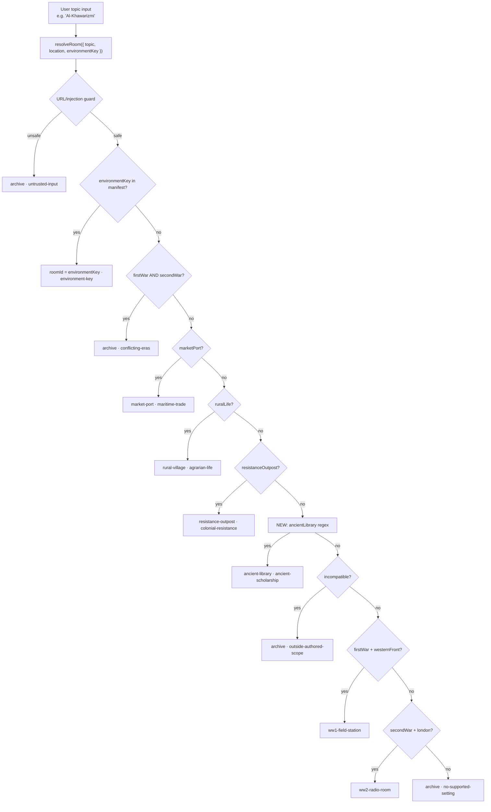

# Ancient Library Room — Implementation Plan

> For agentic workers: REQUIRED EXECUTION METHOD — delegated task execution (recommended) or inline plan execution. Steps use checkbox syntax.

**Goal:** Add `ancient-library` as the 8th immersive room, covering Islamic Golden Age / Greek antiquity topics, with correct routing, 3 inspectable objects, and passing test suite.

**Architecture:** Single data-only entry in `roomManifest` (rooms.js) + one new routing branch in `resolveRoom.js`. No new files, no new components — the renderer (`RoomCanvas`, `RoomModel`, `RoomCamera`) and all existing infra consume any room by id from the manifest. Tests follow the existing `bun:test` pattern in `src/immersive/__tests__/`.

**Tech Stack:** Bun 1.x, Vite + React 18, three.js 0.170 / @react-three/fiber 8.18, Cloudflare Pages, Tailwind CSS v3.

**Active Project Profile:**
- Repository root: `/home/belajarcarabelajar/time-capsule`
- Target scope: `apps/web` — `src/immersive/rooms.js`, `src/immersive/resolveRoom.js`, tests under `src/immersive/__tests__/`
- Toolchain: `bun test src` (unit), ESLint 9
- Configuration sources: `apps/web/package.json` (scripts), `bunfig.toml`
- Revision: HEAD at plan creation (2026-09-08)

**Project Commands:**
```
# Targeted unit — immersive module only:
cd apps/web && bun test src/immersive --timeout 10000

# Full web unit suite (as CI runs it):
cd apps/web && bun test src --path-ignore-patterns 'src/immersive/__tests__/RoomModel.test.jsx' && bun test src/immersive/__tests__/RoomModel.test.jsx

# Lint (targeted — changed files only):
cd apps/web && bunx eslint src/immersive/rooms.js src/immersive/resolveRoom.js
```

**Protected Boundaries:**
- `roomManifest` key order matters: `roomManifest.test.js` asserts `toEqual(['archive', ...])` in order — new room must be appended last.
- `modelUrl` must follow `/history/<id>/room.glb`, `posterUrl` must follow `/history/<id>/poster.webp` (enforced by manifest test).
- Each room must have exactly 3 objects with unique ids (enforced by manifest test).
- `resolveRoom` safety rules: URL/injection guard runs first; `environmentKey` override before any regex; conflicting-eras guard before topic branches; `incompatible` filter must not accidentally swallow new keywords.
- Do NOT modify Cloudflare Functions, auth, D1 schema, or game-engine packages.

**Spec:** This document is the spec (scope is data + one regex branch — no separate spec file warranted).

**Scope:**
- `rooms.js`: add `ancient-library` entry with 3 objects.
- `resolveRoom.js`: add `ancientLibrary` regex + routing branch.
- `resolveRoom.test.js`: add `test.each` cases for the new branch.
- `roomManifest.test.js`: update ordered-keys assertion + add object-id snapshot for `ancient-library`.

**Non-Goals:**
- 3D asset creation (`.glb`, `.webp` files) — art deliverable; documented in Asset Requirements section.
- Changes to `RoomCanvas`, `RoomModel`, `RoomCamera`, `HistoricalEnvironment`, or any component outside `immersive/rooms.js` and `immersive/resolveRoom.js`.
- New React components, hooks, or CSS.
- Changes to game-engine, AI prompt, backend functions, or D1 schema.

---

**Visual Map:**



**Reasoning Lenses:**
- Intent & Scope: one room, pure data + regex, no architectural change.
- Investigative: manifest test asserts exact key order + object count (3 per room). Test runner = `bun test`. Confirmed via file inspection.
- Computational: regex must not collide with `incompatible` filter. Audit confirms `abbasiyah`, `ibn`, `sokrates`, `aristoteles`, `yunani`, `plato`, `archimedes` are absent from current `incompatible` pattern. New branch placed before `incompatible` check to ensure topic matches route correctly.
- Analytical: 2 source files changed, 2 test files updated. No consumer impact beyond assertions.
- Critical: `incompatible` blocks `indonesia`, `java`, `africa`, `russia`, `berlin`, `germany`, `italy`, `america`. None of the new keywords overlap. "Perpustakaan Aleksandria" does not trigger `\bafrika\b`. Safe.
- Behavioral/Test-First: write failing tests for manifest shape and routing before implementing.

---

**Acceptance Criteria:**

| ID | Criterion |
|----|-----------|
| AC-1 | `roomManifest['ancient-library']` exists with `id`, `label`, `scopeLabel`, `modelUrl = '/history/ancient-library/room.glb'`, `posterUrl = '/history/ancient-library/poster.webp'`, valid `camera`, and exactly 3 objects with unique ids. |
| AC-2 | Each object has `label` (>3 chars), `description` (>40 chars), and `view.position`/`view.target` arrays of 3 finite numbers. |
| AC-3 | `resolveRoom({ topic: 'Al-Khawarizmi', location: '' })` returns `{ roomId: 'ancient-library', reason: 'ancient-scholarship' }`. |
| AC-4 | `resolveRoom({ topic: 'Bayt al-Hikmah', location: 'Baghdad' })` returns `{ roomId: 'ancient-library', reason: 'ancient-scholarship' }`. |
| AC-5 | `resolveRoom({ topic: 'Sokrates filsuf Yunani', location: 'Athena' })` returns `{ roomId: 'ancient-library', reason: 'ancient-scholarship' }`. |
| AC-6 | `resolveRoom({ topic: 'Aristoteles', location: '' })` returns `{ roomId: 'ancient-library', reason: 'ancient-scholarship' }`. |
| AC-7 | `resolveRoom({ topic: 'ilmu pengetahuan islam', location: '' })` returns `{ roomId: 'ancient-library', reason: 'ancient-scholarship' }`. |
| AC-8 | All existing `resolveRoom.test.js` cases pass unchanged. |
| AC-9 | `resolveRoom({ topic: 'Ibn Sina', environmentKey: 'ancient-library' })` returns `{ roomId: 'ancient-library', reason: 'environment-key' }`. |
| AC-10 | `roomManifest.test.js` ordered-keys assertion updated; object-id snapshot for `ancient-library` added; both pass. |
| AC-11 | `bun test src/immersive` exits 0, 0 failures, 0 errors. |

**Traceability:**

| AC | Task | Test/Check | Evidence |
|----|------|------------|----------|
| AC-1, AC-2 | Task 1 | roomManifest.test.js shape loop | `bun test` 0 failures |
| AC-3 to AC-7 | Task 2 | resolveRoom.test.js new `test.each` cases | `bun test` 0 failures |
| AC-8 | Task 2 | resolveRoom.test.js existing cases | unchanged cases still green |
| AC-9 | Task 2 | resolveRoom.test.js environmentKey block | new case green |
| AC-10 | Task 3 | roomManifest.test.js updated assertions | `bun test` 0 failures |
| AC-11 | Task 4 | `bun test src/immersive` full suite | exit 0 log |

**Assumptions & Open Questions:**
- Resolved: 3D assets not created in this plan — room registers in code, art team delivers assets separately.
- Resolved: `incompatible` regex needs no extension — no overlap with new keywords confirmed.
- Open: Should topics mentioning both `Aristoteles` and `Perang Dunia I` resolve to WW1 or ancient-library? Decision: `!first` guard ensures WW1 wins — acceptable; history teacher can use `environmentKey` override to force `ancient-library` if needed.

**Dependencies & Impact:**
- No new npm dependencies.
- Consumers of `roomManifest`: `RoomCanvas`, `HistoricalEnvironment`, `resolveRoom`, `roomAssets.test.js`, `roomManifest.test.js`. Check `roomAssets.test.js` for any asset-path hardcoding during Task 4 diff review.

**Risks & Rollback:**
- Risk: `incompatible` swallows a keyword — mitigated by explicit audit above.
- Risk: wrong key order in manifest → test fails loudly — mitigated by appending last.
- Rollback: `git revert` the 2 commits from Tasks 1 and 2; suite confirms clean revert.

**Security & Compatibility:** N/A — no auth, secrets, API, or schema change.

**Operations & Rollout:** Static JS module. Deployed via `scripts/deploy-website.sh`. No feature flag needed — room only activates when AI returns matching keyword or `environmentKey`.

**CI/Review Gate:** `bun test src/immersive` green. ESLint 0 errors. Self-review diff.

**Documentation:** `scopeLabel` in manifest is the user-visible scope disclaimer (consistent with existing rooms).

**Definition of Done:**
- [ ] `rooms.js` has `ancient-library` entry with correct shape (AC-1, AC-2)
- [ ] `resolveRoom.js` routes correctly (AC-3 to AC-7)
- [ ] `resolveRoom.test.js` new cases pass; existing unaffected (AC-8, AC-9)
- [ ] `roomManifest.test.js` updated and passes (AC-10)
- [ ] `bun test src/immersive` exits 0 (AC-11)
- [ ] ESLint 0 errors on changed files
- [ ] Diff review: only 4 files changed
- [ ] No temp files remain

**Plan Status & Version:** Complete v1.1 (code scope), 2026-09-08. Approved by the user in this session. Asset delivery remains deferred.

**Execution record (supersedes the original checklist and conflicting v1.0 assumptions):**
- [x] Manifest RED: 2 failures, then 2 passes. Commit `d2c1e86`.
- [x] Routing RED: 9 failures and 48 passes, then 57 passes. Commit `742b9a0`. Tests cover reasons, environment hints, normalization, and safety/era precedence.
- [x] Required integration correction: `visualVisits.js` has a separate detail-camera map. The existing composition test failed with an undefined camera after adding this room. One camera entry fixes it; both visit tests then pass. Final scope is five code/test files plus this plan, with no renderer component changes.
- [x] Verification on Bun 1.4.2: `rtk proxy bun test src/immersive --timeout 10000 --path-ignore-patterns src/immersive/__tests__/RoomModel.test.jsx` exits 0 (105 passes); `rtk proxy bun test src/immersive/__tests__/RoomModel.test.jsx` exits 0 (2 passes). Total: 107 passes, 0 failures.
- [x] ESLint on all five changed JS files exits 0 without warnings or errors. Diff whitespace check passes. Self-review confirms planned room data and regex, valid camera vectors, and no dependency or backend changes.
- [x] No temporary repository artifacts created. `printdirtree --report` is unsupported locally; used its supported `--dirs-only` option.
- Existing follow-up: isolated `RoomModel.test.jsx` emits `WARNING: Multiple instances of Three.js being imported.` The unchanged RoomModel test/import path does not use the changed manifest, routing, or visit modules. Severity: low; confidence: high. Tests pass, but this suite is not warning-free. No suppression added.
- Asset handoff also requires `apps/web/public/history/ancient-library/poster-detail.webp` for alternating chapter previews. Model and both posters are absent. Visual readiness remains deferred; no browser verification or deployment claimed.
- Completed code work is committed locally. No push or deployment performed. Remaining follow-ups: art delivery and the existing Three.js warning.

**Reproducibility:**
- Bun 1.x required. Test command: `cd apps/web && bun test src/immersive --timeout 10000`
- No env vars required for unit tests.

**Test Reliability:** All tests are deterministic pure-function checks. No DOM, no network, no async.

**Privacy & Data Governance:** N/A.

**Dependencies & Supply Chain:** No new packages. No lockfile change.

**UX States:** N/A — no React component changes. Existing renderer loading/error states cover the new room.

**Verification:**
```bash
cd /home/belajarcarabelajar/time-capsule/apps/web
bun test src/immersive --timeout 10000 2>&1 | tee /tmp/ancient-library-test.log
# Expect: all tests pass, 0 failures, exit 0
```

## Global Constraints
- roomManifest key order: archive, ww1-field-station, ww2-radio-room, kingdom-court, market-port, rural-village, resistance-outpost, **ancient-library**
- Each room: exactly 3 objects, unique ids, description > 40 chars, label > 3 chars
- modelUrl pattern: `/history/<id>/room.glb`
- posterUrl pattern: `/history/<id>/poster.webp`
- resolveRoom reason string: `'ancient-scholarship'`
- No new npm packages
- Changes confined to: `rooms.js`, `resolveRoom.js`, their test files

---

## Task 1: Add `ancient-library` to roomManifest

**Files:**
- Modify: `apps/web/src/immersive/rooms.js` — append after `resistance-outpost` entry, before final `};`

**Interfaces:**
- Produces: `roomManifest['ancient-library']` consumed by `resolveRoom.js` (hasOwnProperty check) and renderer.

**Behavior & Acceptance:** AC-1, AC-2.

**Exact content to append (after line 176 closing `},` of resistance-outpost, before line 177 `};`):**

```js
  'ancient-library': {
    id: 'ancient-library',
    label: 'Perpustakaan kuno',
    scopeLabel: 'Ruang belajar imajinatif; bukan rekonstruksi perpustakaan atau institusi bersejarah tertentu',
    modelUrl: '/history/ancient-library/room.glb',
    posterUrl: '/history/ancient-library/poster.webp',
    camera: { position: [7, 6, 10], target: [0, 1.6, -1], yawLimit: 0.45, pitchLimit: 0.2 },
    objects: [
      {
        id: 'scroll-table',
        label: 'Meja gulungan',
        description: 'Meja tempat para cendekiawan membaca, menyalin, dan menerjemahkan teks. Gulungan di sini bersifat dekoratif dan tidak merujuk pada manuskrip atau karya bersejarah tertentu.',
        view: { position: [2.5, 3.2, 4.5], target: [0, 1.5, -1] },
      },
      {
        id: 'astrolabe',
        label: 'Astrolab',
        description: 'Astrolab membantu mengukur posisi bintang dan menentukan waktu. Alat ini menjadi simbol perpaduan ilmu astronomi, matematika, dan filsafat di pusat-pusat ilmu pengetahuan kuno.',
        view: { position: [1, 2.8, 3.5], target: [-1.5, 1.8, -1.5] },
      },
      {
        id: 'manuscript-shelf',
        label: 'Rak manuskrip',
        description: 'Rak penuh gulungan dan lembaran memperlihatkan tempat ilmu disimpan dan diteruskan antargenerasi. Koleksi ini adalah ilustrasi konsep perpustakaan kuno, bukan salinan koleksi atau institusi nyata.',
        view: { position: [0, 2.5, 3], target: [3, 2, -2.5] },
      },
    ],
  },
```

**Edge Cases:** Object ids must match exactly what Task 3 test snapshot expects.

**Deliberate Shortcuts:** 3D assets not created — `defer: art team / design sprint, upgrade-trigger: immersive feature enabled in production`.

**Test Data & Determinism:** Pure data object, no fixtures.

- [ ] Step 1: (RED) Update `roomManifest.test.js` key order + snapshot — run test, confirm fail
- [ ] Step 2: Run: `cd apps/web && bun test src/immersive/__tests__/roomManifest.test.js` → expect failure on key order assertion
- [ ] Step 3: (GREEN) Append `ancient-library` entry to `rooms.js`
- [ ] Step 4: Run: `cd apps/web && bun test src/immersive/__tests__/roomManifest.test.js` → 0 failures
- [ ] Step 5: Commit: `git add apps/web/src/immersive/rooms.js apps/web/src/immersive/__tests__/roomManifest.test.js && git commit -m "feat(immersive): add ancient-library room to manifest"`

---

## Task 2: Add routing branch in `resolveRoom.js`

**Files:**
- Modify: `apps/web/src/immersive/resolveRoom.js`

**Interfaces:**
- Consumes: `roomManifest` (Task 1 must complete first for AC-9).
- Produces: `{ roomId: 'ancient-library', reason: 'ancient-scholarship' }`.

**Regex constant to add** (after line 10 `pacificWar` constant, before `incompatible`):

```js
const ancientLibrary = /\b(?:abbasiyah|abbasid|bayt al-?hikmah|house of wisdom|al-?khawarizmi|ibn sina|avicenna|ibnu sina|al-?biruni|al-?farabi|al-?ghazali|al-?razi|ibn rushd|averroes|sokrates|socrates|plato|aristoteles|aristotle|yunani kuno|ancient greece|hellenistic|filsuf yunani|greek philosophy|perpustakaan aleksandria|library of alexandria|ptolemy|euclid|archimedes|pythagoras|ilmu pengetahuan islam|golden age of islam|zaman keemasan islam|cendekiawan muslim)\b/u;
```

**Routing branch to add** (after `resistanceOutpost` branch ~line 32–34, before `incompatible` check ~line 35):

```js
  if (ancientLibrary.test(all) && !first && !second) {
    return { roomId: 'ancient-library', reason: 'ancient-scholarship' };
  }
```

**Behavior & Acceptance:** AC-3 to AC-9.

**Edge Cases:** `!first && !second` guards prevent routing here when WW era keywords are present. `incompatible` check comes after this branch intentionally — `ancientLibrary` keywords are not on the incompatible list so order is safe either way, but pre-incompatible placement is correct.

**Deliberate Shortcuts:** None.

**Dependencies:** Task 1 must be committed first (manifest entry needed for AC-9 `environmentKey` test).

- [ ] Step 1: (RED) Update `resolveRoom.test.js` with new routing cases + AC-9 environmentKey case
- [ ] Step 2: Run: `cd apps/web && bun test src/immersive/__tests__/resolveRoom.test.js` → new cases fail with 'archive'
- [ ] Step 3: (GREEN) Add `ancientLibrary` regex + branch to `resolveRoom.js`
- [ ] Step 4: Run: `cd apps/web && bun test src/immersive/__tests__/resolveRoom.test.js` → 0 failures
- [ ] Step 5: Commit: `git add apps/web/src/immersive/resolveRoom.js apps/web/src/immersive/__tests__/resolveRoom.test.js && git commit -m "feat(immersive): route ancient-scholarship topics to ancient-library room"`

---

## Task 3: Test file changes (written before Task 1/2 implementation)

**Files:**
- Modify: `apps/web/src/immersive/__tests__/roomManifest.test.js`
- Modify: `apps/web/src/immersive/__tests__/resolveRoom.test.js`

**roomManifest.test.js — exact changes:**

Line 28, update `toEqual` array:
```js
  expect(Object.keys(roomManifest)).toEqual(['archive', 'ww1-field-station', 'ww2-radio-room', 'kingdom-court', 'market-port', 'rural-village', 'resistance-outpost', 'ancient-library']);
```

After the `resistance-outpost` object-id block (after line 62), add:
```js
  expect(roomManifest['ancient-library'].objects.map(object => object.id)).toEqual([
    'scroll-table',
    'astrolabe',
    'manuscript-shelf',
  ]);
```

**resolveRoom.test.js — add inside `describe('conservative room selection', ...)`:**

```js
  test.each([
    ['Al-Khawarizmi', '', 'ancient-library'],
    ['Bayt al-Hikmah', 'Baghdad', 'ancient-library'],
    ['Sokrates filsuf Yunani', 'Athena', 'ancient-library'],
    ['Aristoteles', '', 'ancient-library'],
    ['Ibn Sina', '', 'ancient-library'],
    ['Perpustakaan Aleksandria', '', 'ancient-library'],
    ['ilmu pengetahuan islam', '', 'ancient-library'],
  ])('ancient-library: %s / %s -> %s', (topic, location, roomId) => {
    expect(resolveRoom({ topic, location }).roomId).toBe(roomId);
  });
```

Add to the existing `environmentKey` test block:
```js
    expect(resolveRoom({
      topic: 'Ibn Sina', location: '', environmentKey: 'ancient-library',
    })).toEqual({ roomId: 'ancient-library', reason: 'environment-key' });
```

**Test Data & Determinism:** Fully deterministic pure-function checks.

- [ ] Step 1: Write `roomManifest.test.js` updates (this is the RED step for Task 1)
- [ ] Step 2: Write `resolveRoom.test.js` updates (this is the RED step for Task 2)
- [ ] Step 3: (Test files committed with their corresponding impl in Tasks 1 and 2 — no separate commit)

---

## Task 4: Verify & close

**Files:** No code changes.

- [ ] Step 1: Full immersive suite
  ```bash
  cd /home/belajarcarabelajar/time-capsule/apps/web
  bun test src/immersive --timeout 10000 2>&1 | tee /tmp/ancient-library-verify.log
  ```
  Expected: all tests pass, 0 failures, exit 0.

- [ ] Step 2: ESLint changed files
  ```bash
  cd /home/belajarcarabelajar/time-capsule/apps/web
  bunx eslint src/immersive/rooms.js src/immersive/resolveRoom.js
  ```
  Expected: 0 errors.

- [ ] Step 3: Diff review
  ```bash
  git -C /home/belajarcarabelajar/time-capsule diff HEAD~2..HEAD --name-only
  ```
  Expected: exactly `apps/web/src/immersive/rooms.js`, `apps/web/src/immersive/resolveRoom.js`, `apps/web/src/immersive/__tests__/roomManifest.test.js`, `apps/web/src/immersive/__tests__/resolveRoom.test.js`.

- [ ] Step 4: Update Plan Status to `Complete`.

---

## Asset Requirements (Art Team Handoff)

| File | Path in repo | Notes |
|------|-------------|-------|
| 3D room model | `apps/web/public/history/ancient-library/room.glb` | Interior library: scroll tables, shelves, astrolabe prop. Style consistent with existing rooms. |
| Poster image | `apps/web/public/history/ancient-library/poster.webp` | Static preview while GLB loads. Min 800x600. |

Room registers correctly in code without assets. 3D view shows blank canvas until assets land (same behavior as any unasset'd room in dev).
