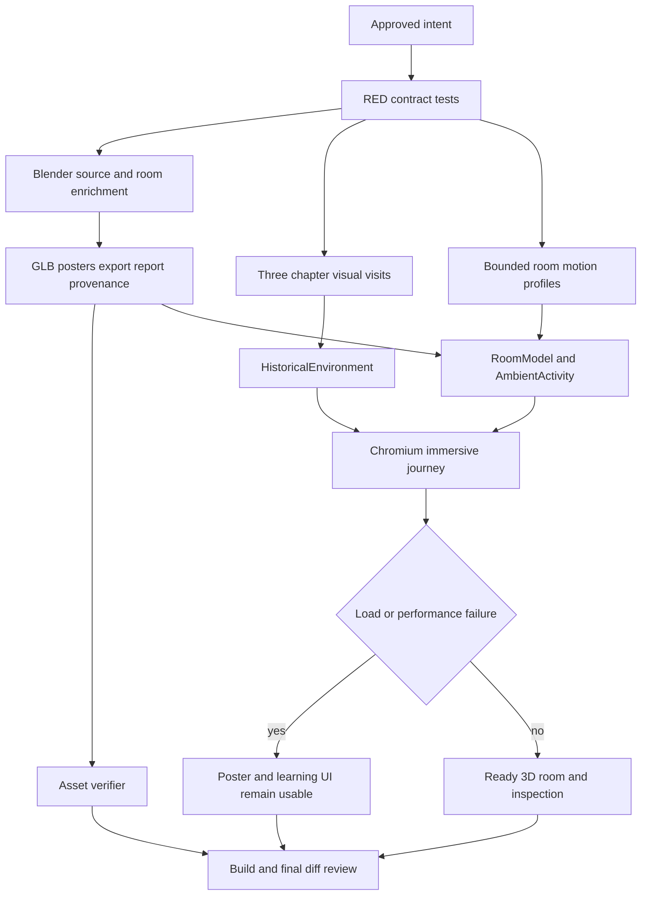

# Existing Immersive Rooms Visual Enrichment Implementation Plan

> For agentic workers: REQUIRED EXECUTION METHOD. Inline execution with explicit checkpoints after human approval. No implementation, generated asset replacement, commit, or deployment starts from this draft alone.

**Goal:** Enrich the visual 3D presentation of all eight registered immersive rooms while completing `ancient-library` asset parity, preserving the existing learning flow, local asset boundary, fallback behavior, accessibility, and mobile performance envelope.

**Architecture:** Authored Blender scenes remain the primary source of visual richness. Each room keeps one local GLB, three authored inspection objects, local poster fallbacks, named `ambient_figure` and `ambient_prop` motion groups, and provenance checksums. Runtime changes stay bounded to chapter composition selection and a small room-specific ambient-motion profile. The existing `HistoricalEnvironment` state machine, `RoomModel` loader, `RoomCamera`, poster fallback, feature flag, and learning UI remain the integration boundary.

**Tech Stack:** Bun 1.4.2, React 18, Vite 5, Three.js 0.170.0, React Three Fiber 8.18.0, Playwright 1.63.0, Blender 5.2.1 LTS, local WebP/GLB/Blend assets, Cloudflare Pages static deployment.

**Active Project Profile:**

- Repository: `/home/belajarcarabelajar/time-capsule`
- Revision: `main` at `386c664c70894b37e5a448209387ac0447bfd3e4`
- Worktree: clean at audit time.
- Target scope: `apps/web/src/immersive`, `apps/web/e2e`, `apps/web/public/history`, `assets/history`, `scripts`, and `docs/history-environments.md`.
- Runtime sources inspected: `apps/web/package.json`, `package.json`, `apps/web/playwright.immersive.config.js`, `apps/web/playwright.fallback.config.js`, `.github/workflows/quality.yml`.
- Architecture sources inspected: `rooms.js`, `resolveRoom.js`, `visualVisits.js`, `RoomCanvas.jsx`, `RoomModel.jsx`, `RoomCamera.jsx`, `AmbientActivity.jsx`, `ambientMotion.js`, `verify-history-assets.mjs`, and `docs/history-environments.md`.
- Asset authoring sources inspected: `scripts/export-history-assets.py`, `scripts/history_asset_details.py`, `assets/history/provenance.json`, and existing room export reports.
- Directory report gap: installed `printdirtree` rejects the requested `--report` option. The exact failure was `unrecognized arguments: --report`; supported `printdirtree --dirs-only` was used as the safe fallback and reported 67 directory entries.

**Project Commands:**

- Focused immersive unit baseline: `rtk bun test apps/web/src/immersive --timeout 10000 --path-ignore-patterns apps/web/src/immersive/__tests__/RoomModel.test.jsx`
- Room loader baseline: `rtk bun test apps/web/src/immersive/__tests__/RoomModel.test.jsx`
- Asset verification: `rtk bun scripts/verify-history-assets.mjs`
- Client asset verification: `rtk bun scripts/verify-client-assets.mjs`
- Web build from repository root: `PATH=/usr/bin:/bin:$PATH rtk proxy bash scripts/build-website.sh`
- Chromium immersive journey from `apps/web`: `PATH=/usr/bin:/bin:$PATH rtk bun run test:immersive -- --project=chromium`
- Chromium fallback journey from `apps/web`: `PATH=/usr/bin:/bin:$PATH rtk bun run test:immersive:fallback -- --project=chromium`
- Full browser attempt from `apps/web`: `PATH=/usr/bin:/bin:$PATH rtk bun run test:immersive`
- Blender export example from repository root: `PATH=/usr/bin:/bin:$PATH blender --background --python scripts/export-history-assets.py -- --root . --room ancient-library`; repeat with each exact manifest ID.

**Protected Boundaries:**

- Preserve the dialogue, quiz, narrator, chapter, auth, points, and AI text contracts.
- Preserve the finite local room resolver and same-origin `/history/archive/`, `/history/ww1-field-station/`, `/history/ww2-radio-room/`, `/history/kingdom-court/`, `/history/market-port/`, `/history/rural-village/`, `/history/resistance-outpost/`, and `/history/ancient-library/` asset paths. AI output must never become a file path, URL, shader, HTML, or executable configuration.
- Preserve poster mode, save-data mode, explicit static mode, load failure, retry, reduced-motion, keyboard, touch, audio failure, and WebGL performance fallback behavior.
- Do not import assets, credentials, configuration, or identifiers from neighboring projects.
- Do not edit generated GLB, WebP, or export-report bytes independently. Regenerate the source Blend, model, posters, report, and checksums together.
- No new runtime dependency. No deployment or publication is included in this plan.

**Spec:** `docs/history-environments.md`, the existing room-specific plans under `docs/code-plan/plans/`, the current room manifest and asset verification contracts, and this audit-derived plan.

**Scope:** Complete `ancient-library`; enrich the seven existing authored rooms; add a third bounded visual chapter beat; add room-specific ambient motion within existing named groups; synchronize manifest, provenance, exporter, verifier, tests, browser fixtures, documentation, and visual evidence.

**Non-Goals:** New historical room routing, new AI scenario fields, free-roaming navigation, combat or simulation systems, VR, runtime Blender generation, external asset downloads, a general-purpose scene engine, a full UI redesign, audio composition, or production deployment.

**Visual Map:**

**Reasoning Lenses:**

- Intent and Scope: visual richness is bounded to current rooms and must not alter learning behavior.
- Investigative and Evidence: current code, export reports, screenshots, tests, browser runs, and provenance are the baseline.
- Computational: chapter-to-visit selection, motion limits, asset budgets, and failure transitions are deterministic.
- Analytical and Systems/Contract: manifest, exporter, generated assets, verifier, runtime loader, and browser fixtures form one contract.
- Creative and Convergent: authored asset enrichment is preferred over procedural runtime geometry because the repository already has a Blender pipeline and a poster fallback.
- User-Centered and Accessible: inspection labels, descriptions, focus recovery, keyboard controls, reduced motion, mobile layout, and fallback states remain required.
- Performance and Cost: preserve GLB, triangle, primitive, poster, and renderer fallback budgets.
- Reproducibility: Blender, Bun, Node, exact commands, source assets, checksums, and browser project boundaries are recorded.

**Current Audit Findings:**

| ID | Finding | Evidence | Confidence | Estimated severity |
|---|---|---|---|---|
| F-1 | `ancient-library` is routed and present in the manifest, but no public assets, editable source, export report, or provenance record exist. | `verify-history-assets.mjs` reports `ancient-library: Missing provenance`; `apps/web/public/history/ancient-library` is absent; provenance contains seven rooms. | High | Blocker for complete 3D room coverage |
| F-2 | Seven rooms satisfy the current hard asset budgets, but the visual richness is uneven. | Current maximum is 1,750,656-byte GLB, 27,376 triangles, and 18 primitives. `market-port` is 398,320 bytes and 6,232 triangles, while archive evidence has the strongest set dressing. | High | Medium |
| F-3 | Existing screenshots show a deliberate low-poly illustrative language, but repeated shelves, tables, flat walls, and large empty surfaces reduce depth in some views. | Reviewed archive, WW1 field-station, and WW2 radio-room evidence screenshots. Other rooms require fresh screenshots before visual sign-off. | High for reviewed screenshots, medium for unreviewed rooms | Medium |
| F-4 | Ambient runtime motion is generic. All rooms use `ambient_figure` and `ambient_prop`, while the only room-specific vertical movement is hardcoded for `market-port`. | `ambientMotion.js` has shared rotation and a `market-port`-only lift branch; exporter has room-specific prop pivots but no room-specific runtime profile. | High | Medium |
| F-5 | Chapter visits currently alternate between two compositions, so chapter three repeats the first composition. | `visualVisits.js` creates only `reveal` and `focus`; `visualVisits.test.js` validates a two-visit cycle. | High | Medium |
| F-6 | The asset test loop covers seven rooms while the manifest test covers eight. This allows the missing ancient-library binary set to escape the unit asset test. | `roomAssets.test.js` line 8 lists seven IDs; `roomManifest.test.js` line 5 lists eight; the standalone verifier catches the gap. | High | High |
| F-7 | Historical environment documentation still lists seven finite room keys and omits `ancient-library`. | `docs/history-environments.md` line 21 and its routing table predate the ancient-library registration. | High | Medium |
| F-8 | Chromium browser coverage passes, but the full browser command exits non-zero because all ten WebKit cases cannot launch in this WSL host. | Fresh run: `10 passed`, `10 failed`; WebKit reports missing host browser dependencies. | High | Environment blocker, not an app defect |
| F-9 | Client asset hygiene is clean and existing immersive unit coverage is green. | 105 immersive tests pass, RoomModel has 2 passes, client assets report 41 verified files, and 0 credential/provider markers. | High | Positive baseline |

**Current Room Asset Baseline:**

| Room | GLB bytes | Triangles | Primitives | Poster bytes | Editable source |
|---|---:|---:|---:|---:|---|
| `archive` | 1,750,656 | 27,376 | 16 | 101,990 | present |
| `ww1-field-station` | 1,593,488 | 25,164 | 14 | 89,926 | present |
| `ww2-radio-room` | 864,904 | 13,620 | 18 | 69,020 | present |
| `kingdom-court` | 1,362,388 | 27,120 | 12 | 54,692 | present |
| `market-port` | 398,320 | 6,232 | 15 | 40,774 | present |
| `rural-village` | 553,380 | 8,984 | 13 | 33,182 | present |
| `resistance-outpost` | 707,988 | 12,180 | 14 | 49,330 | present |
| `ancient-library` | missing | missing | missing | missing | missing |

**Design Alternatives and Decision:**

| Approach | Benefit | Cost or risk | Decision |
|---|---|---|---|
| Asset-only re-export | Lowest renderer risk and uses the existing Blender workflow. | Does not address two-beat chapter repetition or generic ambient motion. | Partial approach only |
| Procedural runtime enrichment | Avoids large binary updates and can vary continuously. | Adds renderer complexity, performance risk, and weaker authored composition. | Rejected |
| Authored asset enrichment plus bounded runtime metadata | Improves depth, chapter variety, and motion while reusing existing loader, fallback, and named-node contracts. | Requires coordinated source, generated asset, provenance, test, and evidence changes. | Recommended |

**Acceptance Criteria:**

- AC-1: Every manifest room, including `ancient-library`, has an editable local Blend source, `room.glb`, `poster.webp`, `poster-detail.webp`, `poster-context.webp`, export report, provenance record, and matching SHA-256 checksums.
- AC-2: Every generated room keeps embedded textures, no external GLB resources, no skinned meshes, GLB size at or below 4 MiB, poster sizes at or below 250 KiB, triangle count at or below 100,000, and primitive count at or below 60.
- AC-3: Every room has exactly three stable inspection objects with labels longer than three characters, descriptions longer than 40 characters, finite camera vectors, and visual anchors that are present in the authored scene.
- AC-4: Each room has one primary composition, one object-focused composition, and one contextual composition. Successive chapters select different visit IDs, cameras, focus objects, and poster variants before cycling.
- AC-5: The enriched room set preserves the shared `ambient_figure` and `ambient_prop` groups. Room-specific motion stays bounded to authored nodes, clamps frame deltas, resets on cleanup, pauses for reduced motion or disabled motion, and never changes unrelated meshes.
- AC-6: The visual briefs add at least three secondary environmental detail clusters per room, with room-specific material, silhouette, depth, or lighting intent recorded in the plan execution evidence.
- AC-7: Existing dialogue, quizzes, narrator text, auth, points, chapter progression, scenario request count, and AI response contents remain unchanged.
- AC-8: Poster mode, save-data mode, explicit static mode, missing asset fallback, retry, reduced motion, audio failure, WebGL context loss, and poor frame pacing remain usable and preserve learning controls.
- AC-9: Desktop Chromium journeys cover all eight rooms, including ancient-library, and verify ready 3D state, canvas presence, inspection, Escape focus recovery, and no extra scenario generation. Mobile coverage verifies one representative enriched room plus save-data poster behavior.
- AC-10: Chromium immersive and fallback journeys pass. WebKit is run when host libraries are available; otherwise the result is recorded as the known WSL environment blocker with its exact launch error.
- AC-11: `verify-history-assets.mjs`, client asset verification, focused unit tests, and the web build exit zero with clean logs. Existing warnings outside the touched surface are recorded separately.
- AC-12: `docs/history-environments.md` describes all eight finite room keys and the regenerated asset workflow, without changing the illustrative, non-reconstruction boundary.
- AC-13: Fresh desktop and mobile screenshots show the enriched primary, focus, and contextual views for every room. Each screenshot has no broken poster, missing model, horizontal overflow, or unreadable inspection state.
- AC-14: Final diff review contains only approved source, generated assets, tests, documentation, and evidence. No secrets, external URLs, unrelated cleanup, or temporary files remain.

**Traceability:**

| Acceptance criteria | Task | Test or check | Required evidence |
|---|---|---|---|
| AC-1, AC-2, AC-3 | Task 1 and Task 2 | `roomAssets.test.js`, `roomManifest.test.js`, `verify-history-assets.mjs` | All eight room records and generated asset metrics |
| AC-4 | Task 3 | `visualVisits.test.js`, `VisualJourney.test.jsx`, browser screenshot assertions | Three distinct visit IDs and posters per room |
| AC-5 | Task 3 | `ambientMotion.test.js`, renderer lifecycle tests | Profile limits, pause, reset, and node isolation |
| AC-6 | Task 2 | Export reports plus visual screenshot review | Room-by-room visual brief checklist |
| AC-7, AC-8 | Task 3 and Task 4 | Existing immersive unit suite, fallback journey, client asset check | Unchanged learning and recovery behavior |
| AC-9, AC-10 | Task 4 | Chromium immersive/fallback projects and WebKit attempt | Browser pass log and environment classification |
| AC-11 | Task 4 | Focused tests, asset checks, build | Exit codes, pass/fail counts, error scan |
| AC-12 | Task 4 | Documentation review and targeted search | Updated room allowlist and workflow |
| AC-13, AC-14 | Task 4 | Screenshot review, `git diff --check`, status and diff audit | Evidence files and clean intended-file diff |

**Assumptions & Open Questions:**

- The request covers all eight currently registered rooms, not only the seven rooms with binary assets.
- Blender 5.2.1 LTS, system Node v26.8.1, and Bun 1.4.2 are available on this host. Blender availability was verified during audit.
- Existing room-specific historical scope labels remain authoritative. New details are illustrative and carry no new historical identity claims.
- The third poster variant is included because a third 3D composition without a matching static fallback would weaken the existing poster-first contract.
- No user decision is needed to include `ancient-library`; it is already part of the manifest and resolver. Human approval is required before implementation starts.
- WebKit host dependency installation is outside this plan. If the environment remains unchanged, WebKit remains an explicitly documented verification boundary.

**Dependencies & Impact:**

- `roomManifest` remains the source of room IDs, local URLs, labels, descriptions, and inspection views.
- `visualVisits` consumes the manifest and emits camera, arrival, focus-object, and poster selections.
- `RoomCanvas` and `RoomModel` consume the existing room URL and motion state; no loader contract change is planned.
- Blender exporter, provenance JSON, public assets, and verifier must be updated atomically per room.
- Browser fixtures must add ancient-library without introducing provider requests or changing scenario payload shape.
- The exporter is currently 567 lines. Because the requested enrichment touches it, split it below the 500-line source threshold by moving shared Blender primitives and room builders into focused modules.

**Risks & Rollback:**

- Asset size growth: reject an export that breaches any hard budget; reduce texture resolution or merge compatible materials before accepting the room.
- Visual clutter: use the three inspection anchors as the focal hierarchy; remove secondary details that obscure the authored camera views.
- Runtime motion regressions: constrain updates to named groups, cap amplitudes, preserve `enabled` gating, and keep reduced-motion tests green.
- Ancient-library route without asset parity: keep the route behind its poster fallback until all generated files and provenance verify together.
- Exporter split regression: run a focused export for one existing room before all-room generation, then verify all rooms.
- Rollback: restore the prior source modules, manifest metadata, generated asset directories, provenance entry, and tests as one reviewed commit. Do not delete or overwrite unfamiliar user work.

**Security & Compatibility:**

- Assets remain same-origin and local. No new network fetch, credential, provider, shader, or AI-generated path is introduced.
- Existing unsafe input handling and room allowlisting remain unchanged.
- Existing GLB compatibility remains version 2 with embedded resources, no skins, and the current Three.js loader.
- No schema, API, auth, database, or user-data migration applies.

**Operations & Rollout:**

- Local implementation and verification only. Deployment is out of scope.
- Existing immersive default and poster fallback act as the rollout control. If one room fails asset or runtime checks, keep its poster fallback and block publication of that asset set.
- Health signals: asset verifier exit code, `data-render-state="ready"`, canvas count, poster fallback visibility, browser scenario call count, and frame-health fallback behavior.
- Rollback trigger: any room fails asset verification, any learning control changes, any browser Chromium journey fails, or a screenshot shows broken asset loading or unusable controls.

**CI/Review Gate:**

- Review required before implementation: this plan, the visual brief table, exact file list, and acceptance criteria.
- Focused checks run before broader checks.
- No commit, push, deployment, or external publication occurs without explicit authorization.

**Documentation:** Update `docs/history-environments.md` for the eight-room allowlist, ancient-library visual scope, three-poster asset contract, and system-Python Blender export command. Add final screenshot and budget evidence to the existing `docs/code-plan/evidence/` convention.

**Definition of Done:** All AC-1 through AC-14 are satisfied; all applicable tests, asset checks, build, Chromium browser journeys, documentation, screenshot, diff, and generated-artifact reviews pass; WebKit is either freshly green or explicitly classified as the known host dependency blocker; no implementation completion claim is made without fresh evidence.

**Plan Status & Version:** Complete v1.2. User approved implementation on 2026-09-08. Eight-room exporter, runtime, browser, asset, documentation, screenshot, and diff checks are complete. WebKit remains an explicitly recorded WSL host dependency blocker; no publication is authorized.

**Reproducibility:** Use repository revision `386c664c70894b37e5a448209387ac0447bfd3e4`, Bun 1.4.2, Node v26.8.1, Blender 5.2.1 LTS, system-Python Blender invocation, local fixtures in `apps/web/e2e/fixtures/historyScenarios.js`, and the commands listed above. Record Blender version and per-room export metrics in each `export-report.json`.

**Test Reliability:** Unit tests are local and deterministic. Asset tests depend on checked-in binary artifacts and SHA-256 reports. Browser tests use a local Vite server, mocked scenario/auth APIs, one worker, zero retries, reduced-motion media where declared, and no external provider requests. WebKit is environment-dependent in this WSL host.

**Privacy & Data Governance:** No new user data, personal data, telemetry, or external asset metadata is collected. Scenario fixtures remain synthetic. Existing illustrative figure provenance remains anonymous and non-identifying.

**Dependencies & Supply Chain:** No package change. Preserve the existing Blender-generated local asset license/provenance records, embedded resources, checked-in lockfile state, and local font licenses. Review generated files for external URLs and unexpected metadata before acceptance.

**UX States:** Preserve ready 3D, poster/static, loading, missing asset, retry, save-data, reduced-motion, paused motion, audio unavailable, blocked lesson, selected object, keyboard Escape recovery, mobile viewport, focus indication, readable contrast, and zero horizontal overflow states.

**Verification:** Complete Task 4's fresh command matrix, inspect filtered logs and exit codes, review every room screenshot, run `git diff --check`, inspect changed-file status and diff, scan touched user-visible files for the em dash character, and record any WebKit host failure without treating it as an application pass.

## Global Constraints

- Keep all room media local under the eight explicit `/history/` room directories listed in Protected Boundaries and all editable sources under `assets/history/source/`.
- Keep three inspection objects per room and preserve their labels, descriptions, and authored camera views.
- Keep `ambient_figure` and `ambient_prop` names stable across every generated GLB.
- Keep GLB at or below 4 MiB, posters at or below 250 KiB, scenes below 100,000 triangles and 60 primitives.
- Do not add external runtime dependencies or provider calls.
- Do not change dialogue, quiz, narrator, auth, points, chapter progression, or AI text contracts.
- Do not publish or deploy from this implementation plan.

## Task 1: RED visual and asset contract tests

**Files:**

- Modify: `apps/web/src/immersive/__tests__/roomAssets.test.js:8-52`
- Modify: `apps/web/src/immersive/__tests__/roomManifest.test.js:4-59`
- Modify: `apps/web/src/immersive/__tests__/visualVisits.test.js:5-29`
- Modify: `apps/web/src/immersive/__tests__/ambientMotion.test.js:5-32`
- Modify: `apps/web/e2e/immersive.spec.js:4-32`

**Interfaces:**

- Consumes: existing `roomManifest`, `resolveVisit`, `createAmbientMotion`, generated asset paths, and current browser fixture API.
- Produces: failing tests that define the ancient-library asset parity, three-visit cycle, context poster, motion profile isolation, and ancient-library browser coverage contracts.

**Behavior & Acceptance:**

- AC-1, AC-2, AC-3: extend the asset loop from seven to eight room IDs and validate `poster-context.webp`, source, report, provenance, embedded resources, motion groups, and budgets.
- AC-4: require `reveal`, `focus`, and `context` visits with different cameras, focus objects, and poster variants over the first three chapters.
- AC-5: add RED cases for room-specific prop behavior, invalid delta handling, disabled motion, and reset.
- AC-9: add an `ancient-library` browser scenario using `Perpustakaan kuno` content and `Astrolab` inspection.

**Edge Cases & Failure Behavior:** A RED run must fail because ancient-library artifacts, the third poster, the third visit, and the new motion profile behavior do not exist yet. No production code is changed in this task.

**Deliberate Shortcuts & Deferrals:** None.

**Dependencies & Risks:** The tests must assert existing contracts without requiring a network provider or a real Blender process.

**Review & Evidence:** Confirm each new test fails for the intended missing contract, not because of syntax or fixture setup. Record exact failing assertions before moving to asset implementation.

**Reasoning Output:** Test data uses the eight manifest IDs, the three existing object IDs per room, deterministic chapter integers, synthetic scene groups, and the existing mocked API.

**Test Data & Determinism:** No clock, random input, external API, or browser retry. Use exact room IDs and exact local file paths.

- [x] Step 1: Write the failing asset, manifest, visit, motion, and ancient-library browser assertions described above.
- [x] Step 2: Run the focused RED tests; failures identified missing assets, context visit, and profile behavior.
- [x] Step 3: Run the ancient-library Chromium selector and record the pre-asset readiness failure.
- [x] Step 4: Review the RED log and freeze the contract before modifying production or generator code.
- [x] Step 5: Review implementation evidence after approval. Commit is intentionally omitted because publication/commit authorization is separate.

## Task 2: Split the Blender pipeline and enrich all authored rooms

**Files:**

- Create: `scripts/history_scene_primitives.py` under 500 lines for shared Blender material, geometry, lighting, table, shelf, and export helper functions.
- Create: `scripts/history_room_scenes.py` under 500 lines for the eight room builder functions and a `ROOM_BUILDERS` mapping.
- Modify: `scripts/export-history-assets.py:1-27, 118-493, 499-565` to keep CLI/export orchestration below 500 lines, accept `ancient-library`, call `ROOM_BUILDERS`, render three posters, and hash all generated files.
- Modify: `scripts/history_asset_details.py:18-85` to add ancient-library prop names and pivot, preserve named motion groups, and retain anonymous illustrative figure provenance.
- Modify: `assets/history/provenance.json` with the ancient-library room record, three poster checksum references, three object IDs, source path, model path, and anonymous figure role.
- Create or regenerate: `assets/history/source/archive.blend`, `ww1-field-station.blend`, `ww2-radio-room.blend`, `kingdom-court.blend`, `market-port.blend`, `rural-village.blend`, `resistance-outpost.blend`, and `ancient-library.blend`.
- Create or regenerate the five outputs `room.glb`, `poster.webp`, `poster-detail.webp`, `poster-context.webp`, and `export-report.json` under each of the eight explicit `apps/web/public/history/` room directories.

**Interfaces:**

- Consumes: `--root`, `--room`, and optional `--input` CLI arguments; existing scene helper signatures; room-specific inspection IDs.
- Produces: eight complete local asset sets with named `ambient_figure`, named `ambient_prop`, embedded textures, three poster renders, and report/checksum data consumed by tests and the verifier.

**Behavior & Acceptance:**

- AC-1, AC-2, AC-3: generate ancient-library parity and regenerate existing rooms only through the exporter.
- AC-6: apply the following visual brief, with three supporting detail clusters per room and clear inspection-anchor silhouettes:

| Room | Primary anchors | Supporting enrichment clusters |
|---|---|---|
| `archive` | armillary instrument, explorer table, archive cabinet | varied shelf depth, rolled charts and drawers, controlled window light and floor inlay |
| `ww1-field-station` | field telephone, message table, supplies shelf | packed-earth/duckboard variation, sandbag and notice depth, restrained ruined-masonry cue |
| `ww2-radio-room` | period radio, blackout curtain, domestic shelf | chair and room-corner layering, curtain folds/window contrast, paper and household micro-props |
| `kingdom-court` | ceremonial seat, manuscript table, courtyard gate | column and threshold rhythm, textile/banner variation, floor pattern and courtyard depth |
| `market-port` | dock, market stall, cargo | waterline and pier posts, awning/rope/canopy layering, varied crates and vessel silhouette |
| `rural-village` | paddy field, granary, irrigation channel | terrace depth, tree/vegetation clusters, water reflection and path transitions |
| `resistance-outpost` | bamboo palisade, watch post, signal fire | uneven terrain, foliage and camp supplies, restrained fire-lit focal contrast |
| `ancient-library` | scroll table, astrolabe, manuscript shelf | tall shelf bays, scroll storage and floor rug, window light/ceiling depth with an anonymous reader |

- The ancient-library scope label remains illustrative. New geometry must not imply a specific institution, collection, or named person.
- Reuse existing material helpers and sibling material merging. Keep named motion groups intact after optimization.
- Keep all scene resources embedded and all source/output paths local.

**Edge Cases & Failure Behavior:** A room export is rejected when the builder mapping is missing, an inspection object is absent, a motion group has no children, a poster exceeds its budget, or any checksum/report entry is incomplete. Do not substitute assets from another room.

**Deliberate Shortcuts & Deferrals:** `defer: physically accurate historical reconstruction, higher-fidelity sculpting, and room-specific audio; upgrade trigger: a product requirement requests factual reconstruction or a measured visual-quality review shows the authored illustrative language no longer meets the target.`

**Dependencies & Risks:** Blender export time and binary diff size are expected. The exporter split must preserve command-line behavior and report schema while adding the third poster.

**Review & Evidence:** Review the source scene names, generated report, per-room size/triangle/primitive metrics, poster readability, and visual hierarchy before accepting any binary output.

**Reasoning Output:** The exporter remains deterministic for a given source and Blender version. Asset enrichment is authored once and reused by runtime, poster mode, and browser evidence.

**Test Data & Determinism:** Run one existing room export after the split, then all eight rooms. Record `Blender 5.2.1 LTS`, command, report metrics, and source/output hashes. Do not edit generated binaries manually.

- [x] Step 1: Write the failing ancient-library asset contract and exporter smoke assertion from Task 1.
- [x] Step 2: Run the focused asset tests and confirm missing source/provenance/output failures.
- [x] Step 3: Split shared primitives and room builders without changing the CLI; add ancient-library builder, third poster render, asset enrichment clusters, and provenance record.
- [x] Step 4: Export archive and ancient-library; verify reports and generated files before exporting the remaining rooms.
- [x] Step 5: Export the remaining six rooms sequentially, inspect reports, and re-export rural after the final structure correction.

## Task 3: Add three visual visits and bounded room-specific motion

**Files:**

- Modify: `apps/web/src/immersive/visualVisits.js:3-34` to add the `context` visit, use the third authored object view, and select `poster-context.webp`.
- Modify: `apps/web/src/immersive/ambientMotion.js:1-24` to replace the single `market-port` lift branch with a small immutable room profile map while preserving named-node isolation, delta clamping, enabled gating, and reset.
- Test already defined in: `apps/web/src/immersive/__tests__/visualVisits.test.js` and `apps/web/src/immersive/__tests__/ambientMotion.test.js`.
- Regression review: `apps/web/src/immersive/RoomModel.jsx`, `RoomCamera.jsx`, `RoomCanvas.jsx`, `AmbientActivity.jsx`, and `HistoricalEnvironment.jsx` remain unchanged unless a failing test proves a minimal integration edit is required.

**Interfaces:**

- Consumes: `roomManifest[id].objects[0..2].view`, `chapterCount`, `roomId`, `ambient_figure`, and `ambient_prop`.
- Produces: deterministic visit IDs formed by appending `-reveal`, `-focus`, or `-context` to each exact room ID, plus bounded motion for the authored groups.

**Behavior & Acceptance:**

- AC-4: chapter 1 uses the room reveal, chapter 2 focuses object 2, chapter 3 focuses object 3, and later chapters cycle through the three authored visits. Arrival always starts from the prior room camera and completes or cancels through the existing state machine.
- AC-5: keep maximum angular movement at or below 0.025 radians and lift at or below 0.02 scene units; cap accumulated frame delta at 0.1 seconds; pause without hidden-time accumulation; reset original position and rotation on cleanup.
- Room profile intent: archive armillary rotation, WW1 notice movement, WW2 curtain sway, kingdom banner sway, market vessel bob, rural paddy sway, resistance grass movement, and ancient-library astrolabe or hanging textile movement. Only generated `ambient_prop` children may receive the prop motion.
- Reduced motion and `motionEnabled=false` must produce no transform changes. Figure motion remains subtle and anonymous.

**Edge Cases & Failure Behavior:** Invalid room IDs and invalid chapter values retain the existing archive/initial-visit fallback. Missing ambient nodes, invalid deltas, room remounts, blocked gameplay, and arrival cancellation must remain safe.

**Deliberate Shortcuts & Deferrals:** `defer: object-level skeletal animation and continuous procedural particle simulation; upgrade trigger: a measured review demonstrates that authored rigid-group motion cannot provide enough room identity without exceeding the current render budget.`

**Dependencies & Risks:** The new context poster path must be generated by Task 2. The motion profile must not silently animate nodes that were not intentionally authored.

**Review & Evidence:** Focused visit and motion tests must pass with exact IDs, cameras, poster paths, amplitudes, pause behavior, reset behavior, and no unrelated node changes.

**Reasoning Output:** Three visits remove the current two-beat repetition while reusing existing manifest view data. Room-specific motion adds identity without adding a renderer subsystem or dependency.

**Test Data & Determinism:** Use fixed chapter values 1 through 12, synthetic Three.js groups, finite deltas, invalid deltas, and exact expected transforms. No timers or external state.

- [x] Step 1: Run the RED visit and motion tests from Task 1 and capture the intended failures.
- [x] Step 2: Implement the three-visit mapping and room profile motion with the existing fallback and reset contracts.
- [x] Step 3: Run focused visit, motion, journey, loader, and learning regression tests; verify zero failures.
- [x] Step 4: Review the diff for unrelated renderer or UI changes and re-anchor against local asset and fallback boundaries.
- [x] Step 5: Record focused green evidence and visual review before final integration checks.

## Task 4: Synchronize verifier, documentation, browser coverage, and final evidence

**Files:**

- Modify: `scripts/verify-history-assets.mjs:10-43` to verify eight rooms, `poster-context.webp`, all checksums, and the existing budget/resource rules.
- Modify: `apps/web/src/immersive/__tests__/roomAssets.test.js:8-52` if the generated report schema requires a final assertion adjustment.
- Modify: `apps/web/e2e/immersive.spec.js:4-32` to include ancient-library and verify all eight room rows use the authored GLB and third inspection object where applicable.
- Modify: `apps/web/e2e/fixtures/historyScenarios.js:1-36` only if the fixture needs a stable ancient-library environment key or location.
- Modify: `docs/history-environments.md:21-88` to include ancient-library, three poster outputs, and the current export/verification commands.
- Create: one desktop evidence image for each exact room ID using the naming pattern `time-capsule-archive-enrichment-desktop.png`, plus representative mobile evidence using the matching room-specific name.

**Interfaces:**

- Consumes: generated reports, local files, room manifest, browser fixtures, existing `data-room` and `data-render-state` attributes.
- Produces: one authoritative verifier result, all-room Chromium coverage, updated project documentation, and fresh visual evidence.

**Behavior & Acceptance:**

- AC-1, AC-2, AC-11: verifier exits zero and reports eight rooms with source, model, three poster, resource, budget, and checksum checks.
- AC-7, AC-8, AC-9, AC-10: browser journeys retain scenario call count, inspectable labels, Escape focus return, poster fallback, save-data, and mobile behavior.
- AC-12, AC-13, AC-14: documentation, screenshots, generated artifacts, final diff, and user-visible copy are reviewed.

**Edge Cases & Failure Behavior:** A missing ancient-library asset, missing third poster, checksum mismatch, provider request, scenario count change, failed Chromium render, broken fallback, or screenshot overflow blocks completion. WebKit host launch failure is recorded as an environment boundary and not counted as an application pass.

**Deliberate Shortcuts & Deferrals:** `defer: native WebKit dependency repair and production deployment; upgrade trigger: the user authorizes host package changes or a deployment verification milestone.`

**Dependencies & Risks:** Browser tests start a local Vite server and can produce failure traces under `/tmp/time-capsule-browser-results*`. Remove temporary test outputs only when the test runner marks them disposable and do not remove user files.

**Review & Evidence:** Inspect all filtered logs, exit codes, screenshot paths, documentation diff, `git diff --check`, and final status. Scan touched user-visible files for the em dash character and remove any hit before claiming completion.

**Reasoning Output:** Asset verification proves local binary integrity; unit tests prove deterministic contracts; Chromium proves rendered interaction; screenshots prove visual richness and responsive presentation; WebKit result records the host boundary.

**Test Data & Determinism:** Existing mocked auth/scenario fixture, one Playwright worker, zero retries, fixed viewport sizes, reduced-motion where declared, no external network/provider requests.

- [x] Step 1: Add the verifier, docs, and ancient-library browser assertions after the RED tests and generated assets exist.
- [x] Step 2: Run asset verification, client scan, focused tests, loader tests, and final rural asset tests; inspect exit codes and warnings.
- [x] Step 3: Run the dedicated build, all eight Chromium room rows, fallback, enrichment matrix, and no-extra-provider checks.
- [x] Step 4: Run the WebKit boundary test; record missing `libicu74`, `libxml2`, and `libflite1` as the known host blocker.
- [x] Step 5: Capture/review desktop and mobile compositions, inspection views, journeys, screenshots, diff check, file-size scan, and intended-file review. Commit/publication remains separately authorized.

## Final Plan Self-Review

- Requirement coverage: all eight current room entries, visual depth, chapter variety, ambient motion, asset parity, fallback, accessibility, mobile, performance, documentation, and verification are mapped to AC-1 through AC-14.
- Mermaid consistency: asset path and runtime path both start at approved intent, pass RED contracts, converge at verifier/browser evidence, and preserve the poster fallback branch.
- Placeholder scan: no unresolved placeholders, undefined task references, or unbounded "appropriate" steps are used.
- File-size review: the existing 567-line exporter is explicitly split; new Python modules must remain below 500 lines; generated assets and reports are exempt.
- Anti-bloat review: no new dependency, scene engine, external asset source, API field, runtime Blender path, or unrelated UI refactor is included.
- Deliberate shortcuts: every deferred visual or platform capability has a ceiling and an upgrade trigger.
- Approval gate: satisfied by the user's explicit implementation request on 2026-09-08. Commits and external publication remain separate actions.

## Task State Record

- Status: Complete. All applicable implementation and verification gates passed; WebKit host dependency exception is recorded.
- Approved scope: implement the approved eight-room visual enrichment, preserving learning and recovery contracts; no publication.
- Completed: audit and approved plan, exporter split, ancient-library assets, three runtime visits, bounded room profiles, asset/verifier contracts, documentation, and initial regression checks.
- Current: no unfinished implementation task. Keep the worktree uncommitted until separately authorized.
- Next: optional commit/publication only after explicit authorization; physical-device and WebKit validation require a suitable host.
- Blockers: WebKit cannot launch because the host lacks libicu74, libxml2, and libflite1. This is the explicitly allowed environment exception, not an application pass.
- Decisions: use authored Blender enrichment plus bounded runtime metadata; add a third visual beat and poster; keep current learning and fallback contracts.
- Rejected options: procedural runtime scene generation, external assets, new dependencies, and broad renderer/UI refactor.
- Evidence: final metrics, browser outcomes, known limits, findings, and screenshot index are in `docs/code-plan/evidence/2026-09-08-visual-enrichment-verification.md` and `docs/code-plan/evidence/visual-enrichment-2026-09-09/index.md`.
