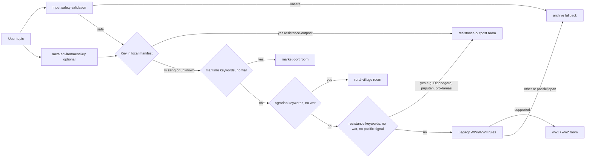

# Resistance-Outpost Environment Implementation Plan
> For agentic workers: inline plan execution with per-task checkpoints. Steps use checkbox syntax.
**Goal:** Add `resistance-outpost`, a colonial-era Nusantara resistance outpost, as the seventh authored room so Indonesian resistance and independence-war topics (Diponegoro, Perang Jawa, Padri, Puputan, 1945) get a visual and the prajurit NPC role gains a home, resolving the open `war-front` bullet as a conservative scoped room.
**Architecture:** Same pattern as `rural-village`. Key appended last to `HISTORY_ENVIRONMENT_KEYS` and `roomManifest`; `environmentKey` honored as before; a conservative resistance predicate plus a Pacific/Japan negative guard in `resolveRoom.js` sits after the agrarian branch and before the incompatible fallback. Same-origin procedural `.blend` to `.glb`/`.webp` with provenance. AI output never selects paths.
**Design decisions (spec content):** see `docs/code-plan/specs/2026-09-08-resistance-outpost-environment-design.md`.
**Tech Stack:** Three.js + React Three Fiber, Bun/Vite/Turbo, Blender 5.2.1 LTS + `scripts/export-history-assets.py`, Playwright Chromium e2e, ESLint.
**Active Project Profile:** Repository root `/home/belajarcarabelajar/time-capsule`, branch `main`, base revision `a864d50`. Toolchain Bun + Vite + Turbo; test runner `bun test`; e2e Playwright Chromium; ESLint. Configuration sources: `package.json`, `apps/web/package.json`, `scripts/export-history-assets.py`, `scripts/history_asset_details.py`, `assets/history/provenance.json`, `docs/history-environments.md`, `docs/code-plan/specs/2026-09-08-resistance-outpost-environment-design.md`.
**Project Commands:**
- `rtk bun test apps/web/src/immersive/__tests__/resolveRoom.test.js apps/web/src/immersive/__tests__/roomManifest.test.js apps/web/src/immersive/__tests__/visualVisits.test.js`
- `rtk bun test apps/web/src/immersive/__tests__/roomAssets.test.js`
- `rtk bun test ./packages/game-engine/tests/scenarioClient.test.js`
- `rtk bun scripts/verify-history-assets.mjs resistance-outpost`
- `PATH=/usr/bin:/bin:$PATH rtk bun run test:immersive -- --project=chromium`
- `rtk bun run lint` (inside `apps/web`)
- `env -u PYTHONUNBUFFERED -u PYTHONUTF8 -u PYTHONDONTWRITEBYTECODE PATH=/usr/bin:/bin blender --background --python scripts/export-history-assets.py -- --root . --room resistance-outpost`
**Protected Boundaries:** Exact-order key assertions at `packages/game-engine/tests/scenarioClient.test.js:18-25` and `roomManifest.test.js:5`; existing resolver rows unchanged (incl. `['Majapahit', 'Java', 'archive']`, `['World War II', 'Tokyo', 'archive']`, `['Perang Dunia II', 'desa di Prancis', 'archive']`); asset budgets, checksums, editable `.blend`, motion pivots `ambient_figure`/`ambient_prop` with children for every room; conservative resolver (unsafe/conflicting/incompatible inputs and unknown keys stay `archive`); AI never returns a URL or path.
**Spec:** `docs/code-plan/specs/2026-09-08-resistance-outpost-environment-design.md`
**Scope:** manifest + keys + prompt advertise (auto via template) + resolver predicate + visualVisits detail view + Blender branch + assets + provenance + unit/e2e tests + `docs/history-environments.md` + checkpoint.
**Non-Goals:** no `urban-poor`, no generic `war-front`, no audio, no runtime baked AO, no new dependency/endpoint/deploy, no change to existing room behavior, no serving of Japan/Pacific theater content.
**Visual Map:**

**Reasoning Lenses:** Intent & Scope, Investigative & Evidence, Computational, Creative & Convergent, Systems & Contract, Behavioral & Test-First, Critical & Adversarial (guard mis-route), Evidence & Reflection.
**Acceptance Criteria:**
- AC-1: `resistance-outpost` in `HISTORY_ENVIRONMENT_KEYS` and the system-prompt advertise list.
- AC-2: Manifest entry with valid `/history/resistance-outpost/*` URLs, camera, 3 unique objects (`palisade`, `watch-post`, `signal-fire`), scopeLabel, and a visualVisits detail view.
- AC-3: `environmentKey:"resistance-outpost"` selects the room; unknown key and unsafe input stay `archive`.
- AC-4: Strong resistance/independence signals route to the room; maritime/agrarian precedence, war signals, Japan/Pacific signals, bare Majapahit/Java, generic colonial text, conflicting eras, and incompatible contexts stay per existing rules.
- AC-5: Assets pass budgets, provenance, and checksums; editable `.blend`; motion pivots preserved; sentry figure role recorded.
- AC-6: Chromium renders the GLB, inspection works, exactly 2 scenario calls, 0 fallback.
- AC-7: `docs/history-environments.md` and provenance updated.
- AC-8: Existing 6 rooms and all resolver rows remain green.
**Traceability:**
| AC | Task | Test/Check | Evidence |
|---|---|---|---|
| AC-1 | T1 | scenarioClient.test | pass, prompt contains key |
| AC-2 | T2 | roomManifest.test + visualVisits.test | pass |
| AC-3 | T2/T3 | resolveRoom.test | pass |
| AC-4 | T3 | resolveRoom.test | pass |
| AC-5 | T4 | roomAssets.test + verify-history-assets.mjs | exit 0 |
| AC-6 | T5 | immersive.spec.js | rows pass |
| AC-7 | T6 | doc diff | reviewed |
| AC-8 | T3-T6 | full focused suite | 0 failures |
**Assumptions & Open Questions:** Blender 5.2.1 LTS verified on this host (provenance of market-port/rural-village). The e2e fixture `mockHistoryApi` accepts arbitrary `environmentKey`. Japanese-occupation-era Indonesian resistance topics (PETA, Singaparna) intentionally stay `archive` per the approved hard guard. Predicate stays conservative: bare `Majapahit`/`Java`, generic colonial text, and Japan/Pacific signals stay `archive` unless strong resistance keywords fire. Visual acceptance of poster/screenshot is a post-execution human step.
**Dependencies & Impact:** `historyEnvironmentKeys.js`, `scenarioClient.test.js`, `rooms.js`, `roomManifest.test.js`, `visualVisits.js`, `resolveRoom.js` + test, `export-history-assets.py` (choices, builder, dispatch, camera dicts), `history_asset_details.py` (prop/figure placement), `provenance.json` (`figureRoles`, `rooms`), `roomAssets.test.js`, `immersive.spec.js`. No DB/API/contract consumers beyond these.
**Risks & Rollback:** GLB budget overrun (clamp geometry and re-export); resolver regression (full resolveRoom.test.js row pass gates T3); Blender authoring is the highest-effort step (verify assets before e2e). Rollback = omit resistance-outpost; feature-off rebuild path unchanged.
**Security & Compatibility:** No new input boundary; keyword regex runs on normalized text <= 500 chars; environmentKey validated against local manifest; same-origin asset URLs. Old responses without the key remain valid. No serving of Japan/Pacific theater content.
**Operations & Rollout:** Local only; no deploy. Post-change verification = full focused suite + e2e Chromium + asset verification.
**CI/Review Gate:** ESLint on changed JS/JSX; targeted unit suites; Chromium e2e; verify-history-assets.
**Documentation:** `docs/history-environments.md` runtime table + authored-assets list + authoring note; checkpoint file; spec doc; this plan.
**Definition of Done:** AC-1..AC-8 evidenced with fresh logs/exit 0; diff review only intended files; docs updated; 0 em dashes in user-visible copy; plan checkboxes/status advanced after execution.
**Plan Status & Version:** Draft v1, 2026-09-08 (approved by user for execution, this docs commit begins T1-T5; plan finalized after execution).
**Reproducibility:** Blender 5.2.1 LTS; Bun lockfile unchanged; commands reproduce from repo root on this WSL host.
**Test Reliability:** Deterministic fixtures; no clock/network in unit tests; e2e blocks provider domains via mock fixture.
**Privacy & Data Governance:** No data collection; no PII; no retention changes.
**Dependencies & Supply Chain:** No new dependencies; lockfile unchanged; no license impact.
**UX States:** Poster-first fallback, reduced motion, save-data, static preference, failed model load, keyboard exploration, lesson controls all retain current behavior.
**Verification:** Per-task RED/GREEN with fresh logs; final full focused suite; Chromium e2e; asset verification.

## Global Constraints
- Exactly 3 inspection objects per room; unique ids; label > 3 chars; description > 40 chars.
- Same-origin local media only; never a remote or AI-selected URL.
- Indonesian-first copy; every object description marks the scene as illustration, never an authentic artifact.
- No em dashes (U+2014) in user-visible copy; no AI-marketing vocabulary.
- Mobile-first: 44px targets, zero horizontal overflow, keyboard focus preserved.

### Task 0: Spec + plan docs
**Files:**
- Create: docs/code-plan/specs/2026-09-08-resistance-outpost-environment-design.md
- Create: docs/code-plan/plans/2026-09-08-resistance-outpost-environment.md (this file)
**Behavior & Acceptance:** Records the design decisions: contract, resolver rule and negative guard, rejected `war-front`/Japanese-occupation scope with reasons, boundaries.
- [x] Step 1: Write spec doc
- [x] Step 2: Write plan doc
- [x] Step 3: Commit [git add docs/code-plan/specs docs/code-plan/plans && git commit -m "docs: add resistance-outpost design spec and implementation plan"]

### Task 1: Game-engine environment keys
**Files:**
- Modify: packages/game-engine/src/historyEnvironmentKeys.js
- Modify: packages/game-engine/tests/scenarioClient.test.js:18-25
**Interfaces:** Produces key `"resistance-outpost"` appended last; consumed by the systemPrompt.js template and the scenarioClient test.
**Behavior & Acceptance:** AC-1; the allowed-keys array and the prompt advertise list contain `resistance-outpost`.
**Edge Cases & Failure Behavior:** Order must match the manifest order convention; appending last keeps existing keys stable.
**Deliberate Shortcuts & Deferrals:** None.
**Review & Evidence:** scenarioClient test passes; prompt contains `resistance-outpost`.
- [ ] Step 1: Write failing test [append `"resistance-outpost"` to expected key array]
- [ ] Step 2: Run, verify fail [rtk bun test ./packages/game-engine/tests/scenarioClient.test.js]
- [ ] Step 3: Write minimal implementation [append key to HISTORY_ENVIRONMENT_KEYS]
- [ ] Step 4: Run, verify pass [same command]
- [ ] Step 5: Commit [git add packages/game-engine && git commit -m "feat(game-engine): register resistance-outpost environment key"]

### Task 2: Web room manifest + visualVisits detail view
**Files:**
- Modify: apps/web/src/immersive/rooms.js (entry: label `Pos perlawanan`, scopeLabel above, camera above, objects `palisade`/`watch-post`/`signal-fire` with Indonesian-first illustration-marking copy > 40 chars, initial view values)
- Modify: apps/web/src/immersive/__tests__/roomManifest.test.js:5 (append `resistance-outpost` to exact order) + object-id assertion for `['palisade', 'watch-post', 'signal-fire']`
- Modify: apps/web/src/immersive/visualVisits.js (detailViews row, initial `{ position: [8.5, 5.8, 10], target: [-0.4, 1.4, -1.5] }`)
**Interfaces:** Consumes AC-1 key; produces `roomManifest["resistance-outpost"]` with objects `palisade`, `watch-post`, `signal-fire`.
**Behavior & Acceptance:** AC-2; manifest contract checks pass for resistance-outpost; visualVisits alternates chapters for the room. Object views frame each authored object; measured view adjustments during T4 update this entry in the same commit.
**Deliberate Shortcuts & Deferrals:** None.
**Review & Evidence:** roomManifest.test + visualVisits.test pass.
- [ ] Step 1: Write failing test [append key + resistance-outpost object-id assertion]
- [ ] Step 2: Run, verify fail [rtk bun test apps/web/src/immersive/__tests__/roomManifest.test.js apps/web/src/immersive/__tests__/visualVisits.test.js]
- [ ] Step 3: Write minimal implementation [rooms.js resistance-outpost entry with Indonesian copy; visualVisits detail row]
- [ ] Step 4: Run, verify pass [same command]
- [ ] Step 5: Commit [git add apps/web/src/immersive && git commit -m "feat(web): add resistance-outpost room manifest"]

### Task 3: Conservative resolver keyword path
**Files:**
- Modify: apps/web/src/immersive/resolveRoom.js (add `pacificWar` + `resistanceOutpost` consts and the guarded branch between the rural branch and the incompatible fallback)
- Modify: apps/web/src/immersive/__tests__/resolveRoom.test.js (rows below plus environmentKey case)
**Interfaces:** Consumes roomManifest; produces `{ roomId: "resistance-outpost", reason: "colonial-resistance" }` from a conservative `resistanceOutpost` predicate checked after the market-port and rural-village branches and before the incompatible fallback, guarded by `!first && !second && !pacificWar`.
**Behavior & Acceptance:** AC-3, AC-4; existing rows unchanged (incl. `['Majapahit', 'Java', 'archive']`, `['World War II', 'Tokyo', 'archive']`, `['Perang Dunia II', 'desa di Prancis', 'archive']`).
**Edge Cases & Failure Behavior:** Maritime and agrarian precedence; war signals, Japan/Pacific signals, generic colonial text, incompatible contexts, and mixed era inputs stay per existing rules.
**Deliberate Shortcuts & Deferrals:** None.
**Review & Evidence:** resolveRoom test passes in full.
- [ ] Step 1: Write failing test [add rows + environmentKey honored case]
- [ ] Step 2: Run, verify fail [rtk bun test apps/web/src/immersive/__tests__/resolveRoom.test.js]
- [ ] Step 3: Write minimal implementation [pacificWar + resistanceOutpost regex and guarded branch]
- [ ] Step 4: Run, verify pass [same command]
- [ ] Step 5: Commit [git add apps/web/src/immersive && git commit -m "feat(web): route colonial resistance contexts to resistance-outpost"]
New rows: positives `['Perang Diponegoro','Pulau Jawa']`, `['Perang Jawa','Jawa Tengah']`, `['Perang Padri','Sumatera Barat']`, `['Puputan','Bali']`, `['Perlawanan rakyat','Sumatera Barat']`, `['Proklamasi Kemerdekaan Indonesia','Jakarta']`, `['Pertempuran Surabaya 10 November 1945','Jawa Timur']`; negatives `['Perlawanan rakyat pada masa pendudukan Jepang','Indonesia']`, `['Perang di Pasifik','Tokyo']`, `['Kehidupan masa kolonial','Pulau Jawa']`, `['Perang Dunia II','Pulau Jawa']`. environmentKey case Majapahit/Java -> `toEqual({ roomId: 'resistance-outpost', reason: 'environment-key' })`.

### Task 4: Asset authoring, generation, provenance
**Files:**
- Modify: scripts/export-history-assets.py (choices line 19, new `resistance_outpost()` builder: ground clearing, bamboo-timber palisade line, raised bamboo watch post, lean-to shelter, low signal fire, storage baskets, forest fringe, sky; `ambient_prop` grass tuft; dispatch dict lines 430-432; detail-camera dict ~line 456)
- Modify: scripts/history_asset_details.py `enrich()` (prop_names + figure x/y/floor tuples; plain bamboo staff carried by the sentry instead of the folio for this room)
- Modify: assets/history/provenance.json (`rooms` entry + `figureRoles["resistance-outpost"] = "Anonymous colonial resistance sentry, no rank or insignia"`)
- Modify: apps/web/src/immersive/__tests__/roomAssets.test.js loop (line 8) (append `resistance-outpost`)
- Generate: assets/history/source/resistance-outpost.blend; apps/web/public/history/resistance-outpost/{room.glb,poster.webp,poster-detail.webp,export-report.json}; adjust object view / visualVisits / exporter camera values to measured framing in the same commit.
**Interfaces:** Scene branch under `args.room == "resistance-outpost"`; three named inspection node groups (`palisade`, `watch-post`, `signal-fire`); provenance record matching the manifest.
**Behavior & Acceptance:** AC-5. Scene: ground clearing, bamboo-timber palisade, raised watch post, lean-to shelter, low signal fire, storage baskets, forest fringe, sky; grass-tuft motion prop; anonymous sentry figure holding a plain bamboo staff; motion pivots preserved.
**Edge Cases & Failure Behavior:** Budget overruns, checksum mismatches, or missing source fail verification.
**Deliberate Shortcuts & Deferrals:** Blender scene authoring is visual/generated work; TDD exception with verification = asset budgets + screenshot + e2e (mirroring rural-village). `defer: no baked AO, upgrade-trigger = realism acceptance pending in three-rooms checkpoint`.
**Review & Evidence:** roomAssets test pass; verify-history-assets.mjs exit 0 for resistance-outpost.
- [ ] Step 1: Write failing test [append `resistance-outpost` to roomAssets id list]
- [ ] Step 2: Run, verify fail [rtk bun test apps/web/src/immersive/__tests__/roomAssets.test.js]
- [ ] Step 3: Write minimal implementation [export branch: choices, `resistance_outpost()`, dispatch, camera; enrich prop/figure + staff]
- [ ] Step 4: Generate assets [blender export command]
- [ ] Step 5: Update provenance.json
- [ ] Step 6: Measure framing, adjust object view / visualVisits / exporter camera in same commit
- [ ] Step 7: Run, verify pass [roomAssets + verify-history-assets resistance-outpost]
- [ ] Step 8: Commit [feat(web): author resistance-outpost room assets]

### Task 5: Browser e2e row
**Files:**
- Modify: apps/web/e2e/immersive.spec.js (row `['Perang Diponegoro','Pulau Jawa','resistance-outpost','Pagar bambu','resistance-outpost']`)
**Interfaces:** Consumes the mocked history API fixture with the resistance-outpost key.
**Behavior & Acceptance:** AC-6.
**Deliberate Shortcuts & Deferrals:** None.
**Review & Evidence:** Chromium suite passes all rows.
- [ ] Step 1: Write the row [mirror kingdom-court row for resistance-outpost]
- [ ] Step 2: Run, verify pass [test:immersive Chromium]
- [ ] Step 3: Commit [test(e2e): cover resistance-outpost rendering and inspection]

### Task 6: Docs, lint, final verification, plan finalize
**Files:**
- Modify: docs/history-environments.md (allowed-keys list line ~21, table row, authoring note)
- Create: docs/code-plan/checkpoints/2026-09-08-resistance-outpost.md
- Modify: this plan doc (checkboxes + status)
**Behavior & Acceptance:** AC-7, AC-8.
**Review & Evidence:** Lint exit 0; full focused suite pass; checkpoint with AC-1..AC-8 evidence mapping; em-dash scan 0 hits.
- [ ] Step 1: Update docs/history-environments.md
- [ ] Step 2: Lint changed files + em-dash scan
- [ ] Step 3: Full focused suite + asset verification
- [ ] Step 4: Diff review, write checkpoint, update plan status, commit [docs: document resistance-outpost environment]

## Plan lifecycle
Status: Draft v1, 2026-09-08 (user approved execution inline). Decisions: `resistance-outpost` chosen as the scoped resolution of the open `war-front` bullet; conservative resistance predicate (strong signals only) with a Pacific/Japan negative guard; bare Majapahit/Java, generic colonial text, and incompatible contexts stay archive unless `environmentKey`. Superseded: none. Visual acceptance of the poster and Chromium screenshot is the remaining human review step (see checkpoint).
