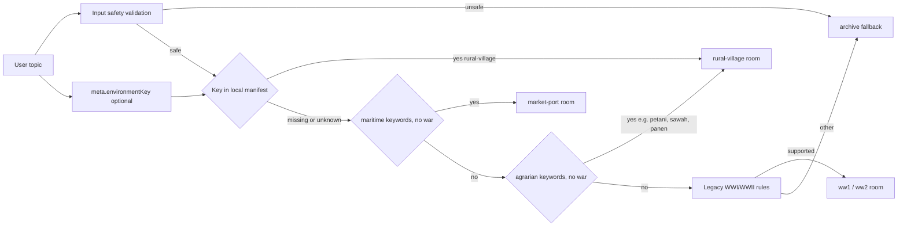

# Rural-Village Environment Implementation Plan
> For agentic workers: inline plan execution with per-task checkpoints. Steps use checkbox syntax.
**Goal:** Add `rural-village`, an open-air agrarian Nusantara village, as the sixth authored dimensional room so Indonesian agrarian-life topics (petani, sawah, panen, irigasi) get a visual and the catalogue gains the rakyat/petani perspective beside market-port's pedagang.
**Architecture:** Same pattern as `market-port`. New key appended last to `HISTORY_ENVIRONMENT_KEYS` and `roomManifest`; `environmentKey` honored exactly like existing rooms; plus a conservative agrarian keyword predicate in `resolveRoom.js` placed after the maritime branch and before the incompatible fallback. Assets same-origin procedural `.blend` to `.glb`/`.webp` with provenance. AI output never selects paths.
**Design decisions (spec content):** see `docs/code-plan/specs/2026-09-08-rural-village-environment-design.md`.
**Tech Stack:** Three.js + React Three Fiber (renderer), Bun/Vite (web), Blender 5.2.1 LTS + `scripts/export-history-assets.py`, Playwright Chromium (e2e).
**Active Project Profile:** Repository root `/home/belajarcarabelajar/time-capsule`, branch `main`, base revision `db6f43f`. Toolchain Bun + Vite + Turbo; test runner `bun test`; e2e Playwright Chromium; ESLint. Configuration sources: `package.json`, `apps/web/package.json`, `scripts/export-history-assets.py`, `assets/history/provenance.json`, `docs/history-environments.md`, `docs/code-plan/specs/2026-09-08-rural-village-environment-design.md`.
**Project Commands:**
- `rtk bun test apps/web/src/immersive/__tests__/resolveRoom.test.js apps/web/src/immersive/__tests__/roomManifest.test.js apps/web/src/immersive/__tests__/roomAssets.test.js`
- `rtk bun test ./packages/game-engine/tests/scenarioClient.test.js`
- `rtk bun scripts/verify-history-assets.mjs rural-village`
- `PATH=/usr/bin:/bin:$PATH rtk bun run test:immersive -- --project=chromium`
- `rtk bun run lint` (inside `apps/web`)
- `env -u PYTHONUNBUFFERED -u PYTHONUTF8 -u PYTHONDONTWRITEBYTECODE PATH=/usr/bin:/bin blender --background --python scripts/export-history-assets.py -- --root . --room rural-village`
**Protected Boundaries:** Exact-order key assertions in `packages/game-engine/tests/scenarioClient.test.js:18-23` (renamed from geminiClient.test.js) and `roomManifest.test.js:5`; existing resolver rows including `['Majapahit', 'Java', 'archive']` unchanged; asset budgets (GLB <= 4 MiB, poster <= 250 KiB, < 100,000 triangles, <= 60 draw primitives, editable `.blend`, sha256 checksums); motion pivots `ambient_figure`/`ambient_prop` with children for every room; conservative resolver (unsafe/conflicting/incompatible inputs and unknown keys stay `archive`); AI never returns a URL or path.
**Spec:** `docs/code-plan/specs/2026-09-08-rural-village-environment-design.md`
**Scope:** room manifest + keys + resolver predicate + prompt advertise list (auto via template) + Blender authoring branch + asset generation + provenance + unit/e2e tests + `docs/history-environments.md` + checkpoint.
**Non-Goals:** no `war-front`/`urban-poor`, no audio, no runtime baked AO, no new dependency/endpoint/deploy, no source-citation backfill, no change to existing room behavior.
**Visual Map:**

**Reasoning Lenses:** Intent & Scope, Investigative & Evidence, Computational, Creative & Convergent, Systems & Contract, Behavioral & Test-First, Evidence & Reflection.
**Acceptance Criteria:**
- AC-1: `rural-village` in `HISTORY_ENVIRONMENT_KEYS` and the system-prompt advertise list.
- AC-2: Manifest entry with valid `/history/rural-village/*` URLs, camera, 3 unique objects (`sawah`, `lumbung`, `irigasi`), scopeLabel.
- AC-3: `environmentKey:"rural-village"` selects rural-village; unknown key and unsafe input stay `archive`.
- AC-4: Strong agrarian keywords (petani, sawah, padi, panen, irigasi, subak, agraris, and similar) with no war signal select rural-village; war/mixed/incompatible contexts and bare `Majapahit`/`Java` stay `archive`; maritime contexts still select market-port.
- AC-5: Assets pass budgets, provenance, and checksums; editable `.blend` present; motion pivots preserved.
- AC-6: Chromium renders the GLB, inspection works, exactly 2 gemini/scenario calls, 0 fallback.
- AC-7: `docs/history-environments.md` and provenance updated.
- AC-8: Existing 5 rooms and all resolver rows remain green.
**Traceability:**
| AC | Task | Test/Check | Evidence |
|---|---|---|---|
| AC-1 | T1 | scenarioClient.test | pass, prompt contains key |
| AC-2 | T2 | roomManifest.test | pass |
| AC-3 | T2/T3 | resolveRoom.test | pass |
| AC-4 | T3 | resolveRoom.test | pass |
| AC-5 | T4 | roomAssets.test + verify-history-assets.mjs | exit 0 |
| AC-6 | T5 | immersive.spec.js | rows pass |
| AC-7 | T6 | doc diff | reviewed |
| AC-8 | T3-T6 | full focused suite | 0 failures |
**Assumptions & Open Questions:** Blender 5.2.1 LTS verified on this host. Playwright Chromium verified locally. The e2e fixture `mockHistoryApi` accepts arbitrary `environmentKey` (confirmed by the kingdom-court row). Predicate stays conservative: bare `Majapahit`/`Java` stay `archive` unless farming action words are present. Checkpoints re-anchor to `~/.config/ai/Super Ultra Code Plan Implementation.md`.
**Dependencies & Impact:** `historyEnvironmentKeys.js`, `scenarioClient.test.js` (renamed from geminiClient.test.js), `rooms.js`, `roomManifest.test.js`, `resolveRoom.js` + test, `export-history-assets.py` (choices, dispatch, camera dicts), `provenance.json` (`figureRoles`, `rooms`), `roomAssets.test.js`, `immersive.spec.js`. No DB/API/contract consumers beyond these.
**Risks & Rollback:** GLB budget overrun (clamp geometry and re-export); resolver regression (full resolveRoom.test.js row pass gates T3); Blender authoring is the highest-effort step (verify before e2e). Rollback = omit rural-village; feature-off rebuild path unchanged.
**Security & Compatibility:** No new input boundary; keyword regex runs on normalized text <= 500 chars; environmentKey validated against local manifest; same-origin asset URLs. Old responses without the key remain valid.
**Operations & Rollout:** Local only; no deploy. Post-change verification = full focused suite + e2e Chromium + asset verification.
**CI/Review Gate:** ESLint on changed JS/JSX; targeted unit suites; Chromium e2e; verify-history-assets.
**Documentation:** `docs/history-environments.md` runtime table + authored-assets list; checkpoint file; spec doc.
**Definition of Done:** AC-1..AC-8 evidenced; fresh log/exit-0 per check; diff review only intended files; docs updated; no em dashes or buzzwords in user-visible copy; plan checkboxes updated and status advanced after execution.
**Plan Status & Version:** Complete v1, 2026-09-08. Executed in commits 40dccf3..e152120 (T1-T5) with this docs commit. All steps marked [x]; evidence re-verified fresh on 2026-09-08: immersive + game-engine suites 81 pass, roomAssets 12 pass, resolveRoom 30 pass, scenarioClient 4 pass, Chromium e2e 9 pass, verify-history-assets exit 0 for all 6 rooms.
**Reproducibility:** Blender 5.2.1 LTS; Bun lockfile unchanged; commands reproduce from repo root on this WSL host.
**Test Reliability:** Deterministic fixtures; no clock/network in unit tests; e2e blocks provider domains via mock fixture.
**Privacy & Data Governance:** No data collection; no PII; no retention changes.
**Dependencies & Supply Chain:** No new dependencies; lockfile unchanged; no license impact.
**UX States:** Poster-first fallback, reduced motion, save-data, static preference, failed model load, keyboard exploration, lesson controls all retain current behavior.
**Verification:** Per-task RED/GREEN with fresh logs; final full focused suite; Chromium e2e; asset verification.

## Global Constraints
- Exactly 3 inspection objects per room; unique ids; label > 3 chars; description > 40 chars.
- Same-origin local media only; never a remote or AI-selected URL.
- Indonesian-first copy; every object description marks the scene as illustration, never an authentic artifact.
- No em dashes (U+2014) in user-visible copy; no AI-marketing vocabulary.
- Mobile-first: 44px targets, zero horizontal overflow, keyboard focus preserved.

### Task 0: Spec doc
**Files:**
- Create: docs/code-plan/specs/2026-09-08-rural-village-environment-design.md
**Behavior & Acceptance:** Records the design decisions: contract, resolver rule, rejected `war-front`/`urban-poor` with reasons, boundaries.
- [x] Step 1: Write spec doc
- [x] Step 2: Commit [git add docs/code-plan/specs && git commit -m "docs: add rural-village environment design spec"] (a37ea8a)

### Task 1: Game-engine environment keys
**Files:**
- Modify: packages/game-engine/src/historyEnvironmentKeys.js
- Modify: packages/game-engine/tests/scenarioClient.test.js:18-23
**Interfaces:** Produces key `"rural-village"` appended last; consumed by the systemPrompt.js template and the scenarioClient test.
**Behavior & Acceptance:** AC-1; the allowed-keys array and the prompt advertise list contain `rural-village`.
**Edge Cases & Failure Behavior:** Order must match the manifest order convention; appending last keeps existing keys stable.
**Deliberate Shortcuts & Deferrals:** None.
**Review & Evidence:** scenarioClient test passes; prompt contains `rural-village`.
- [x] Step 1: Write failing test [append `"rural-village"` to expected key array]
- [x] Step 2: Run, verify fail [rtk bun test ./packages/game-engine/tests/scenarioClient.test.js]
- [x] Step 3: Write minimal implementation [append key to HISTORY_ENVIRONMENT_KEYS]
- [x] Step 4: Run, verify pass [same command]
- [x] Step 5: Commit [git add packages/game-engine && git commit -m "feat(game-engine): register rural-village environment key"] (40dccf3)

### Task 2: Web room manifest entry
**Files:**
- Modify: apps/web/src/immersive/rooms.js
- Modify: apps/web/src/immersive/__tests__/roomManifest.test.js:5 (append `rural-village` to exact order) + object-id assertion for `['sawah', 'lumbung', 'irigasi']`
**Interfaces:** Consumes AC-1 key; produces `roomManifest["rural-village"]` with objects `sawah`, `lumbung`, `irigasi`; camera `{ position: [10, 6.5, 11], target: [0, 1.4, -1], yawLimit: 0.5, pitchLimit: 0.22 }`.
**Behavior & Acceptance:** AC-2; manifest contract checks pass for rural-village. Object views frame each authored object; measured view adjustments during T4 update this entry in the same commit.
**Deliberate Shortcuts & Deferrals:** None.
**Review & Evidence:** roomManifest test passes.
- [x] Step 1: Write failing test [append key + rural-village object-id assertion]
- [x] Step 2: Run, verify fail [rtk bun test apps/web/src/immersive/__tests__/roomManifest.test.js]
- [x] Step 3: Write minimal implementation [rooms.js rural-village entry with Indonesian copy]
- [x] Step 4: Run, verify pass [same command]
- [x] Step 5: Commit [git add apps/web/src/immersive && git commit -m "feat(web): add rural-village room manifest"] (46605bf)

### Task 3: Conservative resolver keyword path
**Files:**
- Modify: apps/web/src/immersive/resolveRoom.js
- Modify: apps/web/src/immersive/__tests__/resolveRoom.test.js
**Interfaces:** Consumes roomManifest; produces `{ roomId: "rural-village", reason: "agrarian-life" }` from a conservative `ruralLife` predicate checked after the market-port branch and before the incompatible fallback, guarded by `!first && !second`.
**Behavior & Acceptance:** AC-3, AC-4; existing rows unchanged (including `['Majapahit', 'Java', 'archive']`).
**Edge Cases & Failure Behavior:** War signals, maritime-only signals (market-port precedence), incompatible contexts, and mixed era inputs stay per existing rules.
**Deliberate Shortcuts & Deferrals:** None.
**Review & Evidence:** resolveRoom test passes in full.
- [x] Step 1: Write failing test [add rural-village rows + environmentKey honored case]
- [x] Step 2: Run, verify fail [rtk bun test apps/web/src/immersive/__tests__/resolveRoom.test.js]
- [x] Step 3: Write minimal implementation [ruralLife regex + guarded branch]
- [x] Step 4: Run, verify pass [same command]
- [x] Step 5: Commit [git add apps/web/src/immersive && git commit -m "feat(web): route agrarian-life contexts to rural-village"] (fbf2de0)

### Task 4: Asset authoring, generation, provenance
**Files:**
- Modify: scripts/export-history-assets.py (choices list, `rural_village()` builder, dispatch dict, camera dict)
- Modify: assets/history/provenance.json (`figureRoles` + `rooms.rural-village`)
- Modify: apps/web/src/immersive/__tests__/roomAssets.test.js (append id to loop)
- Generate: assets/history/source/rural-village.blend; apps/web/public/history/rural-village/{room.glb,poster.webp,poster-detail.webp,export-report.json}
**Interfaces:** Scene branch under `args.room == "rural-village"`; three named inspection node groups (`sawah`, `lumbung`, `irigasi`); provenance record matching the manifest.
**Behavior & Acceptance:** AC-5. Scene: paddy terraces with bund paths and water, timber granary on posts, irrigation channel with gate, low-poly trees, sky backdrop; motion pivots `ambient_figure`/`ambient_prop` preserved.
**Edge Cases & Failure Behavior:** Budget overruns, checksum mismatches, or missing source fail verification.
**Deliberate Shortcuts & Deferrals:** Blender scene authoring is visual/generated work; TDD exception with verification = asset budgets + screenshot + e2e (mirroring market-port). `ponytail: no baked AO, upgrade-trigger = realism acceptance pending in three-rooms checkpoint`.
**Review & Evidence:** roomAssets test pass; verify-history-assets.mjs exit 0 for rural-village.
- [x] Step 1: Write failing test [append `rural-village` to roomAssets id list]
- [x] Step 2: Run, verify fail [rtk bun test apps/web/src/immersive/__tests__/roomAssets.test.js]
- [x] Step 3: Write minimal implementation [export branch: choices, `rural_village()`, dispatch, camera]
- [x] Step 4: Generate assets [blender export command]
- [x] Step 5: Update provenance.json
- [x] Step 6: Run, verify pass [roomAssets + verify-history-assets rural-village]
- [x] Step 7: Commit [feat(web): author rural-village room assets] (33640d4)

### Task 5: Browser e2e row
**Files:**
- Modify: apps/web/e2e/immersive.spec.js (row `["Kehidupan petani", "Pulau Jawa", "rural-village", "Sawah", "rural-village"]`)
**Interfaces:** Consumes the mocked history API fixture with the rural-village key.
**Behavior & Acceptance:** AC-6.
**Deliberate Shortcuts & Deferrals:** None.
**Review & Evidence:** Chromium suite passes all rows.
- [x] Step 1: Write the row [mirror kingdom-court row for rural-village]
- [x] Step 2: Run, verify pass [test:immersive Chromium]
- [x] Step 3: Commit [test(e2e): cover rural-village rendering and inspection] (e152120)

### Task 6: Docs, lint, final verification, plan finalize
**Files:**
- Modify: docs/history-environments.md
- Create: docs/code-plan/checkpoints/2026-09-08-rural-village.md
- Modify: this plan doc (checkboxes + status)
**Behavior & Acceptance:** AC-7, AC-8.
**Review & Evidence:** Lint exit 0; full focused suite pass; checkpoint with AC-1..AC-8 evidence mapping; em-dash scan 0 hits.
- [x] Step 1: Update docs/history-environments.md
- [x] Step 2: Lint changed files + em-dash scan
- [x] Step 3: Full focused suite + asset verification
- [x] Step 4: Diff review, write checkpoint, update plan status, commit [docs: document rural-village environment] (this docs commit)

## Plan lifecycle
Status: Complete (verified 2026-09-08; plan doc finalized after execution). Decisions: rural-village selected over `war-front` and `urban-poor`; conservative agrarian predicate (strong signals only); bare `Majapahit`/`Java` without farming words stay archive unless `environmentKey`. Superseded: none. Visual acceptance of the poster and Chromium screenshot is the remaining human review step (see checkpoint).
