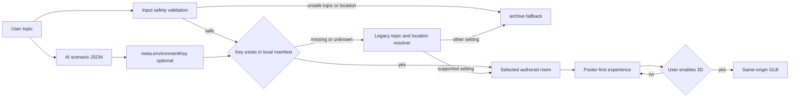

# AI-Routed Historical Environments Design

Status: Draft v1, 2026-09-07. This design records the proposed first expansion from three authored rooms to an AI-directed catalogue. It is not approval to alter application code, generate assets, commit, push, or deploy.

## Problem and evidence

The immersive catalogue has three authored rooms: `archive`, `ww1-field-station`, and `ww2-radio-room`. The current resolver only identifies two narrow contexts from the user topic and `meta.location`; all other contexts fall back to `archive`. The scenario contract contains `meta.location` and `meta.themeColor`, but no stable visual classification. The existing sample prompt already uses an Indonesian kingdom context, while the runtime currently resolves it to `archive`.

The product goal is to expand visual historical coverage incrementally for Indonesian and global learning contexts. Each room must be a distinct illustrative spatial setting. It must never claim to be an exact reconstruction, and no AI response may select a file path, URL, shader, or executable setting.

## Options considered

| Option | Result | Decision |
| --- | --- | --- |
| Continue topic and location keyword rules only | Keeps the current client-only contract but becomes brittle as regions, eras, and settings grow. | Rejected. |
| Let the model return an asset path or arbitrary room object | Reduces resolver code but creates an untrusted asset-selection boundary and makes review impossible. | Rejected. |
| Let the model return an optional allowlisted `environmentKey`; the client validates it against the local manifest and otherwise retains deterministic fallback rules | Keeps authored asset ownership local, supports incremental room packs, preserves old model responses, and provides a single visual intent per scenario. | Recommended. |

## Approved-design proposal pending user confirmation

The first vertical slice adds `kingdom-court`, a generic illustrated royal court that can support Indonesian and global kingdom contexts without representing a named palace or person. It contains exactly three learning objects: `ceremonial-seat`, `manuscript-table`, and `courtyard-gate`. Its copy states that it is an illustration, not an authentic site, object, document, or map.

The scenario contract gains an optional field:

```json
{
  "meta": {
    "location": "Majapahit, East Java, fourteenth century",
    "themeColor": "amber",
    "environmentKey": "kingdom-court"
  }
}
```

`environmentKey` is a model hint, not an asset location. The first catalogue is exactly `archive`, `ww1-field-station`, `ww2-radio-room`, and `kingdom-court`. The model response schema advertises those values. The scenario parser preserves an optional string value so an old response without the field stays valid. The renderer only honors a key that exists in the local `roomManifest`; unknown keys continue through the legacy topic/location resolver and finally `archive`.



## Boundaries and compatibility

- Existing `archive`, WWI, and WWII selection must remain unchanged when `environmentKey` is absent.
- An invalid or unknown key must never construct a URL or override the safe fallback path.
- The initial catalogue is intentionally limited to four keys. `war-front`, `urban-poor`, `rural-village`, `market-port`, and future region-specific rooms are separate room-pack decisions after this slice has passed verification.
- The asset pipeline remains local and same-origin: editable `.blend`, generated `.glb`, generated `.webp`, `export-report.json`, and provenance record move together.
- No dependency, API endpoint, authentication, database, analytics, remote asset, or deployment change is required.

## Asset and UX requirements

- `kingdom-court` has a visibly different room volume and camera composition from the archive and the two existing wartime interiors.
- Asset limits remain: GLB at most 4 MiB, poster at most 250 KiB, fewer than 100,000 triangles, and no more than 60 draw primitives.
- Static poster, reduced motion, save-data, failed model load, keyboard exploration, and lesson controls retain the current behavior.
- Blender authoring uses the verified WSL invocation that removes UV Python shims:

```bash
env -u PYTHONUNBUFFERED -u PYTHONUTF8 -u PYTHONDONTWRITEBYTECODE \
  PATH=/usr/bin:/bin \
  blender --background --python scripts/export-history-assets.py -- --root . --room kingdom-court
```

## Approval gate

Implementation may begin only after the user explicitly approves this design and the linked implementation plan. Approval selects `kingdom-court` as the first room pack, confirms the optional `environmentKey` contract, and keeps all other room families out of this implementation cycle.
