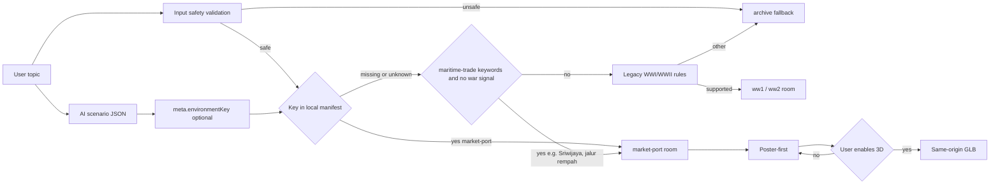

# Market-Port Environment Design

Status: Approved v1, 2026-09-07. The user selected `market-port` as the fifth authored room with a full TDD implementation plan. This design records the approved room, the resolver contract, the asset requirements, and the acceptance gates.

## Problem and evidence

The immersive catalogue has four authored rooms: `archive`, `ww1-field-station`, `ww2-radio-room`, and `kingdom-court`. The only Indonesian-context room is `kingdom-court`, which covers the elite, political, inland world. Indonesian maritime trade is the core national-curriculum theme and has no visual room. The NPC contract also requires a commoner perspective (pedagang/petani/prajurit), and all four current rooms are enclosed interiors, so no room visualizes an outdoor commercial or maritime setting.

Evidence: `resolveRoom.js` only routes WWI-Western-Front and WWII-British-home-front keywords; `Majapahit`/`Java` resolve to `archive` without an environment key (resolveRoom.test.js). `roomManifest` holds four keys. The future room packs named in the approved ai-routed design are `war-front`, `urban-poor`, `rural-village`, and `market-port`.

## Decision

Add `market-port`, an open-air maritime trading port with a pier, market stalls, a moored ship, and cargo. It covers Sriwijaya, the spice route, Sunda Kelapa, Batavia/VOC-era trade, and similar Nusantara maritime contexts. It provides the first outdoor room volume and a visual for the rakyat/pedagang perspective.

Rejected alternatives: `rural-village` overlaps the commoner theme but is less distinctive for the maritime curriculum and spatially similar to enclosed rooms; `urban-poor` has a niche curriculum share; `war-front` overlaps the existing wartime rooms.

## Room contract

```json
{
  "id": "market-port",
  "label": "Pelabuhan niaga",
  "scopeLabel": "Ilustrasi pelabuhan niaga Nusantara; bukan rekonstruksi pelabuhan atau kapal bersejarah tertentu",
  "modelUrl": "/history/market-port/room.glb",
  "posterUrl": "/history/market-port/poster.webp",
  "camera": { "position": [9, 5, 13], "target": [0, 1.5, -2], "yawLimit": 0.5, "pitchLimit": 0.22 },
  "objects": [
    { "id": "dock", "label": "Dermaga", "description": "..." },
    { "id": "market-stall", "label": "Lapak pasar", "description": "..." },
    { "id": "cargo", "label": "Muatan kapal", "description": "..." }
  ]
}
```

`environmentKey` is a model hint, not an asset location. The renderer only honors a key that exists in the local `roomManifest`; unknown keys continue through the legacy topic/location resolver and finally `archive`.



## Resolver contract

Add a conservative maritime-trade predicate checked before the incompatible-context fallback, requiring the absence of war signals:

```js
const marketPort = /\b(?:sriwijaya|srivijaya|sailendra|shailendra|spice (?:route|trade)|jalur rempah|rempah-?rempah|sunda kelapa|batavia|banten|malaka|malacca|melaka|pelabuhan|maritim|kapal dagang|v\.o\.c)\b/u;
if (marketPort.test(all) && !first && !second) return { roomId: 'market-port', reason: 'maritime-trade' };
```

Generic commerce words such as `pasar`, `market`, or `perdagangan` are intentionally excluded from the keyword path and are covered by the `environmentKey` hint, preserving the conservative fallback behavior.

## Boundaries and compatibility

- Existing `archive`, WWI, WWII, and `kingdom-court` selection must remain unchanged when `environmentKey` is absent.
- An invalid or unknown key must never construct a URL or override the safe fallback path.
- `war-front`, `urban-poor`, and `rural-village` remain separate room-pack decisions after this slice passes verification.
- The asset pipeline stays local and same-origin: editable `.blend`, generated `.glb`, generated `.webp`, `export-report.json`, and the provenance record move together.
- No dependency, API endpoint, authentication, database, analytics, remote asset, or deployment change is required.

## Asset and UX requirements

- `market-port` has an open, outdoor volume and a wider camera composition than the four enclosed interiors.
- Asset limits remain: GLB at most 4 MiB, poster at most 250 KiB, fewer than 100,000 triangles, and no more than 60 draw primitives.
- Static poster, reduced motion, save-data, failed model load, keyboard exploration, and lesson controls retain the current behavior.
- Blender authoring uses the verified WSL invocation that removes UV Python shims:

```bash
env -u PYTHONUNBUFFERED -u PYTHONUTF8 -u PYTHONDONTWRITEBYTECODE \
  PATH=/usr/bin:/bin \
  blender --background --python scripts/export-history-assets.py -- --root . --room market-port
```

## Approval gate

Implementation may begin only after the user explicitly approves this design and the linked implementation plan. Approval selects `market-port` as the fifth room pack, confirms the optional `environmentKey` contract, and keeps all other room families out of this implementation cycle.
